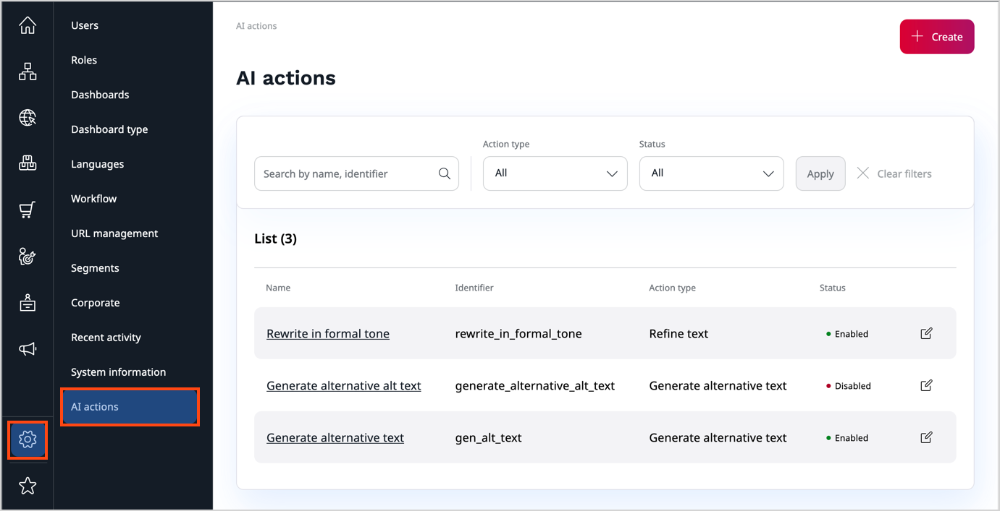
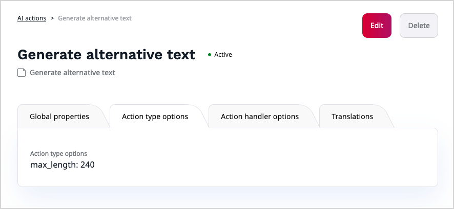

# Work with AI actions

AI actions define what actions are available in AI-enabled areas, such as, for example, the AI Assistant.
If the AI Actions add-on has been installed and configured in your application, and you have sufficient permissions, you can reconfigure the existing AI actions, and create new ones.

For more information about the AI-related capabilities, see [AI Actions](ai_actions.md).

## View AI actions

If you have Administrator permissions, you can view all AI actions configured in the application by navigating to the Admin Panel and selecting **AI actions**.
List entries are ordered by creation date.

You can narrow down the list of AI actions by filtering it by the status, either Available or Unavailable, or by the type.
Out of the box, there are two types of AI Actions present in the system:

- **Refine text** - used primarily in [online editor](create_edit_content_items.md#ai-assistant) for performing text-to-text actions, for example: "Rewrite text in formal tone"
- **Generate alternative text** - used in the [image asset editing screen](upload_images.md#ai) to perform image-to-text actions, for example: "Generate short alternative description of an image"

!!! note "Custom action types"

    In your specific case the types available can be different, and your organization's development team can create custom AI action types.
    For more information, see [developer documentation]([[= developer_doc =]]/ai_actions/).

### View AI action details

Navigate to the Admin Panel and select **AI actions**.
In the **AI actions** list, click the name of an AI action to review its details.
For example, in the **Action type options** tab, you can see specific parameters that modify the prompt that is sent to an AI service.

## Edit existing AI action

To suit your specific needs, you can modify the default AI actions.

1\. Navigate to the Admin Panel and select **AI actions**.

2\. In the **AI actions** list, click the **Edit** icon next to a name of the AI action that you want to modify.

3\. In the **Global properties** section, you can change the name and description of the AI action. You can also toggle the availability of the AI action between disabled and enabled.

4\. In the **Action options** area, change the settings that modify the behavior of an AI service that responds to an AI action, for example:

- **Prompt** - modifies the default request by passing a verbal command, for example, "Make it short and formal."
- **Max tokens** - sets a maximum number of "[words](https://help.openai.com/en/articles/4936856-what-are-tokens-and-how-to-count-them)" that can be processed in a single request
- **Temperature** - controls the randomness of the response. The higher the temperature, the more creative is the output

5\. Click **Save and close** to apply the changes or **Discard** to discard them and close the window.

## Create new AI actions

You can create AI actions that perform actions of different types.
You can also create AI actions that perform the same type of actions but use different models.

!!! note "AI action models"

    Before you can work with AI actions, models must be configured and enabled by your organization's development team.
    For more information, see [developer documentation]([[= developer_doc =]]/ai_actions/).

1. Navigate to the Admin Panel and select **AI actions**.

1. In the **AI actions** list, click **Create**.

1. In the slide-out pane, make initial choices in the following fields, and click **Create**:

    - **Language** - sets the base language for the AI action
    - **Action type** - sets an action type to serve as a template for the AI action, for example, **Refine action**
    - **Model** - sets the AI model used to process the requests resulting from this AI action

1. In the **Global properties** section, you set the name and identifier of the AI action.

1. Optionally, provide a description of the AI action.

1. When ready, set the status of the AI action to enabled.

1. In the **Action options** area, change the settings that control the behavior of an AI service that responds to an AI action, for example:

    - **Length** - in AI actions of text-to-text type, it can sets a maximum length of the output 
    - **Prompt** - modifies the default request by passing a verbal command, for example, "Make it sound funny."
    - **Max tokens** - sets a maximum number of "[words](https://help.openai.com/en/articles/4936856-what-are-tokens-and-how-to-count-them)" that can be processed in a single request
    - **Temperature** - controls the randomness of the response. The lower the temperature, the less creative is the output

1. Click **Save and close** to apply the changes or **Discard** to discard them and close the window.

