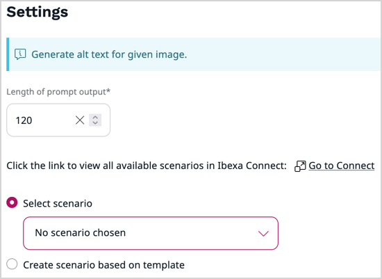

# Work with AI actions

AI actions define what results are available to editors in AI-enabled areas, such as, for example, the AI Assistant.
If the AI Actions LTS update has been installed and configured in your application, and you have the required [permissions]([[= developer_doc =]]/permissions/policies/#ai-actions), including `Action configuration/Edit` and `Action configuration/Create`, you can reconfigure the existing AI actions, and create new ones.

## View AI actions

With the right permissions, you can view all AI actions configured in the application by navigating to the Admin Panel and selecting **AI actions**.

You can narrow down the list of AI actions by filtering it by the status, either Enabled or Disabled, or by the type.
Out of the box, there are two categories of AI actions present in the system:

- **Refine text** - used by default in [online editor](create_edit_content_items.md#ai-assistant) for refining text, for example: "Rewrite text in formal tone"
- **Generate alternative text** - used by default in the [image asset editing screen](upload_images.md#ai) to generate alternative text, for example: "Generate short alternative description of an image"

It may happen that a set of sample AI actions has been [installed with the AI actions package]([[= developer_doc =]]/ai_actions/install_ai_actions/#install-sample-ai-action-configurations-optional), and there is a number of existing AI actions that you can modify and clone.

!!! note "Custom action types"

    In your specific case, the types available can be different, and your organization's development team can create custom AI action types.
    For more information, see [developer documentation]([[= developer_doc =]]/ai_actions/ai_actions/).

### View AI action details

Navigate to the Admin Panel and select **AI actions**.
In the **AI actions** list, click the name of an AI action to review its details.
For example, in the **Properties** tab, you can see specific settings that modify the prompt that is sent to an AI service.

## Edit existing AI actions

You can modify the existing AI actions.

1\. Navigate to the Admin Panel and select **AI actions**.

2\. In the **AI actions** list, click the **Edit** icon next to a name of the AI action that you want to modify.

3\. In the **Global properties** section, you can change the name and description of the AI action. You can also toggle the availability of the AI action between disabled and enabled.

4\. In the **Settings** area, change the settings that modify the behavior of an AI service that executes an AI action, for example:

- **Prompt** - modifies the default request by passing a verbal command, for example, "Make it short and formal."

!!! note "Default request"

    The default request can be seen at the top of the settings area, on a light blue background.

- **Max tokens** - sets a maximum number of "[words](https://help.openai.com/en/articles/4936856-what-are-tokens-and-how-to-count-them)" or tokens that can be used in a single request by both the request and the response

- **Length of prompt output** -  sets a maximum number of words of the generated result

- **Temperature** - controls the randomness of the response.
Takes a value between 0 and 2, but the usual range is between 0 and 1.
The output is more random at higher temperatures.
For more information, see the parameter description in [OpenAI API reference](https://platform.openai.com/docs/api-reference/chat/create#chat-create-temperature)

!!! note "Action settings availability"

    Action settings differ depending on the AI service used, model implementation and actual action type.
    Therefore the settings visible in your installation may vary from the ones presented above.

5\. Click **Save and close** to apply the changes or **Discard** to discard them and close the window.

## Create new AI actions

You can create AI actions that perform actions of different types, using different models, or action handlers.

!!! note "AI action models"

    Before you can work with AI actions, models must be configured and enabled by your organization's development team.
    If there are more AI service connectors available, you might be able to create AI actions that perform the same type of actions but use different models.
    For more information, see [developer documentation]([[= developer_doc =]]/ai_actions/ai_actions_guide/#model).

1. Navigate to the Admin Panel and select **AI actions**.

1. In the **AI actions** list, click **Create**.

1. In the slide-out pane, make initial choices in the following fields, and click **Create**:

    - **Language** - sets the base language for the AI action
    - **Action type** - sets an action type to serve as a template for the AI action, for example, **Refine text**
    - **Action handler** - sets the AI model used to process the requests resulting from this AI action

1. In the **Global properties** section, set the name and identifier of the AI action.

1. Optionally, provide a description of the AI action.

1. When ready, toggle the status of the AI action to enabled.

1. In the **Settings** area.
For a list of available settings, see [Edit existing AI actions](#edit-existing-ai-actions).

1. Click **Save and close** to apply the changes or **Discard** to discard them and close the window.

## Create AI actions that use [[= product_name_connect =]]

If your organization uses [[= product_name_connect =]], you can build multi-step scenarios that define the logic needed to process your input data, for example, by merging the output of multiple AI services.
One such example could be sending out a text for translation by one service, and then to another to make sure that the resulting translation is written in the right tone.

!!! note "[[= product_name_connect =]] configuration required"

    To use AI actions that interface with [[= product_name_connect =]], you must first [configure and initiate the connection]([[= developer_doc =]]/ai_actions/install_ai_actions/#configure-access-to-ibexa-connect), and [define templates](https://doc.ibexa.co/projects/connect/en/latest/scenarios/scenario_templates/#creating-templates) and/or [scenarios](https://doc.ibexa.co/projects/connect/en/latest/scenarios/creating_a_scenario/) in [[= product_name_connect =]].
    
1\. Navigate to the Admin Panel and select **AI actions**.

2\. In the **AI actions** list, click **Create**.

3\. In the slide-out pane, make choices like in [Create new AI actions](#create-new-ai-actions) but in the **Action handler** field, select the model that uses an [[= product_name_connect =]] scenario to process the request, for example `connect-image-to-text`, and then click **Create**.

![[[= product_name_connect =]] handler](img/ai_action_connect_handler_selection.png)

4\. In the **Global properties** area, set the required properties.

5\. In the **Settings** area, select an existing scenario from a drop-down list.
The list contains only those scenarios, which are compatible with the selected action type and are associated with your [[= product_name_connect =]] team.

6\. Optionally, if there are no scenarios for the selected action type, or you want to create a custom scenario, click **Create scenario based on template** and select a template from a drop-down list.

If you do so, when you save the new AI action, a new scenario is automatically created.
You must then fine-tune its settings in [[= product_name_connect =]].

!!! note "Link to [[= product_name_connect =]]"

    Click **Go to Connect** to review all scenarios that exist in [[= product_name_connect =]].

7\. Click **Save and close** to apply the changes or **Discard** to discard them and close the window.

After you save the AI action, you can click its name in the AI actions list and see all the information, such as Scenario ID, webhook URL, or scenario label, which you may needed when working with scenarios in [[= product_name_connect =]]. 

## Duplicate AI actions

You can duplicate existing actions, for example, to create a variant version of an action with slightly different settings.
To do so, in the **AI actions** list, click the **Duplicate** icon next to a name of the AI action that you want to duplicate.

You can then modify the duplicated action (for example, change its name or fine-tine the instructions), enable it and save your changes.
If you discard your changes, the duplicated action will appear on the actions list with status Disabled.
