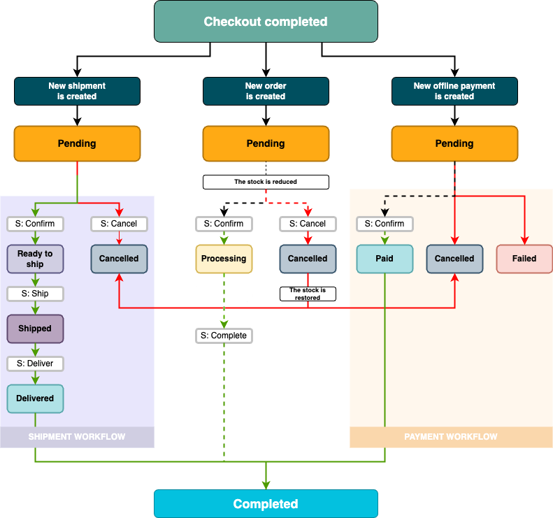

# Commerce

[[= product_name =]] provides a Commerce solution that consists of several modules.
You can use them to create a unified and streamlined e-commerce platform.
Modules interact with each other, for example, to decrease stock following a sale, or cancel shipments and payments when orders are cancelled.

The solution complements functionalities provided by the [PIM](products.md) offering, and allows you to sell products through the website.
With Commerce, you can build your own storefront from a set of generic components, which you can then customize to cover all aspects of the e-commerce experience.

Out of the box, Commerce is configured to follow a specific workflow and support a certain number of processing method types, for example, flat rate, free shipping methods, and offline payment methods.
Contact your administrator or development team about customization options.
For more information, see [developer documentation]([[= developer_doc =]]/commerce/commerce/).

The following diagram includes statuses and actions that may occur on the order's way along the fulfilment path.

From the end-user perspective, once it is properly configured to grant the right permissions to [user Roles](../permission_management/permissions_and_users.md), the Commerce solution gives store managers control over the whole order fulfilment process, while allowing customers to monitor the progress of their transactions.

Once the order is placed, users can interact with it by working with the following back office pages:

[[= cards([
    "commerce/order_management/order_management",
    "commerce/payment/payment_management",
    "commerce/shipping_management/shipping_management"
], columns=3) =]] 