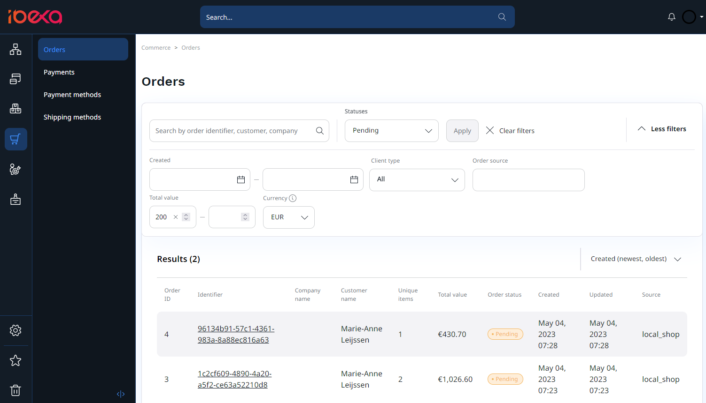

# Order management

The Order management module allows the system to create orders following a purchase made by a customer of the e-commerce presence.

With the Back Office **Orders** screen, you can search for orders and filter search results. 
Depending on the permissions assigned to your [user role](../permission_management/permissions_and_users.md), you might be able to review order details, track order fulfillment status, and cancel orders.

The Order management package interacts with other packages of the system, so that:

- when you successfully pass the checkout stage, stock is decreased and payment and shipment workflows are initiated
- when you cancel your order, stock is replenished and payment and shipment are cancelled