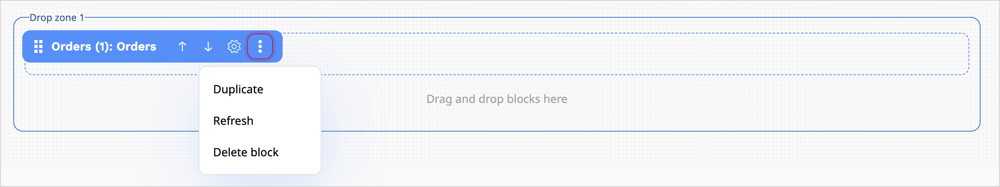
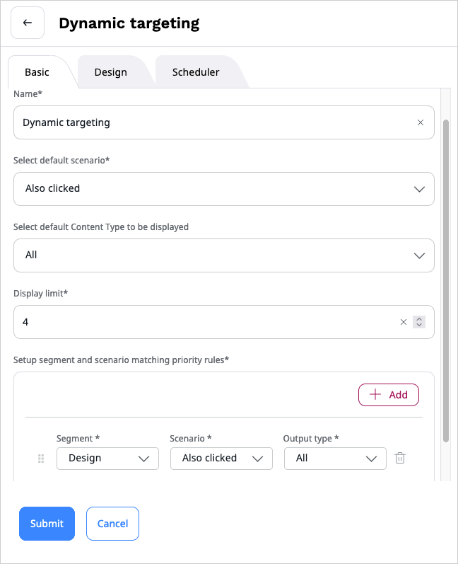
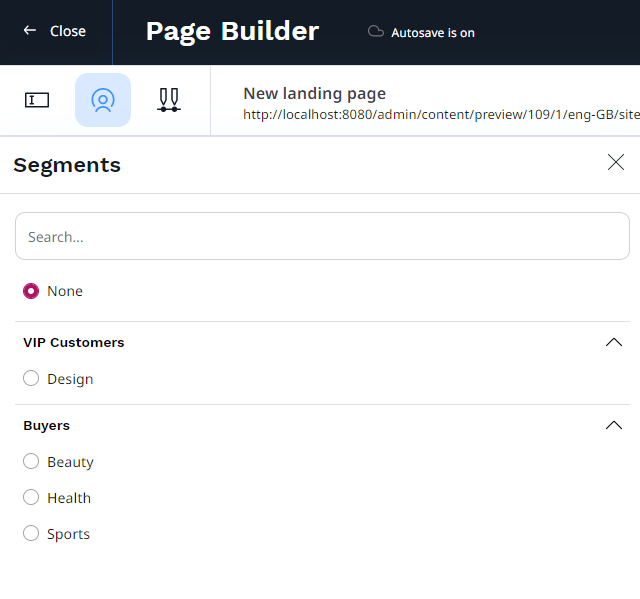

# Block reference

The following blocks are provided with a clean installation of [[= product_name =]]:

|Block|Description|
|-----|-----------|
|[Banner](#banner-block)|Displays an image content item with a URL attached to it.|
|[Bestsellers](#bestsellers-block)|Displays a list of products that were recently a bestseller.|
|[Campaign](#campaign-block)|Displays a campaign selected from [[= product_name_engage =]].|
|[Catalog](#catalog-block)|Displays products from a specific catalog to a selected customer group.|
|[Code](#code-block)|Enables you to place text, links, images, etc. on your Page using custom HTML.|
|[Collection](#collection-block)|Displays a set of content items you select manually from the content structure. |
|[Content List](#content-list-block)|Displays content items of a chosen content type (or types) that are contained in a selected folder. |
|[Content Scheduler](schedule_publishing.md#content-scheduler-block)|Displays content items at a pre-defined time. |
|[Dynamic targeting](#dynamic-targeting-block)|Embeds recommended items based on the [Segment](content_organization/classify_content.md#segments) the user belongs to. |
|[Embed](#embed-block)|Embeds a content item of any content type on the Page. |
|[Form](#form-block)|Embeds a Form content item that you select from the content structure. |
|[Gallery](#gallery-block)|Displays all images contained in a selected folder. |
|[[[= product_name_connect =]]](#ibexa-connect-block)|Retrieves and displays data from an [[= product_name_connect =]] webhook. |
|[Last purchased](#last-purchased-block)|Displays a list of products that were recently purchased from PIM. |
|[Last viewed](#last-viewed-block)|Displays a list of products from PIM that were recently viewed. |
|[Orders](#orders-block)|Displays a list of orders associated with a particular company or individual customer. |
|[Personalized](#personalized-block)|Displays a list of content items/products that are recommended to end users when specific scenarios are triggered. |
|[Product collection](#product-collection-block)|Displays a list of specifically selected products.|
|[Recently added](#recently-added-block)|Displays a list of products that were recently added to PIM. |
|[RSS](#rss-block)|Loads and displays news from RSS feeds (channels). |
|[Sales representative](#sales-representative)|Loads and displays company's sales representative.|
|[SeenThis!](#seenthis-block)|Displays video with exceeded standard video restrictions of 3.5MB.|
|[Targeting](#targeting-block)|Embeds an content item based on the [Segment](content_organization/classify_content.md#segments) the user belongs to. |
|[Text](#text-block)|Enables you to add to the Page a Rich Text block. |
|[Video](#video-block)|Embeds a video into the Page with standard playback controls. |

[[= include_file('docs/content_management/create_edit_pages.md', 86, 96) =]]

## Block basics

Handling blocks is straightforward, drag and drop them into the desired spot within the drop zone.
There's no need to worry about getting their placement perfect initially, you can rearrange them whenever you need.

### Settings

You have the ability to control individual blocks by accessing their settings.
Click on the settings icon next to the block's name.

The settings include:

- Move Up — change the block's position by shifting it upwards.
- Move Down — change the block's position by shifting it downwards.
- Configuration — access the configuration window.
- Duplicate — create a copy of the block below the original, including its settings.
- Refresh — update the block's preview.
- Delete — remove the existing block.

### Design tab

In the block configuration, on the **Design** tab, under the **View** field, you can select the layout for presenting a block.

### Scheduler tab

In the block configuration, on the **Scheduler** tab, you can set a date for the block to be revealed or hidden.

## Banner block

The banner block showcases an image linked to a specific URL.
It can be used for creating visually appealing banners or promotional sections on websites that require linked images to direct users to specific pages or content.
On the **Properties** tab, set values in the following fields:

- **Name** — Enter a name for the page block.
- **Image** — Click **Select content**, browse the available content, and choose an image for display.
- **URL** — Enter a URL that opens when users click on the banner block.

## Bestsellers block

Displays products that were recently top sellers, to help users discover popular items quickly.
On the **Properties** tab, set values in the following fields:

- **Name** – Enter a name for the page block.
- **Personalization scenario** – Select "Bestsellers" to display popular products.
- **Product Types to be displayed** – Select the type of products to be displayed on the list.
- **Limit** – Set the number of products to be displayed.

On the **Design** tab, in the **View** field, select the layout to be used to present a list of products and submit your changes.

## Campaign block

Displays a campaign created and configured in [[[= product_name_engage =]]](../ibexa_engage/ibexa_engage.md).
On the **Properties** tab, set values in the following fields:

- **Name** – Enter a name for the campaign.
- **Campaign** – Select a campaign that you want to display on the page. The list contains only those campaigns from your Qualifio account, which are active or scheduled to launch in the future.

## Catalog block

Shows products from a chosen catalog tailored for a particular group of customers, ensuring a personalized browsing experience.

Before you configure this block, make sure that there are [catalogs](work_with_catalogs.md) that are defined
and published in your PIM.
On the **Properties** tab, set values in the following fields:

- **Name** – Enter a name for the page block.
- **Default catalog** – Select a catalog that is displayed to end-users who are anonymous or not part of any customer group assigned to specific catalogs.
- **Set up customer group and catalog** — Add at least one assignment: add a row, then select a customer group and a matching catalog.
- **Display limit** – Set the number of products to be displayed.

On the **Design** tab, in the **View** field, select the layout to be used to present a list of products and submit your changes.

## Code block

Enables you to use custom HTML to add customized text, links, images, and more to your page.
On the **Properties** tab, set values in the following fields:

- **Name** — Enter a name for the page block.
- **Content** — Enter the HTML code for the content you want to display.

## Collection block

Displays a collection of content items manually selected from the content structure, allowing you to feature specific content for promotional campaigns or highlight essential information on your website.
On the **Properties** tab, set values in the following fields:

- **Name** — Enter a name for the page block.
- **Location list** — Click **Select content**, browse the available content, and add to the collection content items of any content type you want.

All selected content items appear in the **Selected items** box at the bottom of the window.
When done selecting, click **Confirm**.

## Content List block

Displays content items of specified content type from a selected folder, simplifying access to categorized information or targeted content presentation on your site.
On the **Properties** tab, set values in the following fields:

- **Name** — Enter a name for the page block.
- **Parent** — Click **Select content**, browse the content, and select a folder containing content items to display in the list.
- **Limit** — Set the number of products to be displayed.
- **Content types to be displayed** — Select content type(s) to be displayed.

## Dynamic targeting block

Dynamic targeting block provides recommended items based on users related to the configured Segments.

On the **Properties** tab, set values in the following fields:

- **Name** — Enter a name for the page block.
- **Select default scenario** — Select the default scenario for recommended items that should be rendered if the current user
is not assigned to any Segment.
- **Setup segment and scenario matching priority rules** — Select a Segment group, a Segment identifier and Scenario that you want to display recommendations from.
- **Display limit** — Set the number of products to be displayed.

The rules are checked in order, so when a user belongs to more than one Segment, the first rule applies.

## Embed block

Place any content item directly on the page. This function works across all content types seamlessly.
On the **Properties** tab, set values in the following fields:

- **Name** — Enter a name for the page block.
- **Content** — Click **Select content**, browse the content, and select a content item.

## Form block

Place a selected form from the content structure onto the page.
Integrate specific forms into your content to enhance client interaction.
Completing the settings of the Form block requires at least one Form content item created.

On the **Properties** tab, set values in the following fields:

- **Name** — Enter a name for the page block.
- **Form** — Click **Select content**, browse the content, and select a Form content item to append it to the block.

!!! caution "Known limitation"

    To display two or more identical forms on a single page, have your developer create multiple identical form blocks for your use. This prevents potential issues related to duplicate data submission.

    For more information about creating form blocks, see [Creating a newsletter form]([[= developer_doc =]]/content_management/pages/create_custom_page_block/) in developer documentation.

## Gallery block

Presents a comprehensive visual array by displaying all images from your selected folder.
On the **Properties** tab, set values in the following fields:

- **Name** — Enter a name for the page block.
- **Folder** — Click **Select content**, browse the content, and select a folder containing images to display.

After submitting the settings, all images in the folder are shown in the Gallery block.
Selecting a folder containing content items other than images results in displaying only a link to the folder where they're stored.

## [[= product_name_connect =]] block

Access and showcase data retrieved from an [[= product_name_connect =]] webhook. Streamline information presentation for seamless insights and improved decision-making.
On the **Properties** tab, set values in the following fields:

- **Name** – Enter a name for the page block.
- **Webhook link** — Enter the link for the [[= product_name_connect =]] webhook.

!!! caution "Using [[= product_name_connect =]] scenario block"

    For more information about using [[= product_name_connect =]] scenario block, see [[[= product_name_connect =]] scenario block]([[= developer_doc =]]/content_management/pages/ibexa_connect_scenario_block/) in developer documentation.

## Last purchased block

Showcases a list of recently purchased products from PIM.
Helps keep track of recent sales and improve product visibility.
On the **Properties** tab, set values in the following fields:

- **Name** – Enter a name for the page block.
- **Personalization scenario** – Select "Last purchased" to display products that were recently purchased from PIM by any user, or "Last purchased by user" to display products that were recently purchased by the current user.
- **Product Types to be displayed** – Select the type of products to be displayed on the list.
- **Limit** – Set the number of products to be displayed.

## Last viewed block

Showcases a list of recently viewed products from PIM.
Helps track and show recent product interests for quick access and informed decisions.
On the **Properties** tab, set values in the following fields:

- **Name** – Enter a name for the page block.
- **Personalization scenario** – Select "Last viewed" to display products that were recently viewed by any user, or "Last viewed by user" to display products that were recently viewed by the current user.
- **Product Types to be displayed** – Select the type of products to be displayed on the list.
- **Limit** – Set the number of products to be displayed.

## Orders block

Showcases a list of orders linked to a specific company or individual customer.
Helps track purchase history for streamlined customer service and personalized interactions.
On the **Properties** tab, set values in the following fields:

- **Name** – Enter a name for the page block.
- **Columns** — Select columns that should be displayed in the orders table. Some columns are preselected, example: Order ID, Customer name, Total value etc.
- **Statuses** — Set the statuses of orders that should be included in the list.
- **Number of orders** — Set the number of orders to be displayed.
- **Sort order** — Set the sort order for the displayed orders.

## Personalized block

Showcases recommended content items or products triggered by specific scenarios for end users.
Enhances user experience by suggesting tailored options for various situations.
On the **Properties** tab, set values in the following fields:

- **Name** – Enter a name for the page block.
- **Select a scenario** – Select "Landing Page" or "Top clicked".
- **Select a content type to be displayed** – Select "Product".
- **Display limit** – Set the number of products to be displayed.

On the **Design** tab, in the **View** field, change the layout to "Products" and submit your changes.

## Product collection block

Presents curated collections of items for easier exploration and discovery.
On the **Properties** tab, set values in the following fields:

- **Name** – Enter a name for the page block.
- **Product list** — Create a list of products. Enter a comma-separated list of product/variant codes and click **Add** or click **Select product**. Then, in content browser, select products, and click **Confirm**.

!!! note

    Due to a technical limitation, content browser does not display product variants.

## Recently added block

Highlights recently added products from PIM.
Quickly informs users about new additions for quicker distribution and popularizing added products.
On the **Properties** tab, set values in the following fields:

- **Name** – Enter a name for the page block.
- **Personalization Scenario** – Select "Recently added items" to display products that were recently added to PIM.
- **Product Types to be displayed** – Select the type of products to be displayed on the list.
- **Limit** – Set the number of products to be displayed.

## RSS block

Imports and showcases news content from RSS feeds (channels), helping users stay informed with the latest updates and diverse news sources.
On the **Properties** tab, set values in the following fields:

- **Name** – Enter a name for the page block.
- **URL** — Enter the URL for the RSS news feed.
- **Limit** — Set the number of news items to be displayed.
- **Offset** — Set the limit of featured news items to be displayed.

## Sales representative

Imports and showcases sales representatives for the company in the Customer Portal.
Gives users a way to connect with the team that handles their sales needs.
On the **Properties** tab, set values in the following fields:

- **Name** – Enter a name for the page block.

On the **Design** tab, in the **View** field, select the layout to be used to present the Sales representative's details view and submit your changes.

## SeenThis! block

Integration with [SeenThis!](https://seenthis.co/) service. SeenThis! block provides an adaptive streaming technology with no limitations as conventional streaming service. It allows to preserve the best video quality with minimum amount of data transfer.

!!! note
    This page block is in an opt-in bundle, to use it, install `ibexa/connector-seenthis` bundle first.

On the **Properties** tab, set values in the following fields:

- **Name** – Enter a name for the page block.
- **Video ID** – Enter the ID of the video to be streamed.
- **Tracker ID** – Enter the tracking code.
- **Big play button** – Set to display a large play button.
- **Autoplay** – Configure whether the video starts automatically.
- **Muted** – Configure whether the video starts muted.
- **Play button** – Set the number of products to be displayed.
- **Mute button** – Set whether the mute button is displayed or not.
- **Loop** – Set whether to play a video in a loop mode.
- **Loop count** – Set the number of loop repetitions.
- **Include audio** – Configure whether to include audio with the video.

!!! note

    SeenThis! technology might be blocked by some ad blocker solutions. If you can't see the block once configured, check the ad blocker configuration.

## Targeting block

Targeting block provides recommendation of content based on users related to the configured Segments.

On the **Properties** tab, set values in the following fields:

- **Name** – Enter a name for the page block.
- **Select default content** — Click **Select content**, browse the content, and choose the default content item to display when no priority rules are valid.
- **Setup segment and content matching priority rules** — Select a Segment Group and a Segment,
then click **Select content** and navigate to the content item that you want to display for the selected group.

The rules are checked in order, so when a user belongs to more than one Segment, the first rule applies.

You can preview the Page for each of the available Segments:

## Text block

Adds a Rich Text block to the Page.
On the **Properties** tab, set values in the following fields:

- **Name** – Enter a name for the page block.
- **Content** — Enter text, images, videos, etc. using online editor.
For details, see [Editing Rich Text Fields](create_edit_content_items.md#edit-rich-text-fields).

## Video block

Integrates a video into the Page with standard playback controls.
Helps enhance content variety and captivate audiences with seamless video viewing.
On the **Properties** tab, set values in the following fields:

- **Name** – Enter a name for the page block.
- **Video** — Click **Select content**, browse the content, and select a video to display in the block.

On the **Properties** tab you can preview the selected video before adding it to the Page.