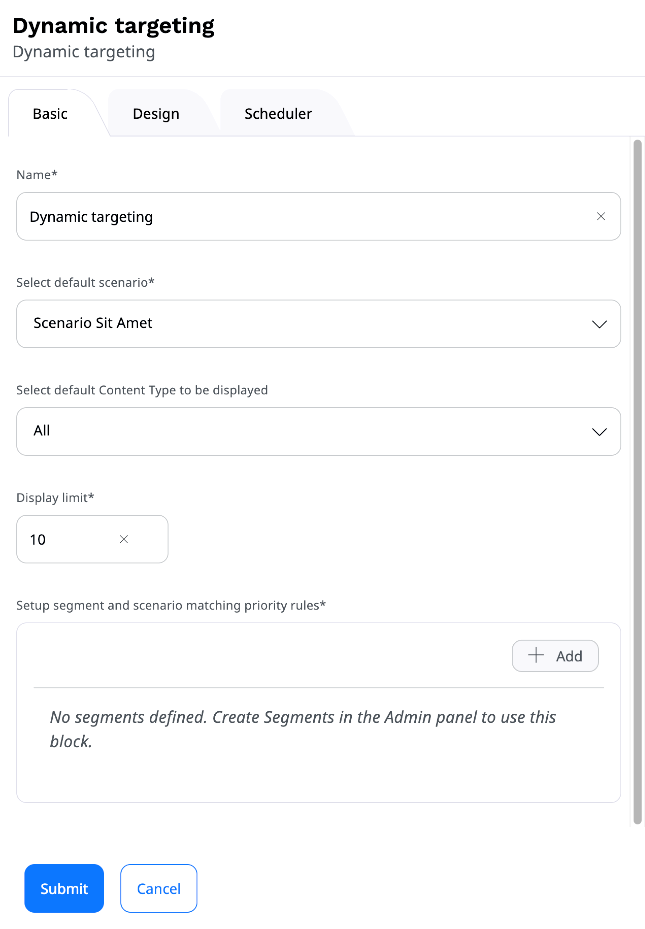

# Block reference

The following blocks are provided with a clean installation of [[= product_name =]]:

|Block|Description|
|-----|-----------|
|[Banner](#banner-block)|Displays an image Content item with a URL attached to it.|
|[Bestsellers](#bestsellers-block)|Displays a list of products from PIM that were recently a bestsellers.|
|[Catalog](#catalog-block)|Displays products from a specific catalog to a selected customer group.|
|[Code](#code-block)|Enables you to place text, links, images, etc. on your Page using custom HTML.|
|[Collection](#collection-block)|Displays a set of Content items you select manually from the Content structure. |
|[Content List](#content-list-block)|Displays Content items of a chosen Content Type (or Types) that are contained in a selected folder. |
|[Content Scheduler](schedule_publishing.md#content-scheduler-block)|Displays Content items at a pre-defined time. |
|[Dynamic targeting](#dynamic-targeting-block)|Embeds recommended items based on the [Segment](content_organization/classify_content.md#segments) the user belongs to. |
|[Embed](#embed-block)|Embeds a Content item of any Content Type on the Page. |
|[Form](#form-block)|Embeds a Form Content item that you select from the Content Structure. |
|[Gallery](#gallery-block)|Displays all images contained in a selected folder. |
|[Last purchased](#last-purchased-block)|Displays a list of products that were recently purchased from PIM. |
|[Last viewed](#last-viewed-block)|Displays a list of products from PIM that were recently viewed. |
|[Personalized](#personalized-block)|Displays a list of Content items/products that are recommended to end users when specific scenarios are triggered. |
|[Product collection](#product-collection-block)|Displays a list of specifically selected products.|
|[Recently added](#recently-added-block)|Displays a list of products that were recently added to PIM. |
|[RSS](#rss-block)|Loads and displays news from RSS feeds (channels). |
|[Targeting](#targeting-block)|Embeds an Content item based on the [Segment](content_organization/classify_content.md#segments) the user belongs to. |
|[Text](#text-block)|Enables you to add to the Page a Rich Text block. |
|[Video](#video-block)|Embeds a video into the Page with standard playback controls. |

[[= include_file('docs/content_management/create_edit_pages.md', 86, 96) =]]

## Banner block

On the **Basic** tab, perform the following actions:

- In the **Name** box, provide the name of the block that will appear on the Page.
- In the **Image** section, click **Select content**, navigate through the content and select an image to display.
- In the **URL** box, enter a URL to open when clicking the selected image.

## Bestsellers block

In the **Basic** tab, set values in the following fields:

- **Name** – Enter a name for the page block, for example, "Your recent bestsellers".
- **Personalization scenario** – Select "Bestsellers" to display products from PIM that were recently a bestsellers.
- **Product Types to be displayed** – Select the type of products to be displayed on the list, for example, "Pendrives" or "Headphones".
- **Limit** – Set the number of products to be displayed.

On the **Design** tab, in the **View** field, select the layout be used to present a list of products and submit your changes.

## Catalog block

Before you configure this block, make sure that there are [catalogs](../pim/work_with_catalogs.md) that are defined 
and published in your PIM.

On the **Basic** tab, set values in the following fields:

- **Name** – Optionally, enter a name for the page block, for example, "15-inch laptops" or "Fishing rods".
- **Setup customer group and catalog matching priority rules** - Create at least one assignment: add a row, then select a customer group and a matching catalog. 
- **Default catalog** – Select a catalog that is displayed to end-users who are either 
anonymous or do not belong to any of the customer groups assigned to specific catalogs.
- **Limit** – Set the number of products to be displayed.

On the **Design** tab, in the **View** field, select the layout to be used to present a list of products and submit your changes.

## Code block

On the **Basic** tab, perform the following actions:

- In the **Name** box, provide the name of the block that will appear on the Page.
- In the **Content** box, enter the HTML code for the content you want to display on the Page.

## Collection block

On the **Basic** tab, perform the following actions:

- In the **Name** box, provide the name of the block that will appear on the Page.
- In the **Location list** section, click **Select content**, navigate through the content
and add to the collection Content items of any Content Type you want.
All selected Content items appear in the **Selected items** box at the bottom of the window.
When done selecting, click **Confirm**.

## Content List block

On the **Basic** tab, perform the following actions:

- In the **Name** box, provide the name of the block that will appear on the Page.
- In the **Parent** section, click **Select content**, navigate through the content and select a folder containing Content items
to display on the list. Click **Confirm**.
- In the **Limit** section, enter a number or use the up and down buttons to set the limit of Content items to display.
- From the **Content Types to be displayed** list, select Content Type(s) to be displayed.
The block will display Content items of the selected Content Types that are in the selected parent folder.

## Dynamic targeting block

Dynamic targeting block provides recommended items based on users related to the configured Segments.

On the **Basic** tab, perform the following actions:

- In the **Name** field, provide the name of the block.
- In the **Select default scenario** section, select the default scenario for recommended items that should be rendered if the current user
is not assigned to any Segment.
- In the **Setup segment and scenario matching priority rules** drop-down, select a Segment group, a Segment identifier and Scenario that you want to display recommendations from.
- In the **Display limit** field, set the number of recommended items to be displayed, for example, 4.

The rules are checked in order, so when a user belongs to more than one Segment, the first rule applies.

## Embed block

On the **Basic** tab, perform the following actions:

- In the **Name** box, provide the name of the block that will appear on the Page.
- Select content to embed by clicking **Select content**. Navigate to a Content item, select it and click **Confirm**.

## Form block

Note that completing the settings of the Form block requires at least one Form Content item created.

On the **Basic** tab, perform the following actions:

- In the **Name** box, provide the name of the block that will appear on the Page.
- In the Form section, click **Select content**, navigate through the content and select a Form Content item to append it to the block.

!!! caution "Known limitation"

    To present two or more identical forms on one Page, ask your developer to create several identical form blocks that you can then use. Otherwise you may encounter issues with duplicate data submission.
    
    For more information about creating form blocks, see [Creating a newsletter form]([[= developer_doc =]]/content_management/pages/create_custom_page_block/) in developer documentation.

## Gallery block

On the **Basic** tab, perform the following actions:

- In the **Name** box, provide the name of the block that will appear on the Page.
- In the **Folder** section, click **Select content**, navigate through the content, select a folder containing images to display and click **Confirm**.
After submitting the settings, all images in the folder will appear in the Gallery block.
Note that selecting a folder containing Content items other than images results in displaying only a link to the folder they are stored in.

## Last purchased block

On the **Basic** tab, set values in the following fields:

- **Name** – Optionally, enter a name for the page block, for example, "Up-to-date products" or "Your recent purchases".
- **Personalization scenario** – Select "Last purchased" to display products that were recently purchased from PIM by any user, or "Last purchased by user" to display products that were recently purchased by the current user.
- **Product Types to be displayed** – Select the type of products to be displayed on the list, for example, "Hardware" or "Linear bearings".
- **Limit** – Set the number of products to be displayed.

On the **Design** tab, in the **View** field, select the layout be used to present a list of products and submit your changes.

## Last viewed block

On the **Basic** tab, set values in the following fields:

- **Name** – Optionally, enter a name for the page block, for example, "Popular products" or "Your browsing history".
- **Personalization scenario** – Select "Last viewed" to display products that were recently viewed by any user, or "Last viewed by user" to display products that were recently viewed by the current user.
- **Product Types to be displayed** – Select the type of products to be displayed on the list, for example, "Bicycles" or "Dental care".
- **Limit** – Set the number of products to be displayed.

On the **Design** tab, in the **View** field, select the layout be used to present a list of products and submit your changes.

## Personalized block

On the **Basic** tab, set values in the following fields:

- **Name** – Optionally, enter a name for the page block, for example, "Bestsellers".
- **Select a scenario** – Select "Landing page" or "Top clicked".
- **Select a Content Type...** – Select "Product".
- **Display limit** – Set the number of products to be displayed, for example, 4.

On the **Design** tab, in the **View** field, change the layout to "Products" and submit your changes.

## Product collection block

On the **Basic** tab, perform the following actions:

- In the **Name** box, provide the name of the block that will appear on the Page, 
for example, "Summer giveway".
- In the **Product list** area, create a list of products: 
- In the **Add product code** field, enter a comma separated list of product/variant codes and click **Add**. 
- Click **Select product**. Then, in content browser, select products and click **Confirm**.

!!! note

    Due to a technical limitation, content browser does not display product variants.

On the **Design** tab, in the **View** field, select the layout be used to present a list of products and submit your changes.

## Recently added block

On the **Basic** tab, set values in the following fields:

- **Block name** – Optionally, enter a name for the page block, for example, "Newest additions".
- **Product Types to be displayed** – Select the type of products to be displayed on the list, for example, "Personal hygiene" or "Drill bits".
- **Display limit** – Set the number of products to be displayed, for example, 4.

On the **Design** tab, in the **View** field, select the layout be used to present a list of products and submit your changes.

## RSS block

On the **Basic** tab, perform the following actions:

- In the **Name** box, provide the name of the block that will appear on the Page.
- In the **URL** box, provide the URL for the RSS news feed.
- In the **Limit** box, enter a number or use the up and down buttons to set the limit of news items appearing in the block.
- In the **Offset** box, enter a number or use the up and down buttons to set the limit of featured news items appearing in the block.

## Targeting block

Targeting block provides recommendation of content based on users related to the configured Segments.

On the **Basic** tab, perform the following actions:

- In the **Name** box, provide the name of the block.
- In the **Select default content** section, click **Select content**, navigate through the content
and select the default Content item that will be displayed when no priority rules are valid.
- In the **Setup segment and content matching priority rules** section, select a Segment Group and a Segment,
then click **Select content** and navigate to the Content item that you want to display for the selected group.

The rules are checked in order, so when a user belongs to more than one Segment, the first rule applies.

You can preview the page for each of the available Segments:

## Text block

On the **Basic** tab, perform the following actions:

- In the **Name** box, provide the name of the block that will appear on the Page.
- In the **Content** box, enter text, images, videos, etc. using the Online Editor.
For details, see [Editing Rich Text Fields](create_edit_content_items.md#edit-rich-text-fields).

## Video block

On the **Basic** tab, perform the following actions:

- In the **Name** box, provide the name of the block that will appear on the Page.
- In the **Video** section, click **Select content**, navigate through the content, select a video to display in the block and click **Confirm**.
On the **Basic** tab you can preview the selected video before adding it to the Page.
