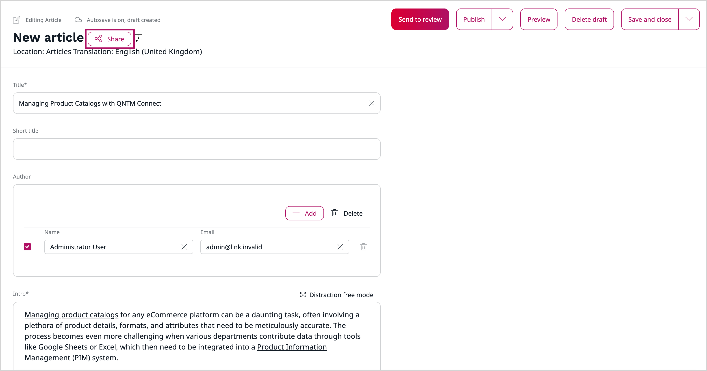
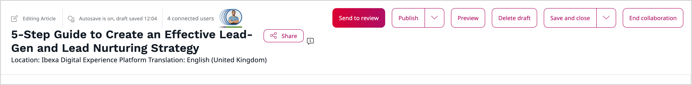

# Collaborative editing

Collaborative editing is a feature that allows multiple users to work on the same content item at the same time.
The system automatically tracks changes and allows users to collaborate within a single application, without the need for third-party tools.
Uses can work together and use a real-time editor to create and review content live.
This makes teamwork faster, more efficient, and simplifies content review process.
It allows to work directly with members of other teams, such as subject matter experts, compliance professionals, and sales representatives, to increase content quality.

## Collaboration session

When you create a new draft of content item you can invite other users to join a collaboration session, thanks to [CKEditor collaboration features](https://ckeditor.com/ckeditor-5/capabilities/collaboration-features/).

To invite collaborators, click the **Share** button, which creates a new collaboration session.
Then, in a pop-up window, you can invite users to newly created session.

!!! note

    Only the Owner can invite other users and initiate collaboration session.
    You can only invite users with permissions.
    Users without permissions are grayed out and you can't select them and invite them to the session.

You can invite two types of users:

- **Internal** - by searching their name or email address. These users can either edit the content item or preview it, depending on your choice.

- **External** - by providing their email address in the field. They can only preview the content item (editing option isn't available, it's greyed out).

Additionally, you can share a direct link to the collaborative session.
To do it, click the **Copy link** button.
Link is copied to the clipboard and you can share it with the users through communication channels.

After inviting users to a collaboration session, they receive a notification:

- visible when clicking the **Notification** icon on the main dashboard (internal users)
- by email (external users)

Collaboration session begins when first invited user accepts the invitation and joins the session, and ends when the Owner performs one of the action:

- save and close
- publish the content (including "Publish later" option)
- delete content draft
- discard
- move the draft in the workflow
- end collaboration session

Each user can leave collaboration session anytime or rejoin it.

## Editing content item

Real-time collaboration is enabled in Rich Text fields.
Other fields are disabled and can be only edited by the Owner of the content item.

Real-time collaboration is available for the following content types containing Rich Text fields:

- Article
- Folder
- Form
- Product category
- Custom content types
- Product (without variants)

There are two modes of the collaboration:

- **Real-time (online)** - editing content at the same time with real-time tracking of the presence and changes of other users
- **Asynchronous** - ediitng content in different time, saving changes as new version

Only the Owner can publish content, save it, delete the draft, or publish it.
Changes are automatically saved when the Owner saves or publishes the content.
Users can continue collaboration without the Owner presence, but they cannot save, or publish changes.

### Real-time collaboration

Collaborative editing feature works by syncing changes in real time, so everyone can see updates instantly.
Avatars of the users invited to collaboration session are visible at the top of the editing screen, also in distraction free mode.
While editing Rich Text fields, you can see colored tracking tags with user avatar thumbnails that indicate who is currently working on it.

Thanks to this, other users in the same session and editing the same piece of the content item at the same time, can see the actions and editing elements performed by a specific user.

You can see all users belonging to a given content item's collaboration session.
All users avatars should are displayed:

- at the top of the content item editing window
- in distraction free mode

When you hover over the user avatar, the user’s first and last name is displayed.
If you want to see all participants list, click at the avatars group.

## Work with draft

You can access created draft in **Content** -> **Drafts**.
Here you can join your collaboration session, share with more users, edit given permissions, or delete the draft.

## Dashboard blocks

Collaborative editing feature brings two new tabs in **My content** dashboard block:

- **My shared drafts** - displays all drafts with active collaborations and shared by the user. Includes following columns: Name, Content type, Modified language, Version, Modified, Shared with (lists all the users who received the invitation to the collaboration session). From this tab, you can perform following actions: Share, Join, Edit

- **Drafts shared with me** - displays all drafts with active collaborations and shared with the user. Includes following columns: Name, Content type, Modified language, Version, Modified, Shared by (displays the user who invited to join the collaboration session). From this tab, you can perform following action: Join

From the dashboard, you can share drafts or join collaboration session for selected content draft.