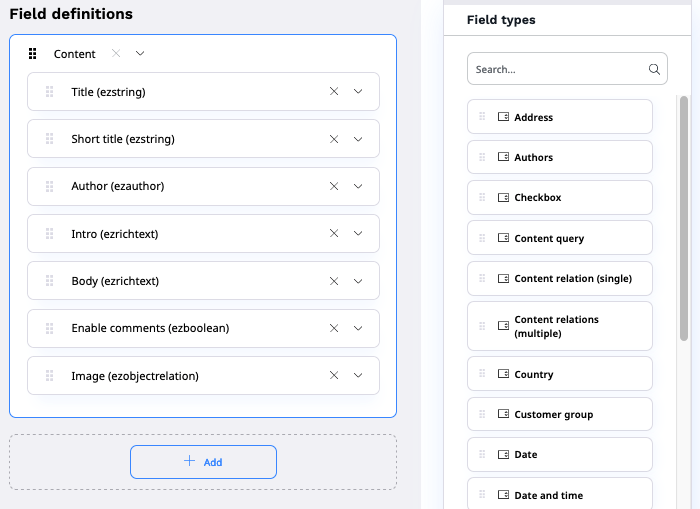
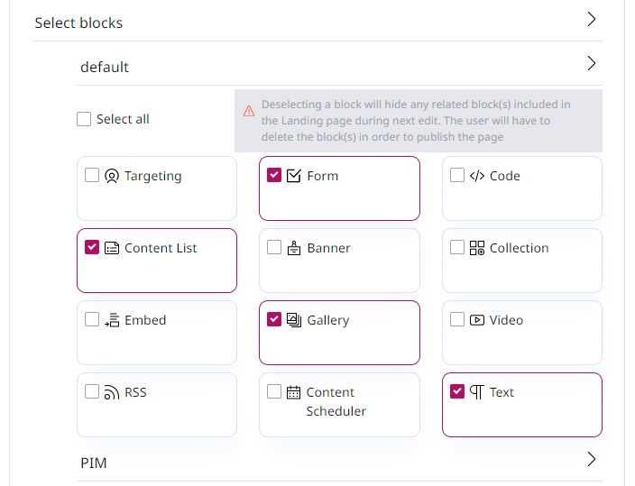
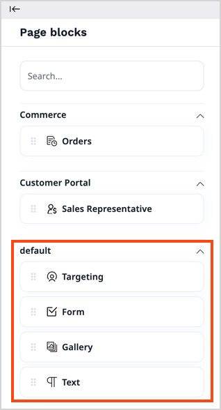
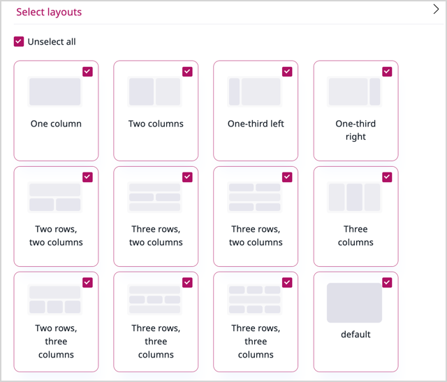
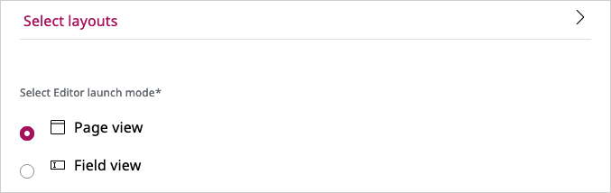
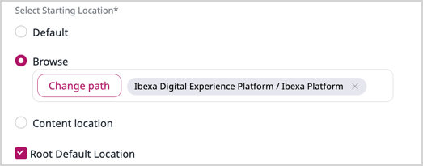

# Configure content type fields

When you work with a [content type](content_model.md#content-types) to add or modify [fields](content_model.md#fields-and-field-types),
you must configure different settings that control the way [[= product_name =]] treats the contents of each field.
Apart from general settings, certain field types, for example, [landing page](#default-configuration-of-pages) and [content relation](#content-relation-settings) field types may have additional settings.

You can only create or modify content types when your [user role](../permission_management/work_with_permissions.md) has the `ContentType/Create` or `ContentType/Update` permission.

1\. [Create or open a content type](create_edit_content_types.md) for editing.

2\. In the **Field definitions** area, find a section, for example, **Content**.

3\. If your application requires a more granular organization of fields within a content type, click **+ Add** to add more sections.

When you add a **Metadata** section, it's later presented as an additional tab in [content item](content_items.md) editing screen.
You can use it, for example, for tags or product categories.
When you add other sections, they're later presented as anchors in content item editing screen.
All sections are later presented as headers on the content item details screen, the **View** tab.

4\. Add, reorder or remove fields as required:

- To add a field, from the **Field types** area, drag the required field tile to the section on the left.
- To reorder fields, drag and drop them within the section or between sections on the left.
- To remove fields from the section completely, click the **X** icon in the field's header.

5\. Expand the header of a field that you want to modify, then [change its settings](#general-settings).

6\. To save your changes:

- Click **Save** and continue editing.
- Click **Save and close** to close the window.

7\. To discard your changes and close the window:

- If you're creating a new content type, click **Discard**.
- If you're updating an existing content type, click **Delete draft**.

## General settings

Depending on their type, fields can have different combinations of the following general settings.

|Setting|Description|Use|
--------|-----------|---|
|Name|A user-friendly name that describes the field, used in the interface. It can be up to 255 characters long and consist of letters, digits, spaces, and special characters.|Required|
|Identifier|An identifier for system use in configuration files, templates, or PHP code. It can be up to 50 characters long and can only contain lowercase letters, digits and underscores. Also used in name patterns for the content type.|Required|
|Description|A detailed description of the field. It's displayed next to it when the user edits the content item.|Optional|
|Required|Indicates whether a value of the field is required for the content item to be saved or published.|Optional|
|Searchable|Indicates whether a value of the field is included in the search.|Optional|
|Translatable|Indicates whether a value of the field can be translated.|Optional|
|Can be a thumbnail|Indicates whether the field can be a thumbnail.|Optional|

## Default configuration of pages

The following settings control the behavior of content items of [page](../content_management/create_edit_pages.md) type.
You modify them in the **Field definitions** section, the **Landing page** field.

### Block display

You can define which page blocks are available to an editor in the page edit mode.
You do it, for example, when a [developer creates a new block]([[= developer_doc =]]/content_management/pages/create_custom_page_block/) and you want to allow adding it to the page.

Expand the **Select blocks** section and select page blocks that you want to be included in the page.

Now, only selected page blocks are available in the edit mode.

!!! caution

    When you deselect blocks, any related blocks that are included in the page hide as well.
    To publish the page, the editor has to remove these blocks from the page, too.

### Available page layouts

You can decide which page layouts are available for an editor.

Expand the **Select layouts** section, and define which layouts are available for this page.

If you deselect a layout that is currently used on a page, the editor has to change the layout to be able to edit the page.

### Preferred editing mode

You can set the editing mode that is launched when an editor starts editing the page.
To do it, in the **Select Editor launch mode** section, select one of the available options.

## Content relation settings

When you add or modify a **[Content relation](create_edit_content_items.md#relation_field)** or **Content relation (multiple)** field in a content type, you can decide:

- which content tree location opens in the [content browser](discover_ui.md#content-browser) when the user browses to a related content item
- whether relations can be to content items of a specific type only, or any content type

#### Relation starting location

In the **Select starting Location** area, select from the available options:

- **Default** - the starting location is automatically assigned to the default location in the tree of a created content item.
- **Browse** - use to manually select the location from the content browser.
- **Content location** - the starting location is the location of the content item that is edited by the user. For example, if the user edits the content item with the location `50`, it sets the starting location to this value with children under this location.
- **Root default location** - use if you want the content browser to start at the defined location with only children available for selection.

#### Allowed content types

In the **Allowed content types** area, expand the drop-down list and select from the available content types.
No selection means that relations to all content types are allowed.
