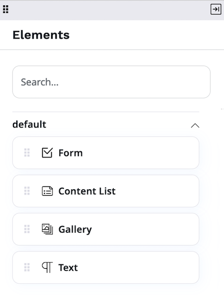

# Configure Content Type Fields

When you [modify a Content Type](create_edit_content_types.md) and add or modify Fields, 
you must configure different settings that control the way [[= product_name =]] 
treats the contents of each Field. Apart from general settings, certain Field Types, such as for example, [Page](#default-configuration-of-pages) and [Relation](#content-relation-settings) Field Types may have additional settings.

You can only create or modify Content Types when your [user role](../permission_management/work_with_permissions.md) has the `ContentType/Create` or `ContentType/Update` permission.

To modify Field settings, in the **Field definitions** section, expand the **Landing page** header. 
When done, click **Save** to apply changes to the Content Type.

## General settings

Depending on their type, Fields can have different combinations of the following 
general settings. 

|Setting|Description|Use|
--------|-----------|---|
|Name|A user-friendly name that describes the Field, used in the interface. It can be up to 255 characters long and consist of letters, digits, spaces and special characters.|Required|
|Identifier|An identifier for system use in configuration files, templates, or PHP code. It can be up to 50 characters long and can only contain lowercase letters, digits and underscores. Also used in name patterns for the Content Type.|Required|
|Description|A detailed description of the Field. It is displayed next the it when the user edits the Content item.|Optional|
|Required|Indicates whether a value the Field is required for the Content item to be saved or published.|Optional|
|Searchable|Indicates whether a value of the Field is included in the search.|Optional|
|Translatable|Indicates whether a value of the Field can be translated.|Optional|
|Can be a thumbnail|Indicates whether the Field can be a thumbnail.|Optional|

## Default configuration of Pages

The following settings control the behavior of Content items of [Page](../content_management/create_edit_pages.md) type. 
You modify them in the **Field definitions** section, the **Landing page** Field.

### Block display

You can define which page blocks are available to an editor in the page edit mode.
You do it, for example, when a [developer creates a new block]([[= developer_doc =]]/content_management/pages/create_custom_page_block/) and you want to allow its selection.

Expand the **Select blocks** section and select page blocks that you want to be included in the page.

Now, only selected page blocks are available in the edit mode.

!!! caution
    When you deselect blocks, any related blocks that are included in the Page 
    hide as well. 
    To publish the Page, the editor has to remove these blocks from the Page, too.

### Available page layouts

You can decide which page layouts are available for an editor.

Expand the **Select layouts** section, and define which layouts are available 
for this Page.

If you deselect a layout that is currently used on a Page, the editor has to change 
the layout to be able to edit the Page.

### Preferred editing mode

You can set the editing mode that is launched when an editor starts editing the Page.

Expand the **Select Editor launch mode** section, and select from the available options.

## Content relation settings

When you add or modify a **[Content relation](create_edit_content_items.md#relation_field)** or **Content relation (multiple)** 
Field in a Content Type, you can decide:

- which Content tree location opens in the 
[Content Browser](content_model.md#content-browser) when the user browses to a related 
Content item 
- whether relations can be to Content items of a specific type only, or any Content Type.

#### Relation starting location

In the **Select starting location** area, select from the available options:

- **Default** - the starting location is automatically assigned to the default location in the tree of a created Content item.
- **Browse** - use to manually select the location from the Content Browser.
- **Content location** - the starting location is the location of the Content item that is edited by the user. For example, if the user edits the Content item with the location `50`, it sets the starting location to this value with children under this location.
- **Root default location** - use if you want the Content Browser to start at the defined location with only children available for selection.

#### Allowed Content types

In the **Allowed Content types** area, expand the pull-down list and select from the available Content Types.
No selection means that relations to all Content Types are allowed.
