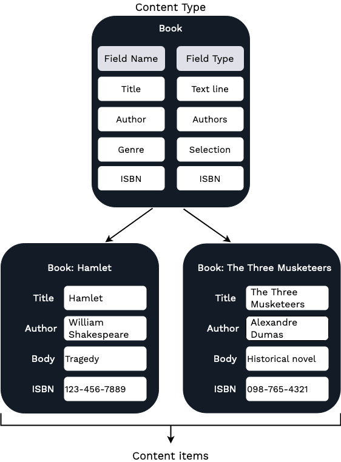

# Content model

At the heart of [[= product_name =]] is a repository that stores all content.
In [[= product_name =]] everything is a content item — not just the actual pages displayed in the website,
but also all media (images, videos, etc.) and user accounts.

[[= product_name =]] lets you customize and adapt the content model depending on your needs and the type of website you create.

Depending on your organization, if you are an editor or a content creator,
it's possible that the content model for your installation has already been created by your administrator or content manager.
However, even a non-technical user can create or modify the content model through the editing interface.

## Content types

A **content type** is comparable to a pattern or a template on which you base [content items](content_items.md).
Whenever you create a new content item, you must choose its content type.

The content type defines what fields are available in the content item.
A content item may only contain the fields that are defined in the content type.

[[= product_name =]] allows you to create, edit, and delete content types and their fields.
A clean installation contains a few basic content types.

## Content items versus content types

A [content item](content_items.md) is an instance of a particular content type, in other words, a single object created based on a content type template.

When a content item is created, it inherits the fields from its content type.
However, the values of the fields (their "contents") are empty, and you need to fill them separately for each content item.
The fields in a content type are only definitions. This means that they describe what fields of what kinds are present in a content item, but as a rule they do not provide these fields' values.

As a consequence, all content items of the same content type share the same set of fields, but their field values are different.

For example, you need to store book information.
You create a new content type called "Book" and add to it fields such as Title, Author, Genre, ISBN, etc.
Next, based on this content type, you can create any number of content items.
You can then fill the empty fields with the information about each specific book:

## Fields and field types

A field type defines what kind of data is stored in a field.
For example, a field with a *TextLine* field type stores a single line of text, an *Image* field type stores an image file,
and *Author* field type holds information about author details (like name and email).
By default, the system comes with a large set of field types that cover the most common needs,
for example, *Text line*, *Rich text*, *Email*, *Author list*, *Content relation*, *Map location*, *Float*, etc.

## Content model in summary

**Content types:**

- A content type defines fields that a content item is composed of.
- Every field is modeled after a field type which defines the kind of data it contains.

**Content items:**

- A content item consists of a number of fields.
- Every content item is based on a content type.

**Fields and field types:**

- [[= product_name =]] comes with a collection of essential field types.
- It's possible to extend the system by creating custom field types for special needs.

!!! note "More information"

    For detailed information about the content model, see [developer documentation]([[= developer_doc =]]/content_management/content_model/#content-information).