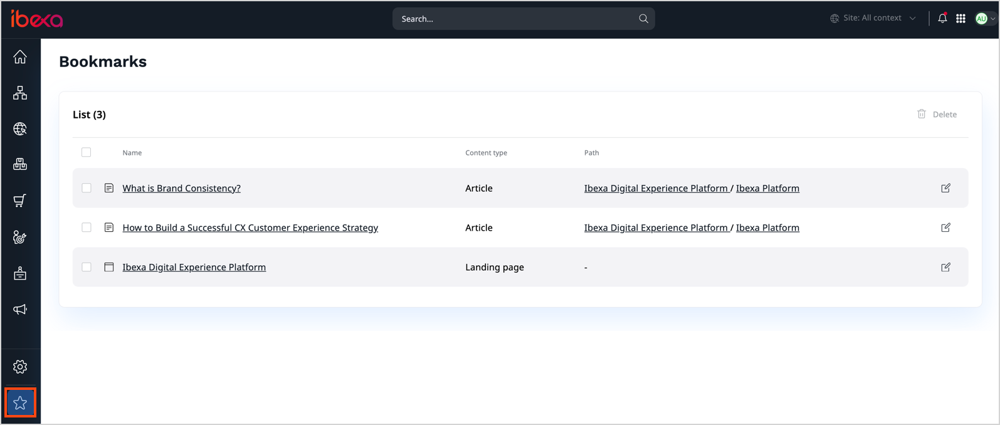
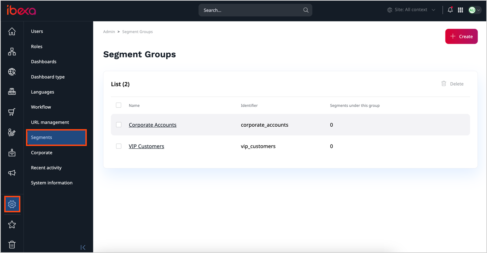

# Classify content

To help you better organize content, [[= product_name =]] comes equipped with 
a number of mechanisms that you can use.

## Sections

You can divide your Content Tree into Sections to better organize it.
Sections let you decide which Users have access to which parts of the tree.
To see which Section a Content item belongs to, look at its **Details** tabs.

You can set up Sections by navigating to **Content** -> **Sections**.
A few Sections are provided with each installation, and you can add new ones.

In the **Sections** tab, you can assign Sections to content or delete them.
You can only delete Sections that do not contain any content.

Each Content item must belong to a Section. By default, new content is placed in the same Section as its parent.
If you want to remove a Content item from a Section, you just need to assign it to a different one.

Access to Sections can be restricted by [setting up proper permissions](../../permission_management/work_with_permissions.md).

## Object states

You can assign specific Object states to all Content items in your website.
You can do it when viewing the Content item, in the **Details** tab, in the **Object state details** section.

!!! note

    The functioning of Object states can be set up differently in each installation.
    Contact your website administrator for information on how to use the states in your case.

## Bookmarks

You can bookmark any Content item by clicking the star icon next to the Content name.

Bookmarks are stored per user. You can view a list of all bookmarks by clicking Bookmarks in the left menu.

## Segments [[% include 'snippets/experience_badge.md' %]] [[% include 'snippets/commerce_badge.md' %]]

With segments you can target content at specific groups of your users.
You can use them to display different content to different Page visitors by using the [Targeting block](create_edit_pages.md#targeting-block).

You can create and configure Segments and Segment Groups in the **Admin** section of the Back Office.

!!! note

    Assigning Users to Segments happens automatically according to rules set up by the administrator.
    Contact your website administrator for more information about your setup.
