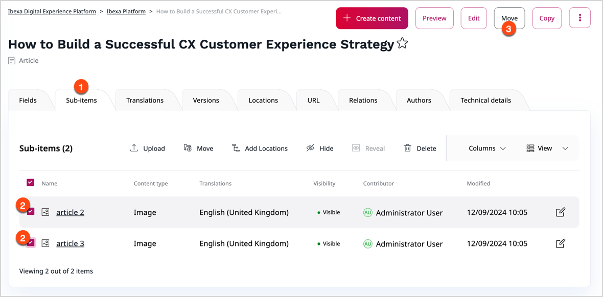
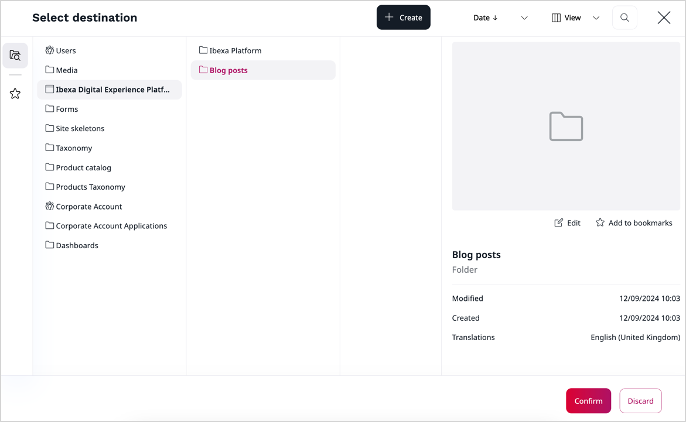
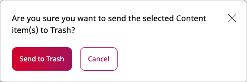
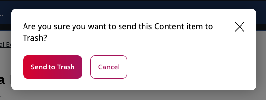
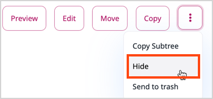
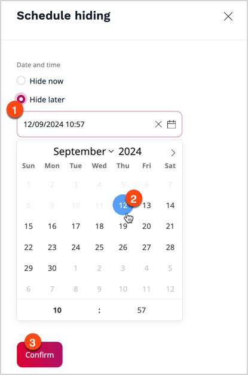

# Copy, move or hide content

## Move or copy

In content tree, you can move or copy existing content items by selecting an 
option at the top of the screen.
You can also copy the whole subtree (a content item with all content under it in the structure).

!!! note

    Copying very large subtrees may take too much time and server effort. That is why the system administrator
    may set a limit on how many content items can be copied at the same time.

    See [Copy subtree limit]([[= developer_doc =]]/administration/back_office/back_office_configuration/#copy-subtree-limit)
    in the developer documentation on how to set this up.

Copying creates a new content item.
If you only want to have the same content item to another place in the content tree, add another Location to it.

### Multi-file move

In the content item's details screen, go to **Sub-items** tab, select multiple items, and click **Move**.

Then choose a destination from the [content browser](../../getting_started/discover_ui.md#content-browser) in the **Select destination** modal that opens up.
After choosing and confirming new destination, all selected files are moved to it.

## Remove content

You can remove content by clicking **Send to Trash** in the menu.
If you remove a content item that has children (other content under it in the content tree),
both this item and the children will be removed. This also breaks the connection between the items,
so you will not be able to restore them with the same structure.

Notice that the content item is not removed completely.
It is moved to Trash, which you can access from the left menu.
In the Trash, you can search for content items and sort your search results based on different criteria. You can then select removed content items and restore them to their original Locations or to new Locations you choose.
If the content item's parent has been removed, you need to select a new parent Location.

If a content item has more than one Location, selecting **Send to Trash** will remove the content item only from the current Location.
The content will appear in Trash only once you have removed the last Location.

You can permanently remove a content item by checking it and clicking the trash icon.
You can also permanently remove all content from the Trash by clicking **Empty Trash**.

!!! caution "Warning"

    Emptying the Trash cannot be undone!

## Multi-file delete

There are multiple ways to delete multiple items, for example:

- in content tree, select multiple items.
Then click the three dots menu and select **Delete**
- in content item's details screen, the **Sub-items** tab, select multiple items and click **Delete**

Confirm your choice in the pop-up window with the **Send to trash** button. All selected files are moved to trash.

### Hide content

You can hide a content item by clicking **Hide** in the menu.

When you click **Hide**, you can choose to **Hide later**
and select and date and time when the content item will be hidden:

A hidden content item is not shown in the frontend when using the default templates. It is also grayed out in the content tree.

This is different from [hiding Locations](manage_locations_urls.md#hide-locations), because it affects the content item
in all of its Locations.

!!! caution "Visibility and permissions"

    The [visibility switcher](https://doc.ibexa.co/projects/userguide/en/latest/content_management/content_organization/manage_locations_urls/#hide-locations) is a convenient feature for withdrawing content from the frontend.
    It acts as a filter in the frontend by default. You can choose to respect it or ignore it in your code.
    It isn't permission-based, and **doesn't restrict access to content**. Hidden content can be read through other means, like the REST API.

    If you need to restrict access to a given content item, you could create a role that grants read access for a given
    [**Section**](https://doc.ibexa.co/projects/userguide/en/latest/content_management/content_organization/classify_content/#sections)
    or [**Object State**](https://doc.ibexa.co/projects/userguide/en/latest/content_management/content_organization/classify_content/#object-states),
    and set a different Section or Object State for the given Content.
    Or use other permission-based [**Limitations**](https://doc.ibexa.co/projects/userguide/en/latest/permission_management/work_with_permissions/).
