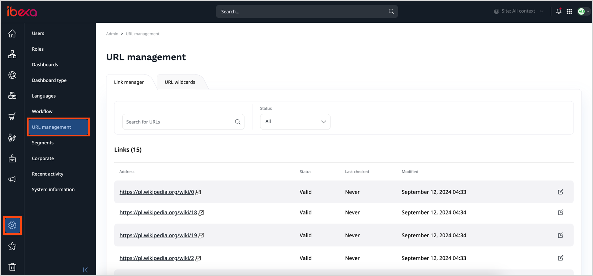
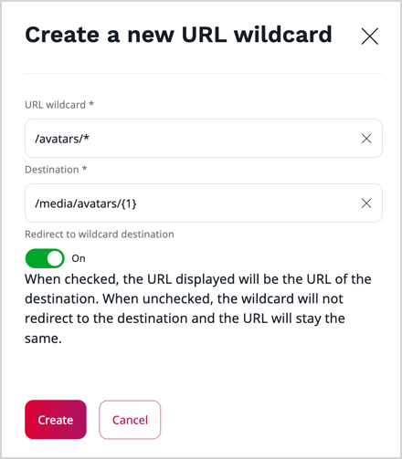

# Manage content Locations and URL addresses

## Content Locations

A content item by itself does not have a place in the Content Tree and is not visible for a visitor of the website.
To be available on the website, it has to be assigned a Location ID.
A new content item is automatically assigned a Location when you publish it.

A content item can have more than one Location ID. In such a case you can find it in more than one place in the Content Tree.
A single Location can only have one content item in it.

!!! tip "Example"

    You can use multiple Locations for an Article about a local sports team's victory,
    which you can place in the tree both under Local News and Sports News.

Even if a content item is placed in more than one Location, one of the Locations is always treated as the main one.

To assign other Locations to content, [disable the Focus mode](../../getting_started/discover_ui.md#disable-focus-mode), go to the content item's **Locations** tab and click **+ Add**.
Then select the new parent from the Content Browser.

### Hide Locations

You can manage the availability of content by hiding or revealing it.
You can do this in the content item's **Locations** tab by using the Visibility switcher.
Notice that this way only affects a *Location*, not the *Content item*.
Even if you hide the content in one Location, it remains visible in its other Locations.
You can also [hide the content item itself](copy_move_hide_content.md#hide-content).

When a Location is hidden, all of its children (other content items that are under it in the tree) are also automatically hidden.
They can only be revealed if the parent Location is revealed as well.

A hidden Location is invisible for everyone viewing the website.
If you are looking for a way to allow only some users to view parts of the Content Tree,
use [Sections](classify_content.md#sections) and combine them with [proper permissions](../../permission_management/permission_system.md).

### Swap Locations

You can swap two content items in their Locations by going to the **Swap Locations** section
in the **Location** tab and selecting a content item to swap with.

!!! caution

    Swapping Locations republishes their respective URL aliases.
    This means that if the swapped content item was accessible by the URL that had a number at the end
    (added due to a name conflict), then after the swap the number will be removed (if possible).
    The opposite case also applies.

    Swapping Locations for content item with the same name and parent results in swapping their URL aliases.
    This means that if the content item was previously accessible by a URL without a number at the end,
    after the swap it will be accessible by a URL with a number at the end (and the other way around).

    If at some point there were more than two content items with the same name under the same parent, then result of swapping such content items might not be obvious. The general rule is that the content item that previously had a higher number at the end of its URL alias will have its URL alias republished first, resulting in the lowest nonconflicting number (or the lack of) at the end of its URL alias. The content item that previously had a lower number at the end of its URL alias will have its URL alias republished second, resulting in the second lowest nonconflicting number at the end of its URL alias.

## URL management

In your website, you can manage external URL addresses and URL wildcards.
You do this in the back office, **Admin** tab, the **URL management** node.

For more information about URL management, see the [Ibexa Developer Documentation.]([[= developer_doc =]]/content_management/url_management/url_management/).

### Link manager

In your website you can link to external websites by placing links inside rich text, or by using the URL field.
You can view and update all external links that exist within the website, without having to modify and re-publish the individual content items.

The Link manager tab shows a list of all links in the website. Click any item in the list to see its details and a list of content items that use this URL.

You can change any link in the Link manager. It is then updated in every place where it is used, across all content items.

The Link manager list also shows whether the link is alive or dead in the **Status** column. The **Last checked** column displays when the status was last verified.

!!! note

    When you edit a link in the Link manager, you cannot change the URL address to one that already exists in the system.

    Once you save the link, it is automatically be marked as "Valid".

### URL aliases

Each content item can have one or more URL aliases. They are additional URLs that can be used to access this content item.

To add URL aliases, go to the **URL** tab, and click **+ Add** in the **Custom URL aliases for...** area.

The URL alias must be unique for the whole installation, regardless of the language.

For each new alias, you can set the following options:

- Language - the language of the content item that the alias redirects to.
- Redirect to alias destination - when toggled on, the alias redirects to the content item's actual URL.
- Place at the website root - when toggled, the alias is created in the root of the website.
If this is toggled off, the alias is relative to the parent of the content item.
- SiteAccess - when selected, the prefix of the respective SiteAccess is added to the alias path.

### URL wildcards

With wildcards, you can replace a portion of the URL address for many content items at the same time, for example, to shorten the path, or to make the path meaningful for the readers.

The URL wildcards tab shows a list of all URL wildcard definitions that exist within the website, and contains all the information about each URL wildcard. You can delete or modify existing entries, or create new ones.

For each URL wildcard definition, you set the wildcard pattern and the destination. Also, you decide whether the link should redirect users to the destination's original address.
