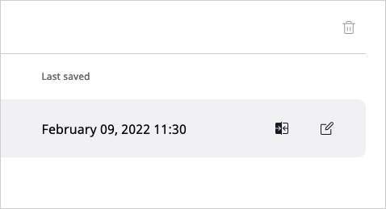
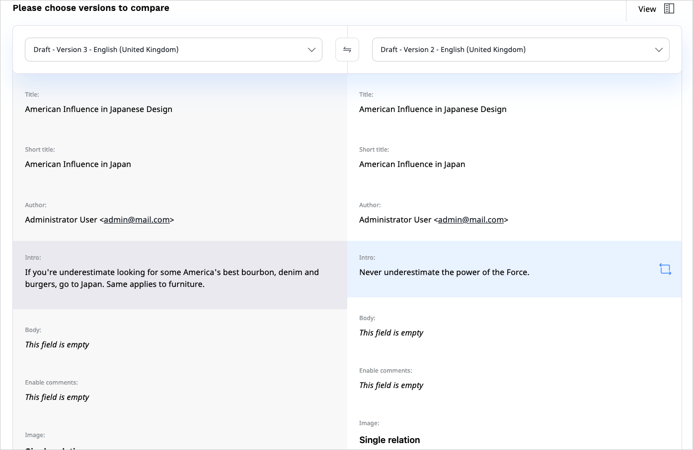
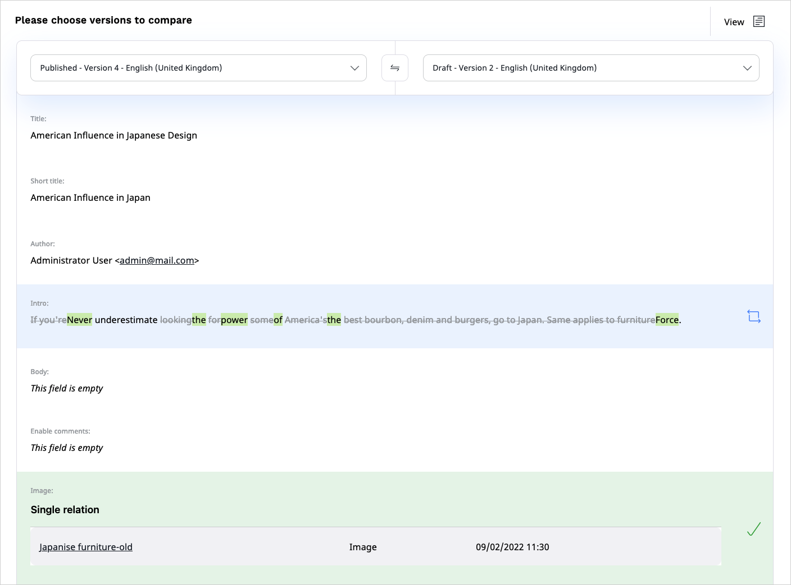
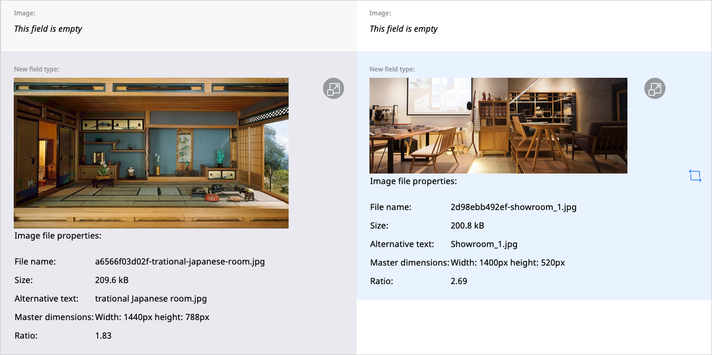

# Content versions

In [[= product_name =]], Content items can have more than one version.
Each version can be either published, archived, or a draft.

The **published version** is the version that is currently used on the website.
Every Content item can have only one published version at a time.

Whenever you edit and publish a Content item again, its previous published version becomes an **archived version**.
It is not available to the visitor and you cannot edit it, but you can create new drafts based on any archived version.

Finally, **drafts** are version that have not been published yet.

You can view all versions of a Content item in the **Versions** tab.

### Autosave

While you edit a Content item or product, [[= product_name =]] saves your work automatically to help you preserve the progress in an event of a failure.
To recover your work, open the most recent draft in the **Versions** tab of the Content item.
Alternatively, open the most recent draft of your work on the **My dashboard** page, the **Drafts** table.

Autosave is enabled by default, and set to save a draft every 60 seconds.
You can toggle autosave or change the time between saving attempts in **User settings**, by changing
the values in the **Autosave draft** and **Autosave interval** fields.

### Compare versions

You can compare two versions of the same Content item by clicking the compare icon
in the **Versions** tab:

Select the two version you want to compare in the drop-down menus at the top of the screen.

You can choose to view the comparison in two columns, side by side,
or in one column, with differences highlighted.

You can also compare media Field Types such as images.

!!! note

    Not all Field Types are available for comparison. You cannot preview the difference in the following Field Types:

    - Form
    - Landing Page
    - User account
