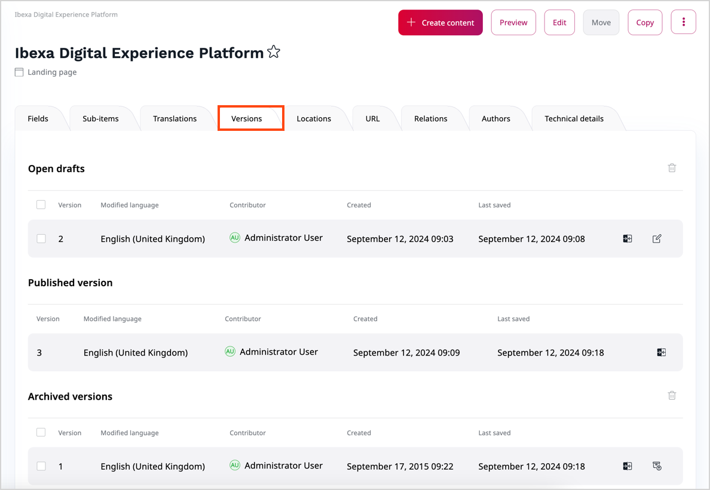

# Content versions

## Types of content versions

In [[= product_name =]], content items can have more than one version.
Versions can be of published, archived, or draft type.

The **published version** is the version that is currently presented to the audience.
Every content item can have only one published version at a time.

Whenever you edit and publish a content item again, its previous published version becomes an **archived version**.
It's not available to the visitor and you cannot edit it, but you can create new drafts based on any archived version.

Finally, **drafts** are versions that haven't been published yet.
There can be many drafts of the same content item.
They can be created by the autosave feature, by the reviewer as part of the 
[editorial workflow](workflow_management/editorial_workflow.md), or when you save
the work and close the content item editing screen.

You can view all versions of a content item on the content item details screen.
To do it, [disable the Focus mode](../getting_started/discover_ui.md#disable-focus-mode), and go to this content item's **Versions** tab.

For more information, see [Editorial workflow](workflow_management/editorial_workflow.md) and [Work with versions](work_with_versions.md).

### Autosave

While you edit a content item or product, [[= product_name =]] saves your work automatically to help you preserve the progress in an event of a failure.
To recover your work, [disable the Focus mode](../getting_started/discover_ui.md#disable-focus-mode), go to this content item's **Versions** tab, and open the most recent draft.
Alternatively, open the most recent draft of your work on the **My dashboard** page, the **Drafts** table.

Autosave is enabled by default, and set to save a draft every 60 seconds.
You can toggle autosave or change the time between saving attempts in **User settings**, by changing
the values in the **Autosave draft** and **Autosave interval** fields.
