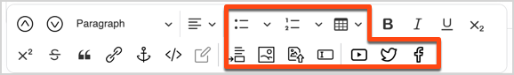
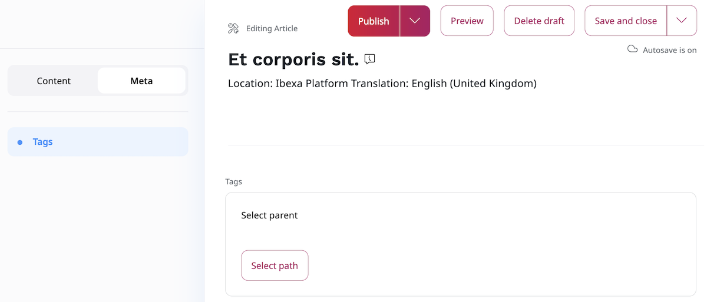

# Create and edit Content items

## Create Content items

There are several ways of creating a new Content item:

1. While viewing a Content item in the [Content Tree](../getting_started/discover_ui.md#content-tree), click **Create** at the top of the screen.
The new item appears under the current Content item in the tree.
1. Click the **Create new** when you [browse content](../getting_started/discover_ui.md#content-browser).
Here also you have to choose a location for the new item.
1. Click **Create content** in the upper-right corner of the [My dashboard](../getting_started/discover_ui.md#my-dashboard) screen.
In this case you have to select where the content will be located.
1. [Drag one or more files](#upload-multiple-content-items) onto the **Sub-items** box when viewing any other content in the Content tree.

When you choose one of the first three options, you have to select the Content Type first.
If you are using [[= product_name_exp =]] or [[= product_name_com =]],
you will have forms and the *Page* Content Type available for selection.
You edit Pages in the Page Builder. For more information, see [Pages](create_edit_pages.md).

Whenever you edit a Content item, a [new version](content_versions.md) is created in the repository.

!!! note "Autosave"

    To help you preserve your work, [[= product_name =]] saves drafts of Content items automatically.
    For more information, see [Autosave](content_versions.md#autosave).

##### Upload multiple content items

When you view the Content item details in the Content Tree, you can add multiple 
sub-items without editing the original Content item.
This way you can upload files such as images, videos, PDF documents, etc.
To do it, on the Content item details screen, from the **Sub-items** top bar, select the 
**Upload** button and choose all items that you want to upload.
When a file is uploaded with multi-file upload, it is automatically stored in a 
Field of the Content item.

!!! note

    The Content Type for the uploaded files will be selected automatically by the system.

## Edit new or existing Content items

Each Content item is based on a Content Type. The Content Type defines what Fields 
you have to fill in when creating a new item.
It may also determine the layout or style in which this item is displayed.

Fields marked with an asterisk (\*) are required. You will not be able to save the Content item without filling them in.

Some Fields, such as *Relation* Fields (which link two Content items) or *Image* Fields
require you to select a different Content item to link to.
A *Location* Field is a point on the map. You can type the place name, enter its coordinates, or select it on the map.

!!! note

    When you create or edit a Content item that contains an *Image* or an *Image asset* Field, 
    you can perform basic image editing functions by using an [Image Editor](edit_images.md).

## Edit Rich Text Fields

Rich Text Fields are filled in using a special Online Editor. Its options appear when you click the Field box.

To add a new element to the Field, select the plus icon to the left of the box and choose one of the available elements:

- Heading
- Paragraph
- Unordered list
- Ordered list
- Image
- Embed
- Table
- YouTube
- Twitter
- Facebook

Each of these elements can have its own settings, such as text formatting.
The option bar also lets you reorder or remove any elements in the Rich Text Field.

### Anchors

For longer texts, insert an anchor linking a fragment of text with another fragment or section
to quickly jump through sections of an article.
Create an anchor by clicking in the area to link to and selecting the anchor icon from the editor menu.
In the modal window, provide the name for the anchor. Scroll to the fragment where you want to insert the link,
and select the text to appear as a link. In the modal window, click the **Link** button.
This will open the window to create the link. In the **Link to** box, enter the anchor name. Click **Save**.

### Images

In image options you can select an image variation.
Variations can include different sizing options and other filters that are applied to images.
Available image variations must be configured at the developer level.
See [Images]([[= developer_doc =]]/content_management/images/images/) for a technical guide on how to do this.

### Tables

In table options you can define the first row and/or column as headers,
add or delete rows and columns in any part of the table, as well as merge and split cells.

### Custom elements

You installation can also have custom elements available in the Rich Text field.
Contact your website administrator about the details of using them.

### Text formatting

When you select a section of text, you get access to text formatting options such as bold or underline.
Here you can also add a link to the text. You can link to an external website, or to another Content item.

## Preview content

While editing, you can preview what the content will look like by clicking the **Preview** button in the menu.

A Content item can have different looks for different [SiteAccesses](translate_content.md#siteaccess).
You can select a SiteAccess to preview by using a drop-down in the preview screen.

## Add taxonomy entries

To keep your content organized and easy to find, you can add taxonomy entries to a Content item while creating or editing it.

1. Switch to the **Meta** tab.
1. Click the **Select Tags** button.
1. In the pop-up window, select the tags you want to add.

See more in [Assign tag to content from taxonomy tree](taxonomy/work_with_tags.md#assign-tag-to-content-from-taxonomy-tree).

## Publish content

If you are ready to publish the Content item, in the menu, click **Publish**.
To save the Content item as a draft to finish editing it later, click **Save**.
You can do it even if some required fields are not filled in.
You can then navigate away from the Content item by clicking the **X** icon in the upper left corner, or the browser's **Back button**.

For more information, see [Publish content](publish_content.md).
