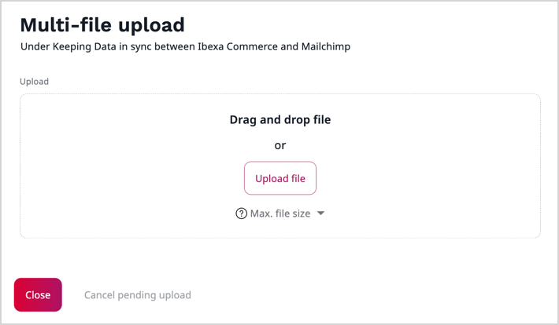

# Create and edit content items

## Create content items

1. Start creating a new content item in one of the following ways:

    - In the left panel, go to **Content** -> **Content structure**. Then select a parent content item and click **Create content**.

        The new content item becomes a child of the content item that you originally selected.

    - In the **Quick actions** block of the [Dashboard](../getting_started/discover_ui.md#dashboard) screen, click **Create content**.
    Then choose a location for the new item in [content browser](../getting_started/discover_ui.md#content-browser) and click **Create**.

    !!! tip

        An alternative way of creating content items is to [drag one or more files](#upload-multiple-content-items) onto the **Sub-items** tab when viewing any content item in a [content tree](../getting_started/discover_ui.md#content-tree).

1. In a slide-out pane, make initial choices in the following fields, and click **Create**:

    - **Select a language** - from a drop-down list, select the base language for the content item.
    - **Select a content type** - use this field to narrow down the list of choices displayed below. Then select a content type to serve as a template for the content item.

    !!! note

        If you're using [[= product_name_exp =]] or [[= product_name_com =]], the options include forms and pages.
        You then [build forms](work_with_forms.md) and [create pages](create_edit_pages.md) in their respective specialist tools.

1. [Fill in the fields](#edit-new-or-existing-content-items) of the content item.

1. Click **Preview** to see how the content item could look to an end-user.

    !!! tip

        A content item can look different on different [SiteAccesses](translate_content.md#siteaccess).
        You can select a SiteAccess to preview with a drop-down in the preview screen.

1. To discard your changes and close the window, click **Delete draft**.

1. To save your changes:

    - Click **Save** to continue editing.
    - Click **Save and close** to close the window.

1. To send your changes to another editor [for review](editorial_workflow.md), click **Send to review**.

1. When the content item is ready for publication:

    - Click **Publish** to publish it immediately.
    - Click **Publish later** to set a specific publication date.

    For more information, see [Publish content](publish_content.md).

<!--ARCADE EMBED START-->
<iframe src="https://demo.arcade.software/T4dqNwZwGGpS3RaLHA6R?embed&embed_mobile=tab&embed_desktop=inline&show_copy_link=true" title="Create and edit article" frameborder="0" loading="lazy" webkitallowfullscreen mozallowfullscreen allowfullscreen allow="clipboard-write" style="position: absolute; top: 0; left: 0; width: 100%; height: 100%; color-scheme: light;" ></iframe>
<!--ARCADE EMBED END-->

!!! note "Versioning and autosave"

    Whenever you edit a content item, a [new version](content_versions.md) is created in the repository.

    To help you preserve your work, [[= product_name =]] saves drafts of content items automatically.
    For more information, see [Autosave](content_versions.md#autosave).

##### Upload multiple content items

When you view the content item details in the content tree, you can upload files such as images, videos, or PDF documents.
This way you can add multiple sub-items without editing the original content item.
To do it, on the content item details screen, in the **Sub-items** tab, click **Upload** and choose all items that you want to upload.
When a file is uploaded with multi-file upload, it's automatically stored in a field of the content item.

!!! note

    The content type for the uploaded files is selected automatically by the system.

## Edit new or existing content items

Each content item is based on a [content type](create_edit_content_types.md).
The content type defines what fields you have to fill in when creating a new item.
It may also determine the layout or style in which this item is displayed.

Fields marked with an asterisk (\*) are required.
You can't save the content item without filling them in.

Some fields, such as *Relation* field (which links two content items) or *Image* field, require you to select a different content item to link to.
A *Location* field is a point on the map. You can type the place name, enter its coordinates, or select it on the map.

!!! note

    When you create or edit a content item that contains an *Image* or an *Image asset* field, you can perform basic image editing functions in an [Image Editor](../image_management/edit_images.md).

### Edit Rich Text fields

To fill in Rich Text fields you use an online editor.
Its options appear when you click inside the field box.

You can choose from available options to edit and customize Rich Text field, for example, move up or down its elements, select heading style, add text elements, like superscript, block quote, or anchor.

You can also add new elements to the field.
To do it, choose one of the available elements:

- Unordered list
- Ordered list
- Table
- Embed
- Image
- YouTube
- X
- Facebook

Each of these elements can have its own settings, such as text formatting.
The option bar also lets you reorder or remove any elements in the Rich Text field.

<!--ARCADE EMBED START-->
<iframe src="https://demo.arcade.software/wkdL1r9PRunTeF6hPtEs?embed&embed_mobile=tab&embed_desktop=inline&show_copy_link=true" title="Online Editor - work in Rich Text field" frameborder="0" loading="lazy" webkitallowfullscreen mozallowfullscreen allowfullscreen allow="clipboard-write" style="position: absolute; top: 0; left: 0; width: 100%; height: 100%; color-scheme: light;" ></iframe>
<!--ARCADE EMBED END-->

#### Edit embedded content items

You can edit embedded content items without leaving current window.

To do it, first insert selected content item in the Rich Text field.
Then, click the three dots icon on the right side and click **Edit**.

If the content item has more than one translation available, you need to select the language.

This action opens a new browser tab with an editing screen of the selected content item.
When you finish editing the item, click **Publish**.
To see implemented changes refresh the browser page.

This option is also available when you want to set up a [relation](configure_ct_field_settings.md#content-relation-settings) with another content item.

#### Distraction free mode

While editing Rich Text fields, you can switch to distraction free mode.

Distraction free mode expands the workspace to full screen and shows only editor toolbar.
It's helpful when you need to work with longer texts that take more space and when you want to focus your attention on editing text.

To access distraction free mode, click **Distraction free mode** on the right side above the workspace.

To exit distraction free mode, click **Exit distraction free mode** or press Esc on the keyboard.

#### Anchors

For longer texts, insert an anchor linking a fragment of text with another fragment or section to quickly jump through sections of an article.

To create an anchor:

1\. Click in the area to link to and select the anchor icon from the editor menu.

2\. In the modal window, provide the name for the anchor.

3\. Scroll to the fragment where you want to insert the link, and select the text to appear as a link.

4\. In the modal window, click the **Link** button.
This opens the window to create the link.

5\. In the **Link to** box, enter the anchor name, and click **Save**.

#### Images

In image options you can select an image variation.
Variations can include different sizing options and other filters that are applied to images.
Available image variations must be configured at the developer level.
See [Images]([[= developer_doc =]]/content_management/images/images/) for a technical guide on how to do this.

#### Tables

In table options you can define the first row and/or column as headers, add or delete rows and columns in any part of the table, and also merge or split cells.

#### Custom elements

Your installation can also have custom elements available in the Rich Text field.
Contact your website administrator about the details of using them.

### AI Assistant

If the [AI Actions](ai_actions.md) LTS update has been installed and configured in your application, when writing content, the **Improve text** button is visible in the toolbox.
If you have the required [permissions]([[= developer_doc =]]/permissions/policies/#ai-actions), you can request that the AI Assistant refines your text by using one of the defined actions.
For example, you can highlight a passage and instruct the AI Assistant to extend the passage or adjust its tone to suit your needs.

The **Go to AI actions** button can also visible to users with access to the **Admin UI**.
By clicking it, you can quickly navigate to [AI actions configuration](work_with_ai_actions.md).

After you select an action, the AI Assistant modal appears, where you can observe the results of AI service's work.
When response is displayed on the screen, depending on whether you are satisfied with the result, you can select one of the options:

- **Replace** - replaces the source text with the output
- **Insert below** - inserts the output text directly after the source passage
- **Try again** - makes another attempt at generating the output

!!! note "Lengthy processing of complex requests"

    Depending on the length of the source text and the complexity of request, processing may take a while.
    You may cancel the processing if it takes too long by clicking **Stop**.

### SeenThis! streaming

!!! note

    This custom tag is in an opt-in bundle, to use it, install `ibexa/connector-seenthis` bundle first.

Use SeenThis! tag to enable displaying of video with maximum quality regardless of connection and server integration.

For more information, see [SeenThis! page block](block_reference.md#seenthis-block) documentation.

### Text formatting

When you select a section of text, you get access to text formatting options such as bold or underline.
Here you can also add a link to the text. You can link to an external website, or to another content item.

### Add taxonomy entries

To keep your content organized and searchable, you can add taxonomy entries to a content item while creating or editing it.
For this feature to work as described, the content type must have a **Metadata** section, with a **Taxonomy Entry** field in it.

1. Switch to the **Meta** tab.
1. Click the **Select path** button.
1. In the pop-up window, select the tags you want to add.

For more information, see [Assign tag to content from taxonomy tree](taxonomy/work_with_tags.md#assign-tag-to-content-from-taxonomy-tree).
