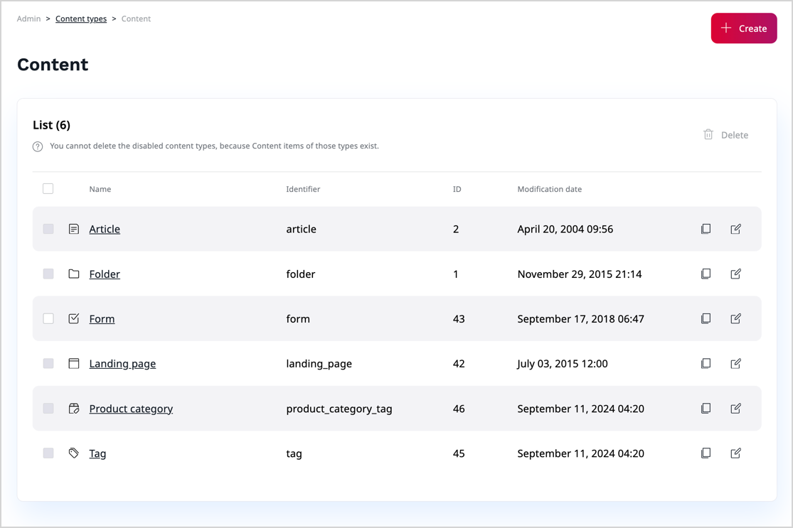

# Create and edit content types

[Content types](content_model.md#content-types) define what fields are available in [content items](content_items.md).
To suit your specific needs, you can modify the default content types, or add custom ones.

You can only create or modify content types when your [user role](../permission_management/work_with_permissions.md) has the `ContentType/Create` or `ContentType/Update` permission.

When you edit a content type, each content item based on this content type changes.
For example, when you add or remove a field to the content type, the change is propagated to every content item of this type.

!!! note

    Rules and templates for displaying content on the website are determined at the developer level.
    That is why content of a new content type that you create may not always display correctly or may cause errors.
    It's always best to discuss adding new content types with the administrator of your website, to make sure whether they need to add it to the configuration.

!!! caution "Deleting content types"

    You can delete a content type only when there are no content items that belong to it.
    This also includes content items in the Trash.

1\. In the left panel, go to **Content** -> **Content types**. Then select a content type group by clicking its name, for example, **Content**.

!!! note

    If your application requires a more granular organization of content types, in this screen, you can create additional content type groups.

2\. If you're adding a new content type, on the content type group's detail screen, click **Create** and skip to step 4.

3\. If you're modifying an existing content type, on the content type group's detail screen, click the **Edit** icon next to a name of the content type.

4\. In the **Global properties** area, fill in global content type properties.

Each content type has the following global properties:

|Setting|Description|Use|
--------|-----------|---|
|Name|A name of the content type.|Required|
|Identifier|A unique identifier of the content type in the system. Up to 50 characters and can only consist of letters, numbers and underscores.|Required|
|Description|Additional information that is displayed when a content item is created based on this type.|Optional|
|Content name pattern|Rules for creating a name for the content item.|Optional|
|URL alias name pattern|Rules for creating the URL alias for a content item.|Optional|
|Container|When checked, content of this type can serve as a container in the content tree.|Optional|
|Sort children by default by|Criterion by which children of this content are sorted in the tree.|Required if **Container** is checked|
|Sort children by default in order|Order in which the children are sorted (ascending or descending).|Required if **Container** is checked|
|Make content available even with missing translations|When checked, content of this Type is by default always available, even if it does not have a language version corresponding to the current SiteAccess.|Optional|

!!! note "Rules for creating patterns"

    When populating the patterns, you can use a schema with attributes which correspond to the identifiers of fields that make up the content type.
    This way, when content items of this type are created, their names and URL aliases are generated according to the defined pattern.

    For example, if you enter `<short_title>` as a value of the **Content name pattern** field, the resulting items are identified in the user interface by their short titles.

5\. In the **Field definitions** area, [add or modify fields that constitute the content type](configure_ct_field_settings.md).

6\. Optionally, [enable and configure SEO for the content type](../search_engine_optimization/work_with_seo.md).

7\. To save your changes:

- Click **Save** and continue editing.
- Click **Save and close** to close the window.

8\. To discard your changes and close the window:

- If you're creating a new content type, click **Discard**.
- If you're updating an existing content type, click **Delete draft**.

Once the content type details screen is displayed, you can navigate back to the content type list.

!!! note "More information"

    For in-depth information about the content model, see [developer documentation]([[= developer_doc =]]/content_management/content_model).
