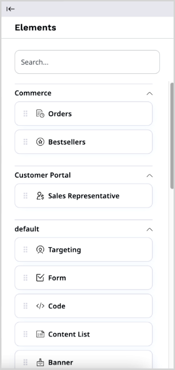
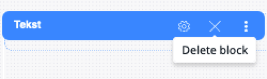

# Create and edit pages

Page is a special type of Content items that contains zones onto which you can drop 
different dynamic blocks.
You can edit pages to personalize the layout and contents of your website.

Whenever you edit a Page, a [new version](content_versions.md) is created in the repository.

!!! tip
    The Page Content Type contains a **Landing Page** Field Type which manages 
    the zones and blocks.
    Any Content item that has the **Landing Page** Field Type behaves like 
    a page.

## Create Page

1. In the left panel, go to **Content** -> **Content structure**. Then select a parent Content item and click **Create content**.
1. In a slide-out pane, make initial choices in the following fields, and click **Create**:
    - **Select a language** - from a drop-down list, select the base language for the Content item.
    - **Select a Content Type** - use this field to narrow down the list of Content Type choices displayed below. Then select one of page type, for example, **Landing Page**, and click the **Create** button.
1. In the [Page Builder toolbar](#page-builder-toolbar) click **Fields** and define the page's title and description.
1. Click  **Switch layout** and select the layout.
1. [Edit the page](#edit-page).
1. To discard your changes and close the window, click **Delete draft**.
1. To save your changes, click **Save draft**.
You can now navigate away from the Page by clicking the **Close** button.
1. When the page is ready for publication:

    - Click **Publish** to publish it immediately.
    - Click **Publish later** to set a specific publication date.

    For more information, see [Publish content](publish_content.md).

!!! note "Autosave"

    To help you preserve your work, [[= product_name =]] saves drafts of Content items automatically.
    For more information, see [Autosave](content_versions.md#autosave).

## Edit Page

You edit Pages by using the Page Builder.

### Page Builder toolbar

The Page Builder comes with a toolbar that enables you to perform advanced editing and previewing of the Page.

Using the toolbar buttons, you can perform the following actions:

|Button|Description|
|------|-----------|
||Switch between previewing and editing the Page.|
||Switch between Page layouts.|
||Access preview of the Page for a given Segment.|
||Access the timeline to preview how the Page changes with time. You can also view the list of all upcoming scheduled events. For details, see [Timeline](schedule_publishing.md#timeline).|
||Toggle through to see how the Page is rendered on different devices.|
||Access menu with Elements.|

In a newly created Page you can choose a [layout](configure_ct_field_settings.md#available-page-layouts) which defines the available zones.

Applying a layout divides the Page into the defined zones. The zones are placeholders for Content items.
Now you are ready to add blocks of content to the Page.

### Add blocks

In Page Builder you can access a menu of **Elements** — a set of blocks of content that you can add to the zones of the Page.
Each block is unique in its function and enables you to customize the content appearing on the Page.

Add a block by dragging it from the menu to an empty place on a zone.
Do not worry about placing blocks in the proper place from the start.
You can reorder them at any time by dragging and dropping them in the desired location.

[[= product_name =]] comes with a set of ready-to-use Page blocks,
but [developers can add their own]([[= developer_doc =]]/content_management/pages/create_custom_page_block/).

For a list of blocks available out of the box, see [Block reference](block_reference.md).

!!! note 

    Before you add a block that involves products, product types, or product categories, make 
    sure your that your [user Role](../permission_management/permissions_and_users.md) has 
    the `Product/View` and `Product type/View` permission.

    Before you add a block that uses results derived from a [Personalization](../personalization/personalization.md) scenario, 
    for example, [Dynamic targeting](block_reference.md#dynamic-targeting-block) or [Recently added block](block_reference.md#recently-added-block), make sure that the scenario is 
    [properly configured](../personalization/configure_scenarios.md).

#### Configure block settings

Each kind of block has its special properties.
You can access them by placing the cursor on the added block and clicking the 
**Block settings** (cog) icon.
Use the same menu to remove the block from the Page by clicking the **Delete block** (X) icon.

Settings available for blocks are divided into three tabs — **Basic**, **Design**, and **Scheduler**.
The settings available on the **Basic** tab are tailored to the block's content.
For a description of these settings, see [Block reference](block_reference.md).

The remaining tabs contain parameters common to all blocks provided with [[= product_name =]].
Use them to modify the layout and visibility of a block. For details, see [Scheduling publication](schedule_publishing.md).

You cannot publish a Page if you have not set all the required settings of all blocks.

!!! tip
    Settings and function of custom-made blocks of content depend on their design.
    For details on adjusting and using them, contact your website administrator.

After you change the block settings, click **Submit** to save the changes or **Discard** to cancel.

##### Focus mode

While configuring blocks that include Rich Text section, for example, Text block, you can switch to focus mode.

Focus mode expandes the workspace to full screen and shows only editor toolbar.
It is helpful when you need to work with longer texts that take more space and focuses your attention on the editing content.

To access focus mode, click **Focus mode** on the right side above the workspace.

To exit focus mode, click **Default mode** or press Esc on the keyboard.

## Publish Page

If you are ready to publish the Page, click **Publish** in the top-right corner.
To save it as a draft to finish editing it later, even if some required fields are not filled in, click **Save draft**.
You can then navigate away from the Page by clicking the logo in the upper left corner, or the browser's **Back button**.

For more information, see [Publish content](publish_content.md).
