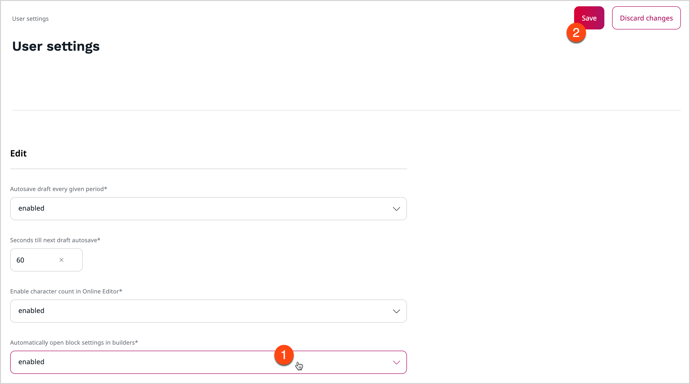
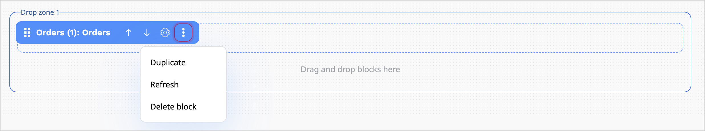

# Create and edit Pages

**Page** is a special Content Type.
You can create and modify Pages with a visual drag-and-drop editor - Page Builder.
Page is divided into zones into which you can drop various dynamic blocks.
By editing pages you can customize the layout and content of your website.

Whenever you edit a Page, a [new version](content_versions.md) is created in the repository.

!!! tip
    The Page Content Type contains a **Landing Page** Field Type which manages 
    the zones and blocks.
    Any Content item that has the **Landing Page** Field Type will behave like 
    the Page Content Type.

## Create Page

To create a new page:

A\. In the left panel, go to **Content**.

B\. Select **Content structure**.

C\. On the right-side toolbar, click **Create content** and from the list of Content items select **Landing Page**.

D\. Select the layout and click **Create**.

You can also add a new Page in the Page Builder.
Open the Page Builder by clicking **Site** and selecting a website from the list that 
appears next to the **List** icon.
On the [Page Builder toolbar](#page-builder-toolbar) click the plus button and from the list select **Landing page**.
On the **Page creation** modal, select the layout and click **Create draft**.

Before you publish or save the Page, edit its title and description.
Switch to the Field view using the Page Builder toolbar.

!!! note "Autosave"

    To help you preserve your work, [[= product_name =]] saves drafts of Content items automatically.
    For more information, see [Autosave](content_versions.md#autosave).

## Edit Page

You edit Pages using the Page Builder.
To start editing an existing Page, in the Back Office from the Content Tree choose the page that you want you edit and click **Edit** button.

### Page Builder interface

Page Builder has plain and intuitive interface. It is easy to create a Page without having advanced technical skills.

Page Builder user interface consists of:

A. Drop zone

B. Elements / Structure view toolbar

C. Settings toolbar (including Fields, Visibility and Schedule settings)

D. Mode toolbar (including PC, tablet and mobile mode)

E. Buttons:

|Button|Description|
|------|-----------|
||Switch between previewing and editing the Page.|
||Access preview of the Page for a given Segment.|
||Access the timeline to preview how the Page changes with time. You can also view the list of all upcoming scheduled events.|
||Toggle through to see how the Page is rendered on different devices.|
||Move Elements / Structure view to the other side of the screen.|
||Undo latest change.|
||Redo latest change.|

F. Saving options

|Option|Description|
|------|-----------|
|Close|Close the page without saving it.|
|Send to review|Save the page and send it to review.|
|Publish / Publish later|Publish the page or schedule publishing for later.|
|Save draft|Save the page draft*.|
|Delete draft|Delete the page draft.|

* To help you preserve your work, system saves drafts of Content items automatically. For more information, see [Autosave](https://doc.ibexa.co/projects/userguide/en/master/content_management/content_versions/#autosave).

Page Builder has two main views that you can use while creating a page:

- Elements toolbar - consists of all available elements that you can use by dragging them and dropping on a drop zone.

- Structure view - shows a structure of your page, including their division into zones and the blocks that they contain.

### Choose layout

For newly created Page you can choose a [layout](configure_ct_field_settings.md#available-page-layouts) which defines the available zones.

Applying a layout divides the Page into the defined zones. The zones are placeholders for Content items.

On the Page creation modal, select the layout and click **Create draft**.
Now you are ready to add blocks of content to the Page.

The page layouts that an editor has access to are up to you to choose.
In the `Select layouts` section, you can select layouts that you want to be available for the Page.

The default, built-in Page layout has only one zone, but developers can create other layouts in configuration.
For more information, see [Configure layout](https://doc.ibexa.co/en/latest/templating/render_content/render_page/#configure-layout).

In a newly created Page you can choose a [layout](configure_ct_field_settings.md#available-page-layouts) which defines the available zones.

### Add blocks

In Page Builder you can access a menu of **Elements** — a set of blocks of content that you can add to the zones of the Page.
Each block is unique in its function and enables you to customize the content appearing on the Page.

Add a block by dragging it from the menu to an empty place on a zone.
Do not worry about placing blocks in the proper place from the start.
You can reorder blocks in a few ways:

- drag and drop block in the desired location on a drop zone
- select block and use up and down arrow on the keyboard
- access Structure view and use 'Move up' and 'Move down' function in the settings of the block

When you add a new block to the drop zone, drop it in the blue highlighted area. Before you drop it, a bold line appears  - it helps you see the position of the newly added block in relation to other, already added blocks.

When you add a block by dragging it from Elements menu into the drop zone,
the block settings panel open immediately where you can configure all block properties.

This is a default behavior. You can globally turn off automatic opening of the block settings panel in the user settings.
First, access your user settings on the right side of the top bar:

Then, go to **My preferences** tab, **Edit** section.
Here, you can find `Automatically open block settings in builder` setting, which, by default, is set up to `enabled` value.
To change this behavior, click on **Edit** icon, find the setting, and change its value to `disabled`.

[[= product_name =]] comes with a set of ready-to-use Page blocks,
but [developers can add their own]([[= developer_doc =]]/content_management/pages/create_custom_page_block/).

For a list of blocks available out of the box, see [Block reference](block_reference.md).

!!! note 

    Before you add a block that involves products, product types, or product categories, make 
    sure your that your [user Role](../permission_management/permissions_and_users.md) has 
    the `Product/View` and `Product type/View` permission.

    Before you add a block that uses results derived from a [Personalization](../personalization/personalization.md) scenario, 
    for example, [Dynamic targeting](block_reference.md#dynamic-targeting-block) or [Recently added block](block_reference.md#recently-added-block), make sure that the scenario is 
    [properly configured](../personalization/configure_scenarios.md).

#### Configure block settings

Each kind of block has its special properties.
You can access them by placing the cursor on the added block and clicking the 
**Block settings** (cog) icon.

You can manage each block by accessing its settings. To do it, click settings icon next to the block's name.

Available settings are:

- Move up - allows you to change position of the block on the page by moving it up
- Move down - allows you to change position of the block on the page by moving it down
- Configuration - allows you to access configuration window
- Duplicate - duplicates existing block with its settings by creating its copy
- Refresh - refreshes preview of the block
- Delete - deletes existing block

Settings available for blocks are divided into three tabs — **Basic**, **Design**, and **Scheduler**.
The settings available on the **Basic** tab are tailored to the block's content.
For a description of these settings, see [Block reference](block_reference.md).

The remaining tabs contain parameters common to all blocks provided with [[= product_name =]].
Use them to modify the layout and visibility of a block. For details, see [Scheduling publication](schedule_publishing.md).

You cannot publish a Page if you have not set all the required settings of all blocks.

!!! tip
    Settings and function of custom-made blocks of content depend on their design.
    For details on adjusting and using them, contact your website administrator.

After you change the block settings, click **Submit** to save the changes or **Discard** to cancel.

## Publish Page

If you are ready to publish the Page, click **Publish** in the top-right corner.
To save it as a draft to finish editing it later, even if some required fields are not filled in, click **Save draft**.
You can then navigate away from the Page by clicking the logo in the upper left corner, or the browser's **Back button**.

For more information, see [Publish content](publish_content.md).