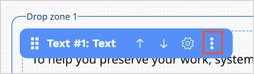

# Create and edit pages

Page is a special content type.
You can modify pages with a visual drag-and-drop editor, the [Page Builder](#page-builder-interface).
Pages are divided into drop zones into which you can drop various dynamic blocks.
By editing pages, you can customize the layout and content of your website.

Whenever you edit a Page, a [new version](content_versions.md) is created in the repository.

!!! tip
    The Page content type contains a *Landing Page* field type which manages
    the zones and blocks.
    Any content item that has the *Landing Page* field type behaves like
    a page.

## Create Page

1. In the left panel, go to **Content** -> **Content structure**. Then select a parent content item and click **Create content**.
1. In a slide-out pane, make initial choices in the following fields, and click **Create**:
    - **Select a language** - from a drop-down list, select the base language for the content item.
    - **Select a content type** - use this field to narrow down the list of content type choices displayed below. Then select one of page type, for example, **Landing Page**, and click the **Create** button.
1. In the [Page Builder toolbar](#page-builder-toolbar) click **Fields** and define the page's title and description.
1. Click  **Switch layout** and select the layout.
1. [Edit the page](#edit-page).
1. To discard your changes and close the window, click **Delete draft**.
1. To save your changes, click **Save draft**.
You can now navigate away from the Page by clicking the **Close** button.
1. When the page is ready for publication:

    - Click **Publish** to publish it immediately.
    - Click **Publish later** to set a specific publication date.

    For more information, see [Publish content](publish_content.md).

!!! note "Autosave"

    To help you preserve your work, [[= product_name =]] saves drafts of content items automatically.
    For more information, see [Autosave](content_versions.md#autosave).

## Edit Page

To edit an existing Page, in the back office, from the Content Tree, choose the page that you want to edit, and click **Edit** button.

### Page Builder interface

Page Builder has a plain and intuitive interface.
You can create Pages without having advanced technical skills.

Page Builder user interface consists of:

A. Drop zone

B. Elements / Structure view toolbox

C. Settings toolbar (including Fields, Visibility and Schedule settings)

D. Device mode toolbar (including Desktop, Tablet and Mobile mode)

E. Buttons

The following table presents buttons and provides a short description of their function:

|Button|Description|
|------|-----------|
||Edit main details of the Page, like title and description.|
||Switch between Page layouts.|
||Access preview of the Page for a given segment.|
||Access the timeline to preview how the Page changes with time. You can also view the list of all upcoming scheduled events.|
||Toggle through to see how the Page is rendered on different devices.|
||Move Elements / Structure view toolbox to the other side of the screen.|
||Undo latest change.|
||Redo latest change.|

Page Builder has two main views that you can use while creating a page:

- Elements toolbox - consists of all available elements that you can use by dragging them and dropping on a drop zone.

- Structure view toolbox - shows a structure of your page, including their division into zones and the blocks that they contain.

### Work with layout

[Layout](configure_ct_field_settings.md#available-page-layouts) divides the Page into the defined zones. The zones are placeholders for the blocks.

The page layouts that an editor has access to are up to you to choose.

The default, built-in Page layout has only one zone, but developers can create other layouts in configuration.
For more information, see [Configure layout](https://doc.ibexa.co/en/latest/templating/render_content/render_page/#configure-layout).

While editing, you can switch layout for your page.
To do it, click **Swicth layouts** button.

### Add blocks

In Page Builder you can access a toolbox of **Elements** — a set of blocks of content that you can add to the zones of the Page.
Each block is unique in its function and enables you to customize the content appearing on the Page.

Add a block by dragging it from the toolbox to an empty place on a zone.
Do not worry about placing blocks in the proper place from the start.
You can reorder blocks later, in a few ways:

- drag and drop block in the desired location on a drop zone
- hover over the block and use 'Move up' and 'Move down' function in the settings of the block
- access Structure view toolbox and use 'Move up' and 'Move down' function in the settings of the block

When you add a new block to the drop zone, drop it in the blue highlighted area.
Before you drop it, a bold line appears  - it helps you see the position of the newly added block in relation to other, already added blocks.

When you add a block by dragging it from Elements toolbox into the drop zone,
the block settings panel open immediately where you can configure all block properties.

This is a default behavior. You can globally turn off automatic opening of the block settings panel in the user settings.
First, access your user settings on the right side of the top bar:

Then, go to **My preferences** tab, **Edit** section.
Here, you can find `Automatically open block settings in builder` setting, which, by default, is set up to `enabled` value.
To change this behavior, click on **Edit** icon, find the setting, and change its value to `disabled`.

[[= product_name =]] comes with a set of ready-to-use Page blocks,
but [developers can add their own]([[= developer_doc =]]/content_management/pages/create_custom_page_block/).

For a list of blocks available out of the box, see [Block reference](block_reference.md).

!!! note

    Before you add a block that involves products, product types, or product categories, make
    sure your that your [user role](../permission_management/permissions_and_users.md) has
    the `Product/View` and `Product type/View` permission.

    Before you add a block that uses results derived from a [Personalization](../personalization/personalization.md) scenario, for example, [Dynamic targeting](block_reference.md#dynamic-targeting-block) or [Recently added block](block_reference.md#recently-added-block), make sure that the scenario is [properly configured](../personalization/configure_scenarios.md).

You can work with the block, for example, duplicate it, change its position, or delete it.
Hover over the block and the toolbar appears.
Click the three dots icon to see more options.

The following actions are available:

- Move up block - allows you to change position of the block on the page by moving it up
- Move down block - allows you to change position of the block on the page by moving it down
- Block settings - allows you to access properties window
- Duplicate - duplicates existing block with its settings
- Refresh - refreshes preview of the block
- Delete - deletes existing block

#### Configure block settings

Each kind of block has its special settings.
You can access them by placing the cursor on the added block and clicking the **Block settings** icon.

Settings available for blocks are divided into three tabs — **Basic**, **Design**, and **Scheduler**.
The settings available on the **Basic** tab are tailored to the block's content.
For a description of these settings, see [Block reference](block_reference.md).

The remaining tabs contain parameters common to all blocks provided with [[= product_name =]].
Use them to modify the layout and visibility of a block. For details, see [Scheduling publication](schedule_publishing.md).

For your comfort, you can adjust the size of the block settings window.
When you hover over the window frame, blue line appears.
Click-and-drag the border to adjust the size.

You cannot publish a Page if you have not set all the required settings of all blocks.

!!! tip
    Settings and function of custom-made blocks of content depend on their design.
    For details on adjusting and using them, contact your website administrator.

After you change the block settings, click **Submit** to save the changes or **Discard** to cancel.

#### Edit embedded items

You can edit embedded content items without leaving Page Builder.

To do it, first select content item that you want to insert in the block.
Then, click the icon on the right side and click **Edit**.

This action opens a new tab in the browser with an editing screen of the selected content item.
When you finish editing the item, click **Publish** and go back to Page Builder tab.
All the content item details automatically update in the block window.

If the content item has more than one translation available, you need to select the language.

This function is available for following blocks:

- Banner
- Collection
- Content Scheduler
- Embed
- Gallery
- Product collection
- Targeting
- Text

##### Distraction free mode

While configuring blocks that include Rich Text section, for example, Text block, you can switch to distraction free mode.

Distraction free mode expands the workspace to full screen and shows only editor toolbar.
It's helpful when you need to work with longer texts that take more space and when you want to focus your attention on editing text.

To access distraction free mode, click **Distraction free mode** on the right side above the workspace.

To exit distraction free mode, click **Exit distraction free mode** or press Esc on the keyboard.

## Save page

There are several options for saving work on the page:

|Option|Description|
|------|-----------|
|Close|Close the page without saving it.|
|Send to review|Save the page and send it to review.|
|Publish / Publish later|[Publish](publish_content.md) the page or schedule publishing for later. |
|Save draft|Save the page draft*.|
|Delete draft|Delete the page draft.|

* To help you preserve your work, system saves drafts of content items automatically. For more information, see [Autosave](https://doc.ibexa.co/projects/userguide/en/master/content_management/content_versions/#autosave).
