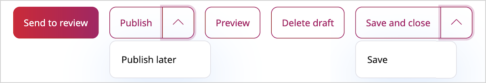

# Publish content instantly

When you publish a content item, it's given a Location ID and placed in the content tree.
After you click **Publish**, the content item is validated and if any of the required fields are not configured, you see a notification.
Once the content item passes the validation, it's immediately available to the visitor.

Instead of instantly publishing content items, you can also save them, discard changes by deleting the draft, or [publish later](schedule_publishing.md#date-based-publishing).
If you're creating a new content item, you can also [send it to review](editorial_workflow.md).
All these options are available in the menu when you're in the edit mode.

### Publishing vs. saving

Clicking **Save** does not immediately publish the content item.
Instead, it saves the [new version](content_versions.md) of the content as a draft.
You can then keep on editing the same content and save it again when needed,
or click **Save and close** to close the window.

!!! caution

    Only selecting **Delete draft** removes the whole draft and all the work you have done on it.
    A discarded draft is removed instantly, not placed in the Trash, so it can't be restored.

Once you leave the editor after saving your draft, you can return to modify it, or create a new draft.
To edit an existing draft, [disable the Focus mode](../getting_started/discover_ui.md#disable-focus-mode), go to this content item's **Versions** tab and click the edit icon in the proper line.
When you select **Edit** in a content item that has one or more open drafts, you're asked which draft you want to continue working on.
You also have the option to create a new draft based on the currently published version.

You cannot edit an unpublished draft created by another user.
