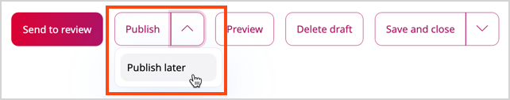
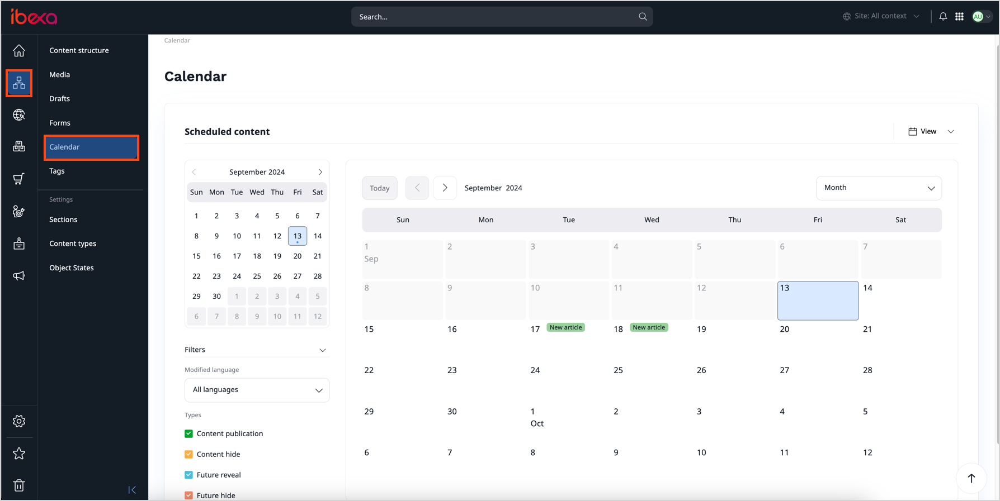
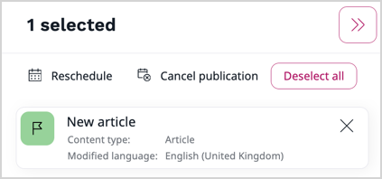
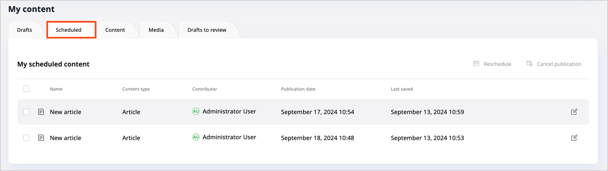

# Schedule content publication

You can schedule content to be published, revealed or hidden in the future.
To do it, use one of the three options:

- [Scheduler tab](#scheduler-tab) in any Page block's configuration
- [Content Scheduler block](#content-scheduler-block) on a Page
- [Publish later option](#date-based-publishing) when editing content

## Scheduler tab [[% include 'snippets/experience_badge.md' %]] [[% include 'snippets/commerce_badge.md' %]]

The Scheduler tab is available in the configuration of all Page blocks.
You can use it to set the date and time when the block becomes visible and when it disappears from a Page.
If you configure the reveal and/or hide dates for a Page block, you can then see the scheduled blocks (except for the Content Scheduler) in the calendar.
This way you can see what content is planned to be available in the future.

## Content Scheduler block [[% include 'snippets/experience_badge.md' %]] [[% include 'snippets/commerce_badge.md' %]]

In the Content Scheduler block you can select content items to be displayed at a selected time.

For each content item you can choose an airtime - a date and time in the future.
At this time the content item becomes visible.

The Content Scheduler block has a limit of content items.
If the limit is filled and a new content item is displayed, the oldest item disappears from the block.

## Date-based publishing

When editing a content item, select **Publish later** in the menu on the right.

A **Future publication settings** window is displayed.
Choose a date and time for the content publication.

If you had planned a future publication date and enter the edit mode of the same content item,
you also have a new option in the menu: **Discard publish later**.
Use it to remove the previously selected publication date.

You can also [reschedule or cancel planned publications](#reschedule-or-cancel-publication).
To browse all the future events, use the [Calendar widget](#calendar-widget).

## Date-based hiding

When your content item is published, you can schedule a date and time for the content to become hidden.
To do this, go to the **Content** tab and select **Content structure** or **Media**.
Then, navigate to the content item that you want to hide and click **Hide** in the menu.

Once a content item is hidden, it's unavailable on the front page and inactive in the content tree.
This change affects the content item in all of its [Locations](content_organization/manage_locations_urls.md#content-locations).

## Timeline [[% include 'snippets/experience_badge.md' %]] [[% include 'snippets/commerce_badge.md' %]]

The timeline in Page mode shows all changes that happen to the Page in the future.

You can use the slider to preview what the Page looks like at a given time.
Use the button on the right of the time to see a list of all upcoming changes.

## Calendar widget

The calendar widget enables you to view and perform actions on various events.
Out of the box, it displays content items and Page blocks scheduled for future publication, but your page administrator can configure custom events.
Therefore, the calendar can contain other events, e.g. national holidays, important dates, etc.

To access the calendar widget, in the **Content Panel**, open the **Calendar** tab.

You can switch between different views to see events planned for a certain day, week, or month.
You can also use [filters](#calendar-filters) to focus on certain events displayed in the calendar.

!!! tip

    If the number of events to display in a selected view exceeds the configured limit, some events remain hidden.
    To view the full list of events, click **Load More**.

To access the calendar features, use the following buttons:

|Button|Description|
|------|-----------|
||Display the current day regardless of the view.|
||Navigate through months, weeks, or days.|
||Switch between month, week, or day view.|
||Switch between the calendar and list view.|

### Calendar filters

With numerous events appearing in the calendar widget, you can make the view less cluttered by applying filters.
You can filter by the events' type or modified language in all three views (month, week, and day).

Access all available filters by clicking **Filters**.

To apply filters, select or deselect entities from the **Types** or **Modified language** list.
The calendar view refreshes automatically.

### Calendar toolbar

The calendar widget toolbar displays events you select and gives you access to actions assigned to them.
The available actions appear in the upper-right corner of the toolbar when you select an event.
You can select multiple events of the same type and perform bulk actions on them, e.g. [reschedule or cancel publication](#reschedule-or-cancel-publication).

!!! note

    Actions available in the toolbar may vary depending on the custom configuration.
    For details, contact your page administrator.

To select, click on all events of the same type you want to add to the toolbar list.

## Reschedule or cancel publication

In case of publishable content items (e.g. articles), you can change or cancel their planned publication by clicking **Reschedule** or **Cancel publication**.
These buttons are available on the **My dashboard** screen, and in the Calendar widget.

|Button|Description|
|------|-----------|
||Reschedule all selected events.|
||Cancel the future publication of selected events.|

#### Reschedule or cancel in the dashboard

To reschedule or cancel events with the dashboard, perform the following actions:

1. Open the **My dashboard** screen by clicking the logo in the left-upper corner.
1. In **My content** panel, view all your scheduled content items by clicking **My scheduled content**.
1. From **My future publications**, select all content items to have their publication time rescheduled or cancelled.
1. Using the buttons in the upper-right corner, perform one or both of the following actions:
    - To change the publication time, click **Reschedule**.
      In the **Reschedule** modal window, select the new date and click **Confirm date change**.
    - To cancel publication, click **Cancel publication**.
      In the modal window, confirm the cancellation by selecting **Cancel publication**.

#### Reschedule or cancel in Calendar

In the [Calendar widget](#calendar-widget), select all events to have their publication time rescheduled or cancelled.
Using the toolbar buttons, perform one of the following actions:

- To change the publication time, click **Reschedule**.
In the **Reschedule publication** modal window, select the new date and click **Confirm rescheduling**.
- To cancel event's publication, click **Cancel publication**.
In the modal window, confirm the cancellation by clicking **Cancel publication**.
