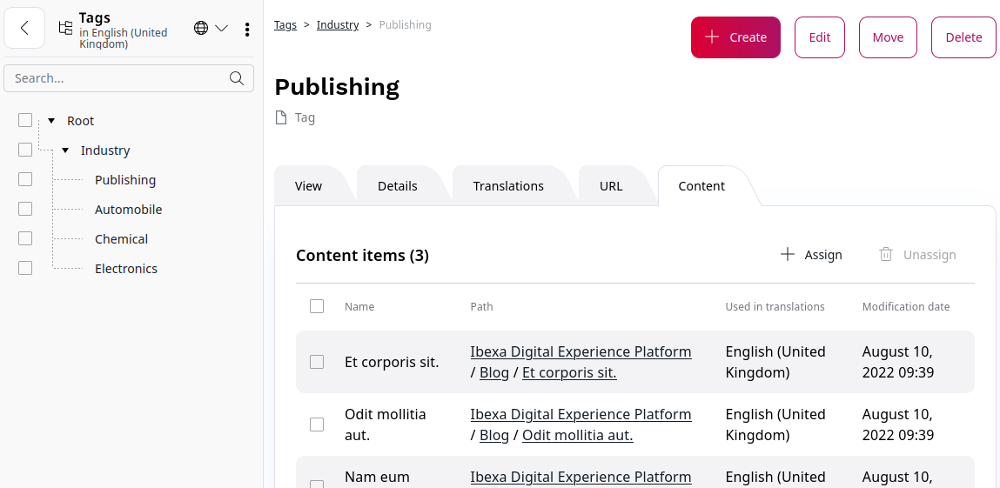

# Taxonomy

With Tags, which can be understood as keywords, you can classify content: you create relationships between items to make it easier for website users to find the content they need, or browse and view content appropriate for them.

Tag hierarchies (aka Taxonomies) are classifications of logical relationships between content items.
In [[= product_name =]], you can create many taxonomies, each with a tree that contains many tags.

## Taxonomy tree

Taxonomy tree is where you create a hierarchy of all tags and relationships between tags and content items.
Working with the Taxonomy tree is similar to working with the content structure tree.

For more information about setting up tags, see [Work with tags](work_with_tags.md).
