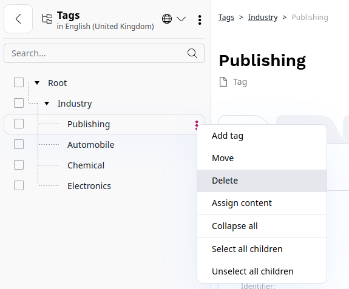

# Work with tags

Once you have created content items that follow the structure defined within the content model, you can create [taxonomies](taxonomy.md) that consist of tags, to help users find the content they need.

## Add tag

You can create tags in two ways:

- create them directly in the taxonomy tree
- click the **Create** button in the **Tags** section

1. To create a new tag in the taxonomy tree, in the left panel click **Content** -> **Tags**.
1. In the **Root** section, click the three dots icon on the level/place you want to add new tag and select **Add**.
1. Enter a unique name for the new tag.
1. Add the tag's identifier.
1. (Optional) Add tag description.
1. To set the parent category, click the **Select parent** button.
1. To save a new tag, click **Save**.

Now, the tag is visible in the taxonomy tree.

<!--ARCADE EMBED START-->
<iframe src="https://demo.arcade.software/l7FSQBrnzGvtBgAaicrs?embed&embed_mobile=tab&embed_desktop=inline&show_copy_link=true" title="Add new tag" frameborder="0" loading="lazy" webkitallowfullscreen mozallowfullscreen allowfullscreen allow="clipboard-write" style="position: absolute; top: 0; left: 0; width: 100%; height: 100%; color-scheme: light;" ></iframe>
<!--ARCADE EMBED END-->

### Assign tag to content from taxonomy tree

Taxonomy is controlled and configured by the *Taxonomy Entry Assignment* field settings, so you can use multiple fields of this type with different taxonomies, for example, tags and product categories in the same content type.
To be able to assign tags to a Content, first, you need to add a *Taxonomy Entry Assignment* field to the content type definition.

1. Go to **Content types** -> **Content**.
1. Click the **Edit** icon next to the content type you want to modify.
1. Go to **Field definitions** and from the available options, drag and drop the *Taxonomy Entry Assignment* to fields in the content type.
1. From the **Taxonomy** drop-down, select the taxonomy type you want to tag this content item with.

Now, when you edit or create a content item of this type, in the tags section, you can add a tag by clicking **Select Taxonomy Entries**. See [Add taxonomy entries](create_edit_content_items.md#add-taxonomy-entries).

!!! caution "Duplicate taxonomy fields"

    Because tags are assigned per content item, not per field, you cannot use two *Taxonomy Entry Assignment* fields with the same taxonomy type in one content type.

### Add tag translation

If you have more than one language version of your website, you can also translate
tags that are used in the website into the target language.

1. Go to the **Tags** section.
1. Click a tag and go to the **Translations** tab.
1. Click **+Add new** and from the available languages, set the source and target language.
1. To finish, click **Create**.

### Delete tag

You can delete tags directly from the taxonomy tree. Go to **Tags** section.

1. Click the three dots icon next to the tag you want to delete.
1. From the context menu, select **Delete**.

### View all content items with specific tag

You can view a list of all content items which are tagged with the given tag.
To do it, go to **Tags** section.
In the taxonomy tree click the respective tag and go to the **Content** tab.

