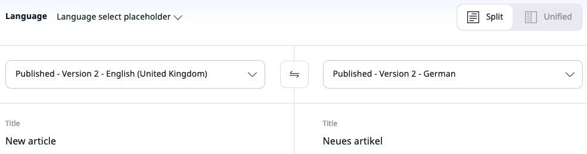

# Translate content

The content on your website can be translated into different languages. Each Content item can have different language versions.
The version visible to a visitor depends on the way your installation is set up (see [SiteAccess concept](#edit-page-for-different-language-versions-of-a-website)).

## Add website languages

You can only add translations in languages that have been set up for your website in the **Admin Panel**.
If your user [Role](work_with_permissions.md) has the right permissions, you can create a new language for the website.
To do it, go to the **Admin Panel**, open the **Languages** tab, and click **Add language**.

Every new language must have a name and a language code written in the xxx-XX format, for example eng-US, fre-FR, nor-NO, etc.
After adding a language, you may have to reload the application to be able to use it.

!!! caution

    Depending on the way the website is set up, additional configuration may be necessary
    for the new translations to be displayed properly.
    Contact your administrator and inform them that you need to add a new language to the website
    (see [the technical documentation on language versions]([[= developer_doc =]]/multisite/languages/languages/)).

## Add translations

You can create a new translation of a Content item by going to the **Translations** tab and clicking **+ Add**.
On the next screen, select the source and target languages and click **Create**.
All the Fields are then pre-filled with the values they have in the base translation.
If you do not choose a base translation, the Fields remain empty.
While working, you can save your work and continue or click **Delete draft** to discard your changes.
When done, you can save your work and close the window, publish the translated article immediately, or pick another publication date.
Every time you add or edit a translation, a new version of the Content item is created,
the same way as when editing only one language.

## Edit Page for different language versions of a website [[% include 'snippets/experience_badge.md' %]] [[% include 'snippets/commerce_badge.md' %]]

When you edit a Page, a bar at the top of the screen lists the most recently used SiteAccesses on your website.
Use this bar to switch between the different versions and work on them.

!!! note "SiteAccess concept"

    SiteAccesses are a means to present different versions of the website to different
    categories of users.
    You could treat SiteAccesses as different "entrance points" to your website.
    They allow you to show different content or design to visitors, for example,
    to serve different language versions to visitors from different countries.

    To see a full list of all SiteAccesses, in the main view, the left-hand menu, click **Site** -> **List**.

    For more information about setting up websites, see [Work with websites](../website_organization/work_with_sites.md).

## Translation comparison

You can compare different versions of the translations of the Content item.

To do it, open the **Content structure** tab, choose the Content item in the Content Tree,
and then go to the **Versions** tab.

Then, click the **Version compare** icon: {.inline-image}.

In the **Comparing versions** screen, pick the split view by using the switcher in the top right corner:

Then, from the dropdowns, select two different language versions of the same Content item.
The screen refreshes to display the side by side view of its Fields.

For more information, see [Work with versions](work_with_versions.md#compare-versions).