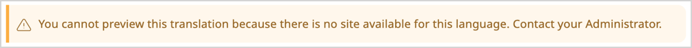
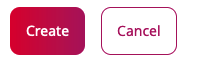
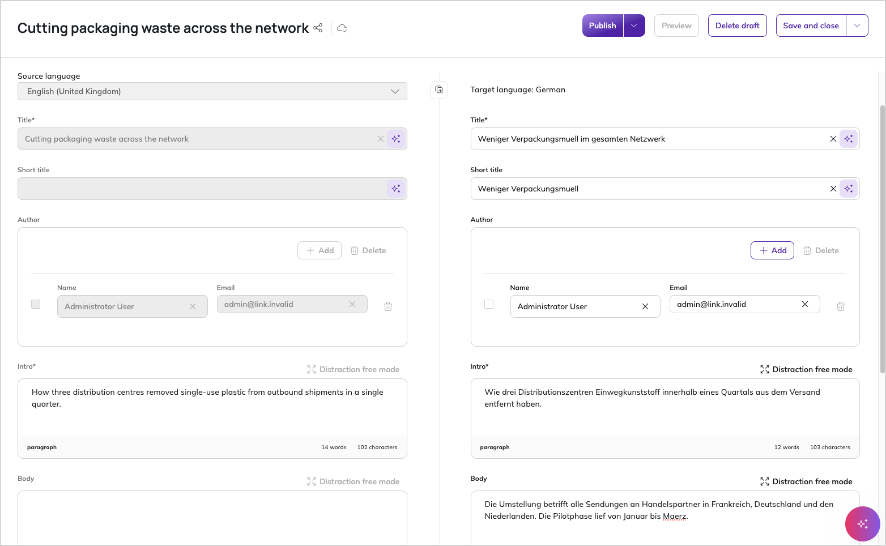
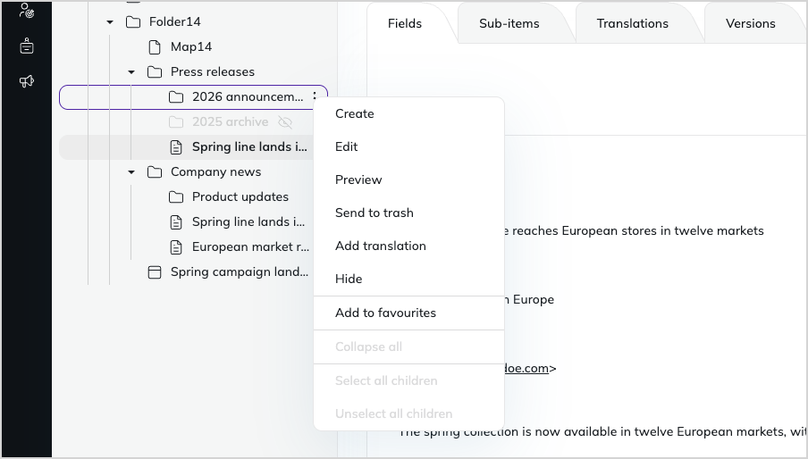
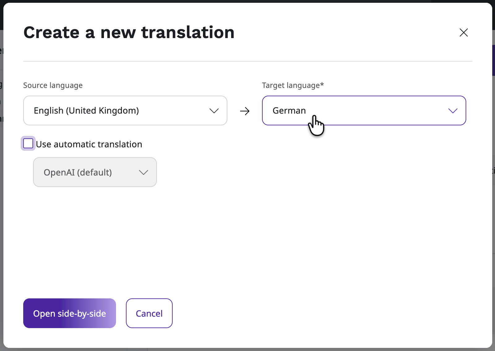
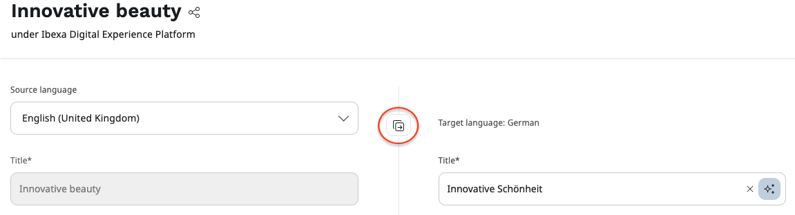
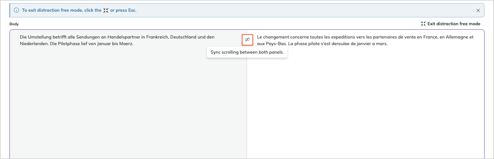
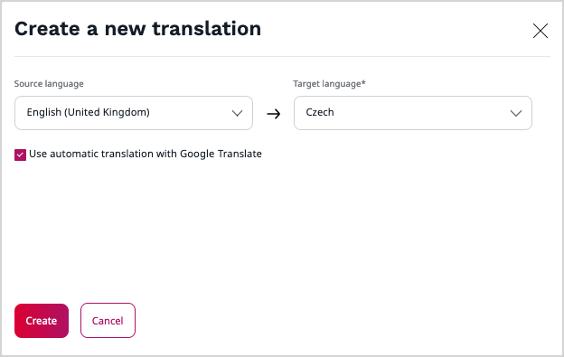
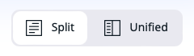
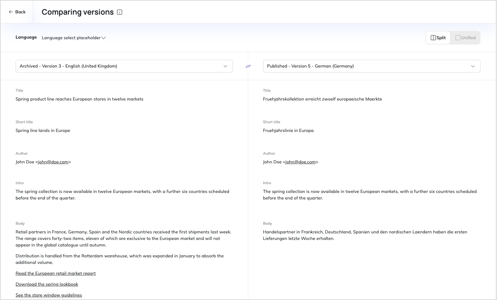

# Translate content

The content on your website can be translated into different languages.
Each content item can have different language versions.
The version visible to a visitor depends on the way your installation is set up (see [SiteAccess concept](#edit-page-for-different-language-versions-of-a-website)).

If the [Translations management](#translations-management) LTS Update is installed in your system, [[= product_name =]] offers a side-by-side translation view that displays the source and target languages simultaneously, making it easier for you to provide, edit and review translations.

## Add website languages

You can only add translations in languages that have been set up for your website in the **Admin** panel.
If your user [role](work_with_permissions.md) has the right permissions, you can create a new language for the website.
To do it, go to the **Admin** panel, open the **Languages** tab, and click **Add language**.

Every new language must have a name and a language code written in the xxx-XX format, for example, eng-US, fre-FR, or nor-NO.
After adding a language, you may have to reload the application to be able to use it.

!!! note "Previewing translations"

    You can only preview content items translated to languages that have a corresponding website configured in that language.
    
    

!!! caution

    Depending on the way the website is set up, additional configuration may be necessary for the new translations to be displayed properly.
    Contact your administrator and inform them that you need to add a new language to the website.
    For more information, see [Developer Documentation on language versions]([[= developer_doc =]]/multisite/languages/languages/).

## Add translations

1\. In the left panel, go to **Content** -> **Content structure**. Then select a content item.

2\. Go to **Translations** tab and click **+ Add**.

3\. In the **Create a new translation** modal, select the source and target languages, then click **Create**.

All the fields are then pre-filled with the values they have in the base translation.
If you do not choose a base translation, the fields remain empty.

While working, you can save your work and continue or click **Delete draft** to discard your changes.
When done, you can save your work and close the window, publish the translated article immediately, or pick another publication date.

Every time you add or edit a translation, a new version of the content item is created,
the same way as when editing only one language.

<!--ARCADE EMBED START-->
<iframe src="https://demo.arcade.software/wrOL621W0E3uAwSOBBmZ?embed&embed_mobile=tab&embed_desktop=inline&show_copy_link=true" title="Add translation" frameborder="0" loading="lazy" webkitallowfullscreen mozallowfullscreen allowfullscreen allow="clipboard-write" style="position: absolute; top: 0; left: 0; width: 100%; height: 100%; color-scheme: light;" ></iframe>
<!--ARCADE EMBED END-->

## Translations management [[% include 'snippets/lts-update_badge.md' %]]

If the translations management feature [is installed and properly configured]([[= developer_doc =]]/multisite/languages/translations_management) in your system, the set of features available for content translation changes:

- Application administrators can [define language pairs]([[= developer_doc =]]/multisite/languages/translations_management/#define-language-pairs) and assign [translation providers]([[= developer_doc =]]/multisite/languages/translations_management/#configure-translation-providers) to them.
- Content editors get a redesigned translation interface called side-by-side translation view. If at least one automated translation provider is configured, editors can use them to machine-translate content.

### Side-by-side translation view

The side-by-side translation view displays the source and target text of the content item on one screen.
This way you can add, modify or review translations in context without having to switch between tabs or windows.

Depending on [user settings](get_started.md#user-settings), the source language column appears on the left or right of the side-by-side view.
By default, the source is on the left.

Non-translatable fields are inactive in the source column, but they remain active in the translation column.
This way you can, for example, replace images, with their localized counterparts.

Like in the standard content item editor, when multiple sections or field groups exist within the content item, anchors appear at the top of the side-by-side translation view to help you jump directly to a specific section.

!!! note "Content type support limitations"

    Content types that use Page Builder or Form Builder do not support the side-by-side translation view and open in the standard single-language editor instead.

    Also, product attributes are not translatable and they are inactive in the side-by-side translation view.

The back office offers several entry points where you can access the side-by-side translation view, for example:

- **Translations tab** — Go to **Content** -> **Content structure**, select a content item, open the **Translations** tab, and click **+ Add**.
- **Content tree** — Click a three dot icon next to a content item in the content tree and, in the context menu, click **Add translation**.
- **Content edit view** — When you choose to edit a content item and several language versions exist, the **Edit side-by-side** button is active for all languages that differ from the main language of the content item.

### Add new translation

1. Either click **Add translation** in the content tree, or **+ Add** in the **Translations** tab.
3. In the **Create a new translation** modal, select the source and target languages.

    !!! note "Draft conflict"

        If a draft already exists for the selected target language, a warning appears in the modal to inform you about this fact.
        You can proceed and add a new draft, or discard the modal and edit the existing draft translation.
        For more information, see [Edit existing translations](#edit-existing-translations).

4. If **Use automatic translation** is checked, select a translation provider from a drop-down list.

    !!! note "Manual translation"

        You may prefer to translate the content by yourself.
        To do it, uncheck **Use automatic translation** and proceed.

        If no translation provider are configured in the system, the checkbox is inactive.

5. Click **Open side-by-side**.

The side-by-side translation view opens with the source text in one column and the target form in the other.
Depending on whether you chose to use automated translations, target fields can be empty or pre-translated.

#### Copy content from source

The divider between the source and target columns contains a **Copy all from source** button.
Click it to copy all translatable field values from the source column into the target fields in a single action.

Values of all fields are copied at the same time, and there is no option to copy individual fields.

#### Change source language

When a content item has three or more published language versions, a dropdown field appears at the top of the source column instead of a label.
You can use the dropdown list to change the language that is displayed in the source column.

#### Hide the source

When the source is placed on the right, the divider between the source and target columns contains a **Collapse source language** button.
The button toggles the source panel visibility, allowing editors to hide the source text when they no longer need it.

#### Distraction-free mode

The distraction mode helps you focus on editing the text or work with longer texts that take more space.
 
Click the **Distraction free mode** button next to any field in the target column to open a full-screen view of that field.
Like in the standard mode, in the distraction-free mode, the source text is visible next to the target field for reference.
However, the **Copy content from source** button is absent.

In distraction-free mode, AI actions, including automatic translation, are available from the editor toolbar.

When the source is displayed on the right, the **Collapse source language** button displays here as well to let editors hide the source text.

### Edit existing translations

The back office offers several entry points where you edit existing content item translations.

To edit a draft translation:

- In content tree, select a content item and open the **Versions** tab. Click a three dot icon next to a draft translation that you want to edit and, in the context menu, click **Edit side-by-side**.
- In the main menu, go to **Content** or visit the **My dashboard** page, and go to **Drafts**. Find a draft whose source and target languages differ and click **Edit side-by-side**.

This opens the existing draft in the side-by-side translation view, so you can review and refine a translation without creating a new draft.

To edit a published translation:

- In content tree, select a content item and click **Edit**. If more than one language version of a content item exists, a list of all available translations is displayed in the **Select translation** modal. Select a language and click the **Edit side-by-side** button.

This opens the side-by-side translation view, where you can perform a review or make your changes and either publish directly create a new draft.

!!! tip

    The **Edit side-by-side** button is active only for languages other than the main language of the content item.

## Automated translation

If your application comes with a [properly configured automated translation feature]([[= developer_doc =]]/multisite/languages/automated_translations), you can have your content machine-translated into multiple languages by using external translation services like Google Translate and DeepL.

To use it, in the **Create a new translation** modal, select the source and target languages and the **Use automatic translation with...** checkbox.
If more than one service is configured, you can choose either of the available options.

When you click **Create**, all the Fields are pre-filled with the values in target language, provided by the selected translation service.

## Translation comparison

You can compare different versions of the translations of the content item.

1\. [Disable the Focus mode](../getting_started/discover_ui.md#disable-focus-mode).

2\. In the left panel, go to **Content** -> **Content structure**. Then select a content item.

3\. Go to **Versions** tab and click the **Version compare** icon: {.inline-image}.

4\. In the **Comparing versions** screen, use the switcher in the top right corner, and click the split view:

5\. From the drop-downs, select two different language versions of the same content item.
The screen refreshes to display the side by side view of its fields.

For more information, see [Work with versions](work_with_versions.md#compare-versions).

## Edit page for different language versions of a website [[% include 'snippets/experience_badge.md' %]] [[% include 'snippets/commerce_badge.md' %]]

When you edit a page, a bar at the top of the screen lists the most recently used [SiteAccesses](multisite.md#siteaccess) on your website.
Use this bar to switch between the different versions and work on them.

!!! note "SiteAccess concept"

    SiteAccesses are a means to present different versions of the website to different categories of users.
    You could treat SiteAccesses as different "entrance points" to your website.
    They allow you to show different content or design to visitors, for example, to serve different language versions to visitors from different countries.

    See [Work with websites](../website_organization/work_with_sites.md) for more information about setting up websites.
