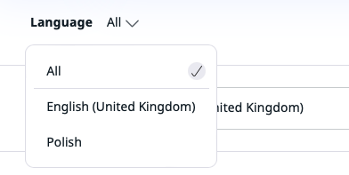

# Translate content

The content on your website can be translated into different languages. Each Content item can have different language versions.
The version visible to a visitor depends on the way your installation is set up (see [SiteAccess concept](#edit-page-for-different-language-versions-of-a-website)).

## Add translations

You can create a new translation of a Content item by going to the **Translations** tab and clicking the plus button.
You will see a list of all available languages. You can also base the new translation on an existing one.
All the Fields will then be pre-filled with the values they have in the base translation.
If you do not choose a base translation, the Fields remain empty. Every time you add or edit any translation,
the Content item gets a new version, the same way as when editing only one language.

You can only add translations in languages that have been set up for your website in the **Admin Panel**.
To create a new language for the website, go to the **Admin Panel**, open the **Languages** tab, and click the **Add language** button.

Every new language must have a name and a language code written in the xxx-XX format, for example eng-US, fre-FR, nor-NO, etc.
After adding a language, you may have to reload the application to be able to use it.

!!! caution

    After adding a language, you should be able to start adding translations to your content.
    However, depending on the way your website is set up, additional configuration may be necessary
    for the new language to work properly, especially with SiteAccesses.
    It is recommended you contact your administrator and inform them if you need to add a new language to the website
    (see [the technical documentation on language versions]([[= developer_doc =]]/multisite/languages/languages/)).

## Edit Page for different language versions of a website [[% include 'snippets/experience_badge.md' %]] [[% include 'snippets/commerce_badge.md' %]]

When you edit a Page, a bar at the top of the screen lists the most recently used SiteAccesses on your website. Use this bar to switch between the different versions and work on them.

Click the SiteAccess list in the left side menu to see the full list of all SiteAccesses.

!!! note "SiteAccess concept"

    SiteAccesses are a means to present different versions of the website to different 
    categories of users.
    You could treat SiteAccesses as different "entrance points" to your website. 
    They allow you to show different content or design to visitors, for example, 
    to serve different language versions to visitors from different countries.
    
    See [Work with websites](../website_organization/work_with_sites.md) for more information about setting up websites.

## Translation comparison

You can compare different versions of the translations of the Content item.

To do it, open the **Content Structure** tab, choose the Content item in the Content Tree, 
and then go to the **Versions** tab.

Then, click the **Version Compare** icon: {.inline-image}.

There are two options of the view:

- Split - default, side by side view to compare versions of the same or different languages
- Unified - single column view to compare versions of the same language

You can change the view by using the switcher in the top right corner:

!!! caution

    When you compare different languages, split view is the only possible option.
    The switcher for the view change is disabled and the system does not highlight differences in this case.

When you compare different versions within the same language, the system highlights the changes:

- yellow - content updated
- blue - content added
- red - content deleted

If there are any translations of the Content item added in the system, the language filter appears in the top left corner. 
You can use a filter to focus on a specific language.
The system shows only versions of chosen language in the drop-down lists.

To do it, click on the arrow and choose a language from the drop-down list.

!!! note

    You can compare only two different versions.
    It is not possible to choose the same version from left and right drop-down lists.