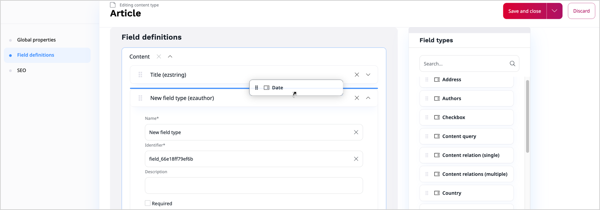
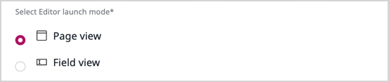

# Work with Content Types

## Create or modify Content Types

If you have Administrator permissions, you can create and modify Content Types.
Click **Content** to see content management options, and then **Content Types** 
to see groups into which the types are organized.
You can add your own groups here to keep your Content Types in better order.
Each group lists all the Content Types that belong to it, where you can modify 
the existing ones or add new ones.

!!! caution "Deleting Content Types"

    You can delete a Content Type only when there are no Content items that belong to it.
    This also includes Content items in the Trash.

Every Content Type has the following general settings:

|Setting|Description|
--------|-----------|
|Name|General name of a Content Type.|
|Identifier|Name that identifies the Content Type in the system.|
|Description|Additional information that is displayed when creating new content based on this type.|
|Content name pattern|Rules for creating the name for a Content item.|
|URL alias name pattern|Rules for creating the URL alias for a Content item.|
|Container|When checked, Content of this Type can serve as a container in the Content tree.|
|Sort children by default by|Criterion by which children of this content will be sorted in the tree.|
|Sort children by default in order|Order in which the children will be sorted (ascending or descending).|
|Make content available even with missing translations|When checked, content of this Type will by default be always available, even if it does not have a language version corresponding to the current SiteAccess.|

To add a Field to the new Content Type, select a [Field Type](content_model.md#fields-and-field-types)
in the Field Type selection drop-down menu and click specific Field Type.
You can determine the order in which Fields will be displayed.

To delete Field(s), check the boxes next to any Field names and select the trash icon.

When a Content Type is modified, each instance of this type (each Content item based on this Content Type) will be changed as well.
If a new Field is added to a Content Type, this Field will appear in every relevant Content item.
Therefore, if the new Field is required, it is recommended to provide a default value for it.
If a Field is deleted from the Content Type definition, all these Fields will be removed from Content items of this type.

Each Field has a number of common parameters:

|Parameter|Description|
|---------|-----------|
|Name|Stores a user-friendly name that describes the Field. The name of a Field can consist of letters, digits, spaces, and special characters. The maximum length is 255 characters. If a blank name is provided, the app automatically generates a unique name for the Field.|
|Identifier|Stores the Name in the system. The identifier can have no more than 50 characters.|
|Position|Defines the order of the Fields in the Content Type.|
|Description|Gives details about the Field that will be displayed next to it when editing content.|
|Required|When this is checked, you will not be able to save or publish a Content item of this type unless the Field in filled in.|
|Searchable|Decides if the contents of the Field will be covered by search.|
|Translatable|Decides if the Field can be translated.|
|Can be a thumbnail|Informs if the Field can be a thumbnail|
|Category|Decides which Field category it will be displayed in for easier organization.|

!!! note "More information"

    For detailed information about modifying Content Types, see [developer documentation]([[= developer_doc =]]/content_management/content_model/#field-definitions).

## Modify default configuration of Pages

As an administrator, you can modify various Content Type settings. 
For example, you can modify settings that regulate the behavior of Content items of [Page](../content_management/create_edit_pages.md) type.

### Configure block display

You can define which page blocks are available for an editor in the page edit mode.

Go to the Content Type that you want to edit. 
In the **Field definitions** section, click the **Landing page** tab.
Expand the **Select blocks** section, and select page blocks.

To apply changes, click **Save**.

Now, only selected page blocks are available in the edit mode.

!!! caution
    When you deselect blocks, any related blocks that are included in the Landing page hide as well. 
    To publish the Page,
    a user has to delete these blocks from the Landing Page.

!!! caution "Add new blocks"
    If a [developer creates a new block]([[= developer_doc =]]/content_management/pages/create_custom_page_block/) and you want to make it available 
    in the editor mode, you must select it manually in the **Select page blocks** section.

### Configure preferred edit mode

As an administrator, you can set the edit mode that is launched when an editor starts editing the Page.

Go to the Content Type that you want to edit. 
In the **Field definitions** section, click the **Landing page** tab.
Expand the **Select Editor launch mode** section, and select from the available options.

### Configure available page layouts

As an administrator, you can configure which page layouts are available for an editor.

Go to the Content Type that you want to edit. 
In the **Field definitions** section, expand the **Landing page** tab.
Expand the **Select layouts** section, and define which layout will be available for this Page.
To apply changes, click **Save**.

If you deselect a layout that is currently used, the user has to change the layout to be able to edit the Page.

## Relation settings

Fields of specific types can also have their own additional settings.
For example, for the "Content relations (multiple)" Field Type you can decide
to have relations only to Content items of a specific, or any Content Type.

!!! caution

    The rules and templates for displaying content on your website are determined at the developer level.
    That is why content of a new Content Type you create may not always display correctly or may cause errors.
    Therefore, it is always best to discuss the need for new Content Types with the administrator of your website
    to make sure whether they need to add it to the configuration.

#### Set relation starting location

When you add a [Relation Field type](create_edit_content_items.md#relation_field) to a Content Type, you can decide which Content tree location opens in the [Content Browser](content_model.md#content-browser) when the user browses to a related Content item.

To set the starting location for the relation, perform the following steps. 

1. Go to **Content Types** and edit the respective Content Type.
2. Go to **Field definitions** and either select or add the `objectrelation` Field
3. Under **Select starting location**, select from the available options:
    - **Default** - the starting location is automatically assigned to the default location in the tree of a created Content item.
    - **Browse** - use to manually select the location from the Content Browser.
    - **Content location** - the starting location is the location of the Content item that is edited by the user. For example, if the user edits the Content item with the location `50`, it sets the starting location to this value with children under this location.
    - **Root default location** - use if you want the Content Browser to start at the defined location with only children available for selection.

