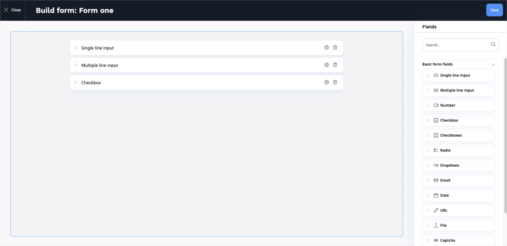

# Work with forms 

You can use forms to increase the functionality of the website by adding a survey, 
questionnaire, sign-up form, etc.
You can then review the results gathered from website users, for example, to improve 
user experience.

For more information about building and styling forms, see [developer documentation]([[= developer_doc =]]/content_management/forms/forms).

## Create forms 

In a selected place of the content tree, click **Create content** and select **Form**. 
Provide the title, for example, "User experience survey" and click **Build form**. 

Build a form by dragging different types of fields into it.
The available types are:

- Single line input
- Multiple line input
- Number
- Checkbox
- Checkboxes
- Radio
- Dropdown
- Email
- Date
- URL
- File
- Captcha
- Button
- Hidden field

Each field has settings that you can access with the options button.
The settings differ depending on the type of field.

**Button** is a special kind of field. You use it for submitting the form.
You can choose one of a few options of what is shown to the user after filling in and submitting the form.

## View results

Once you publish a form and users start filling it in, you can preview the results in the **Submissions** tab in the Content item view.

Here you can view the details of each submission.
You can also delete any submissions (for example if they were made while testing or contain spam).

The **Download submissions** button enables you to download all the submissions in a .CSV (comma-separated value) file.

