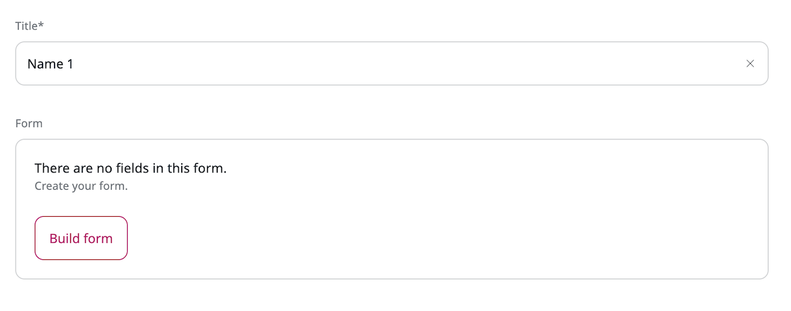

# Work with forms

You can use forms to increase the functionality of the website by adding a survey, questionnaire, sign-up form, etc.
You can then review the results gathered from website users, for example, to improve user experience.

For more information about building and styling forms, see [developer documentation]([[= developer_doc =]]/content_management/forms/forms).

## Create forms

Editors can use the created form anywhere on the website.
Forms can be used in page blocks, embedded in the online editor or even used as a field relation.
The same form can be placed at multiple locations on the website.

To create a form:

1\. In the left panel, go to **Content** -> **Form** and click **Create content**.

2\. In a slide-out pane, make initial choices in the following fields, and click **Create**:

- **Select a language** - from a drop-down list, select the base language for the content item.
- **Select a content type** - use this field to narrow down the list of content type choices displayed below. Then select **Form**, and click the **Create** button.

3\. Provide the title and click **Build form**.

4\. Drag (A) or click (B) on the type from the form fields toolbar.
To create more complicated and detailed form, you can use more than one form field type.

5\. Click on the **Settings** icon to access form field settings. The settings differ depending on the type of field.

**Button** is a special kind of field. You use it for submitting the form.
You can choose one of a few options of what is shown to the user after filling in and submitting the form.

6\. Fill in necessary information and click **Submit**.

7\. Click **Save** or **Close** to exit the Form Builder.

8\. To discard your changes and close the window, click **Delete draft**.

9\. To save your changes:

- Click **Save** to continue editing.
- Click **Save and close** to close the window.

10\. To send your changes to another editor [for review](editorial_workflow.md), click **Send to review**.

11\. When the form is ready for publication:

- Click **Publish** to publish it immediately.
- Click **Publish later** to set a specific publication date.

    For more information, see [Publish content](publish_content.md).

## View results

Once you publish a form and users start filling it in, you can preview the results in the **Submissions** tab in the content item view.

Here you can view the details of each submission.
You can also delete any submissions (for example if they were made while testing or contain spam).

Click **Download submissions** icon to download all the submissions in a .CSV (comma-separated value) file.

## Use case - create newsletter

In the following example, you can learn how to create a Newsletter form and use it with Page Builder.

1\. Create a new content item in the chosen localization in the content tree and choose **Form** type.

2\. Enter **Newsletter** as a title and click **Build** form.

3\. From the **Basic form fields** toolbar choose: Single line input (two times), Email, Checkboxes and Button.

4\.  Click on **Settings** icon and modify chosen form fields:

- Single line input: **Name**: Name
- Single line input #2: **Name**: Surname
- Email: **Name**: Email address
- Checkboxes: **Name**: Gender, **Options**: click **Add** button and add three values: Male, Female, Other.
- Button: **Name**: Sign up!, **Action**: choose Show a message and in the **Message to display** field enter: Thank you!

5\. Click **Save** button and then **Confirm**.

6\. Now, you can use **a Newsletter** form on your page. Open your site using Page Builder and from the **Page blocks** toolbox choose **Form**. Drag it and drop on the zone.

7\. Click **Block settings** icon and then, in the Form window click **Select content** button. Find your form in the content tree and choose it, then click **Confirm** and **Submit** buttons.

8\. Now, you can see a Newsletter form on your page.

