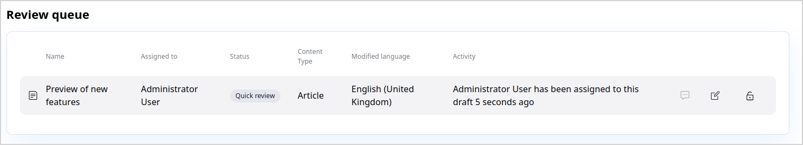

# Editorial workflow

With editorial workflow, you can pass content between different stages in a preconfigured flow.
Typically, the stages correspond to different teams or departments that contribute to content
and approve it.

For example, you can pass content through stages of draft, design and proofreading.

!!! note

    Workflows are configured differently in each installation.
    In your workflows you can have different stages and transition between them.

    Contact your administrator or developer team to configure workflows.
    See [developer documentation]([[= developer_doc =]]/content_management/workflow/workflow/) for information on how to do it.

## Review queue

You can view Content items which are in different stages under review on the 
**My dashboard** screen, in the Review queue table.
The table only shows Content items that your Role has permissions to edit.
If your installation is [configured to support draft locking]([[= developer_doc =]]/content_management/workflow/workflow/#draft-locking), 
the table also informs you whether any reviewers are assigned and have claimed 
their drafts for review.

In the Review queue table, you can access the draft for editing, review its history, 
and unlock the draft or request that a lock is released.

For more information, see [Work with versions](work_with_versions.md).