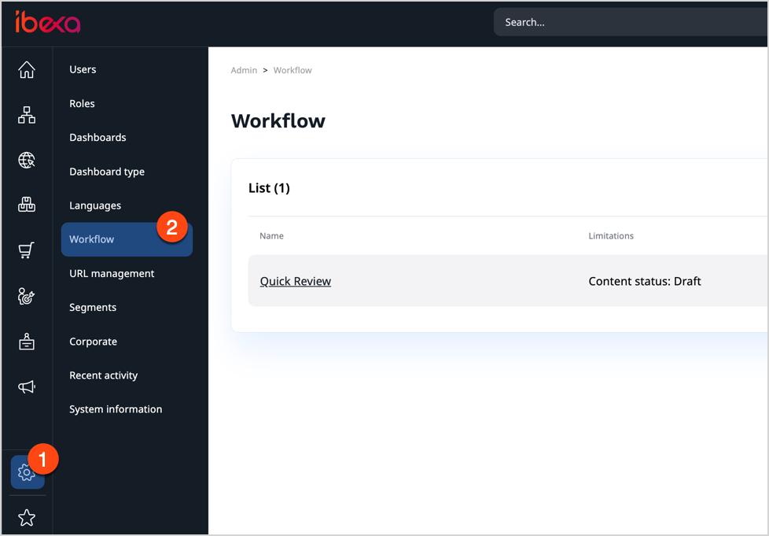
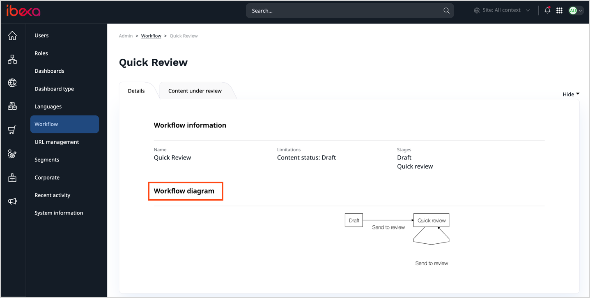

# View workflow list

If you have Administrator permissions, you can view all configured workflows in the **Admin** panel by selecting **Workflow**.

You can preview a diagram of the workflow.

You can also select a configured workflow to see all content items that are under review as part of this workflow.

For more information about configuring workflows, see [Developer Documentation]([[= developer_doc =]]/content_management/workflow/workflow/).