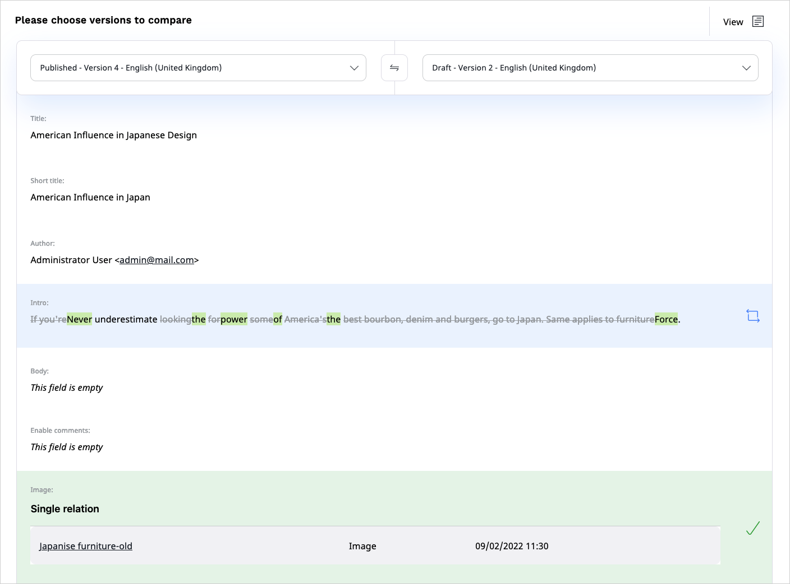
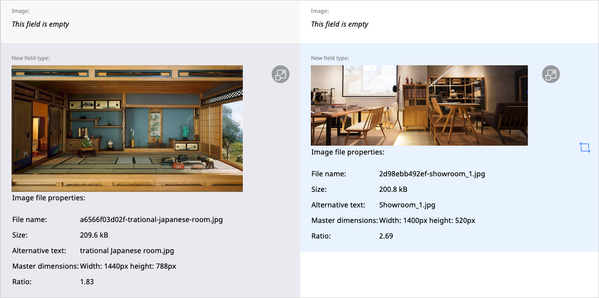

# Work with versions

In [[= product_name =]], Content items can have one published [version](../content_versions.md), 
and several draft and archived versions.
You can perform various tasks on Content item versions, either to advance them 
through the workflow or compare edits from different users.

## Edit drafts

If you are assigned to a draft version of a Content item for [review](editorial_workflow.md), 
when you click the **Edit draft** icon in **My dashboard**, the **Review queue** 
table, you see the **Event(s)** timeline that lists all the transitions that this 
content has gone through.

If draft locking is supported, you also see a message that confirms that the draft is now locked to you.

## Release locked drafts

If you are assigned to a draft version of a Content item and have locked it for 
review, you can release the lock by closing the modal window, publishing the draft, 
or sending it to another reviewer.
You can also do it in **My dashboard**, the **Review queue** table, by clicking 
the **Unlock** icon.

If you are not assigned to the draft, depending on the permissions set for your 
Role, in the **Review queue** table, you can either release the lock by clicking 
the **Unlock** icon, or request that the lock is released by the reviewer 
by clicking the **Request access** icon.

## Compare versions

You can compare two versions of the same Content item.
To do it, in the Content item details screen, the **Versions** tab, click the 
**Version compare** icon:

From the drop-down menus at the top of the screen, select the two versions that you want to compare.

You can choose to view the comparison in two columns, side by side,
or in one column, with differences highlighted.

You can also compare media Field Types such as images.

!!! note

    Not all Field Types are available for comparison. You cannot preview the difference in the following Field Types:

    - Form
    - Landing Page
    - User account
