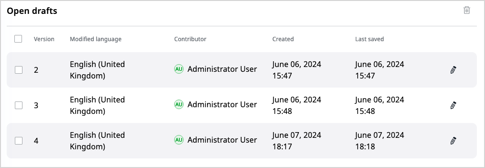
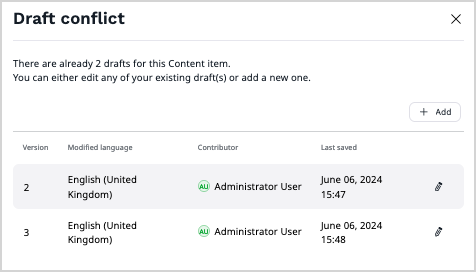
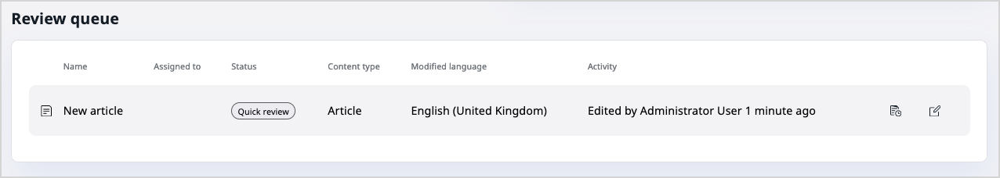
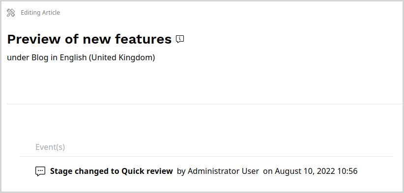
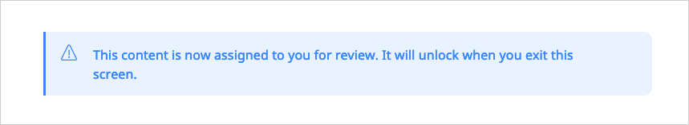
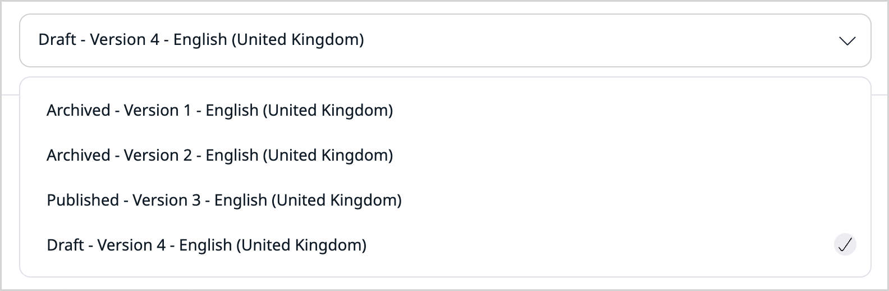
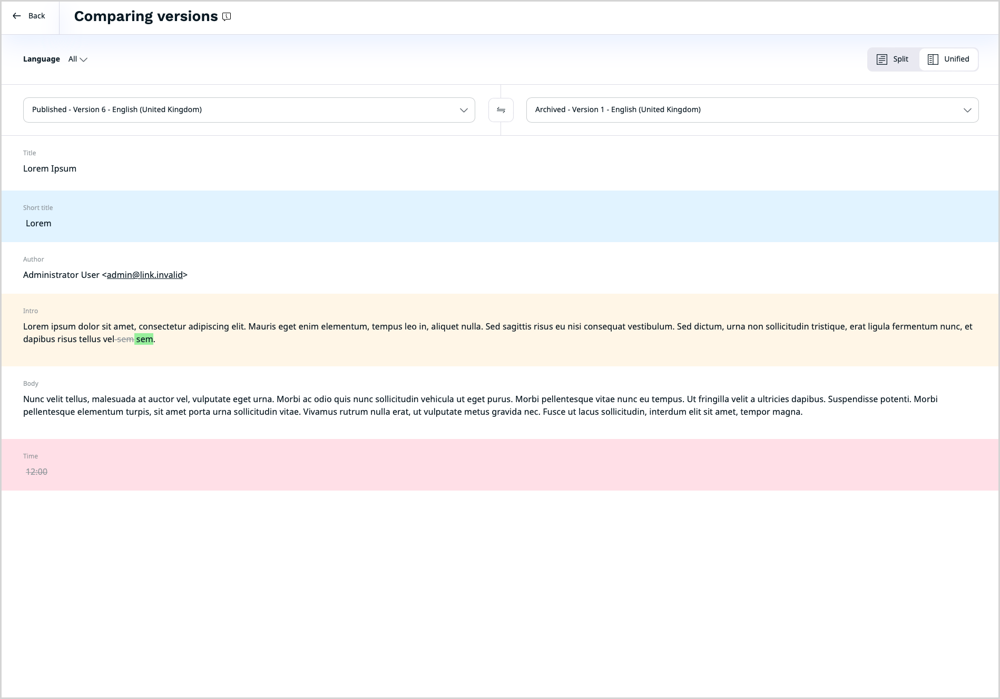
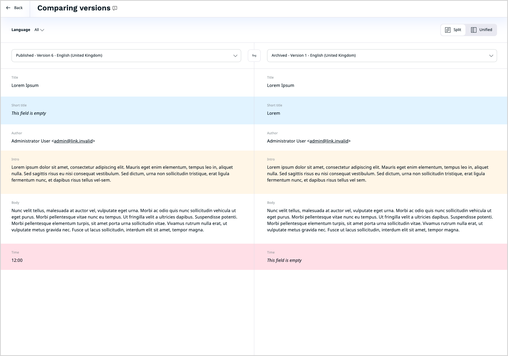
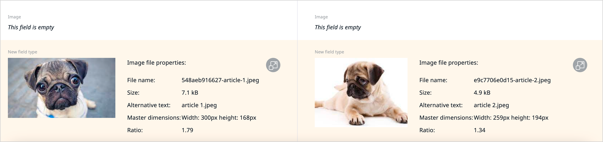

# Work with versions

In [[= product_name =]], content items can have one published [version](../content_versions.md), 
and several draft and archived versions.
You can perform various tasks on content item versions, either to advance them through the workflow or compare edits from different users.

## Edit drafts

There are several ways in which you can start editing an existing draft:

- by picking a draft for editing from the content item's details screen, **Versions** tab, the **Open drafts** list.
You may need to [disable the Focus mode](../../getting_started/discover_ui.md#disable-focus-mode) first. 

- by trying to edit a content item that already has open drafts.
You then see a [**Draft conflict**](content_versions.md#draft-conflicts) screen, where you can pick a draft for editing, or create a new one.
The new draft is based on the published version of the content item and does not contain changes from other drafts.

- when you are assigned to a draft version of the content item for [review](editorial_workflow.md), by picking a draft for editing from the [Dashboard](discover_ui.md#dashboard), **Review queue**

When you review a content item, you see the **Event(s)** timeline that lists all the transitions that this content has gone through.

If draft locking is supported, you also see a message that confirms that the draft is now locked to you.

### Release locked drafts

If you are assigned to a draft version of a content item and have locked it for review, you can release the lock by closing the modal window, publishing the draft, or sending it to another reviewer.
You can also do it in the **Dashboard**, the **Review queue** table, by clicking the **Unlock** icon.

If you are not assigned to the draft, depending on the permissions set for your Role, in the **Review queue** table, you can either release the lock by clicking the **Unlock** icon, or request that the lock is released by the reviewer by clicking the **Request access** icon.

## Compare versions
You can compare two versions of the same content item, for example, to resolve a conflict between drafts coming from different sources.

To do it, [disable the Focus mode](../../getting_started/discover_ui.md#disable-focus-mode).
Then, in the content item details screen, go to the **Versions** tab and click the 
**Version Compare** icon: {.inline-image}.

From the drop-down menus at the top of the screen, select the two versions that you want to compare.

There are two options of the view:

- Split - default, side by side view
- Unified - single column view

When you compare two versions, the system highlights the changes:

- yellow - content updated
- blue - content added
- red - content deleted

You can also compare media Field Types such as images.

!!! note

    Not all Field Types are available for comparison. You cannot preview the difference in the following Field Types:

    - Form
    - Landing Page
    - User account
