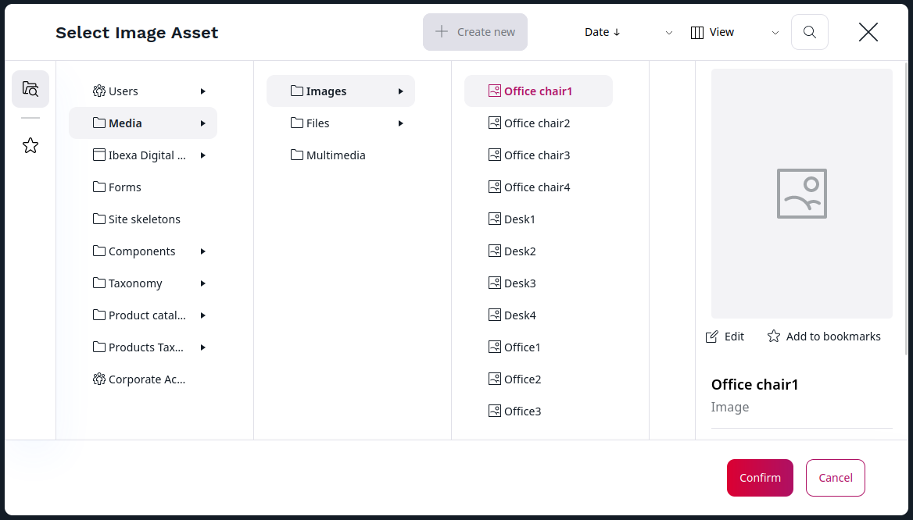

# Content model

At the heart of [[= product_name =]] is a repository that stores all content.
In [[= product_name =]] everything is a Content item — not just the actual pages displayed in the website,
but also all media (images, videos, etc.) and User accounts.

[[= product_name =]] lets you customize and adapt the content model depending on your needs and the type of website you create.

Depending on your organization, if you are an editor or a content creator,
it is possible that the content model for your installation has already been created by your administrator or content manager.
However, even a non-technical user can easily create or modify the content model through the editing interface.

## Content Types

A **Content Type** is comparable to a pattern or a template on which you base Content items.
Whenever you create a new Content item, you must choose its Content Type.

The Content Type defines what Fields will be available in the Content item.
A Content item may only contain the Fields that are defined in the Content Type.

[[= product_name =]] allows you to create, edit, and delete Content Types and their Fields.
A clean installation contains a few basic Content Types.

## Content items

A **Content item** is a single piece of content: an article, a blog post, an image, a product, etc.
Each Content item has general characteristics, such as name and identifier. It also contains **Fields**.
These Fields will differ depending on what kind of content you are dealing with.
An *article* Content item may have Fields such as *title*, *name*, *author*, *body*, *image*, *subscriber teaser*, etc.
A *product* Content item may have *product name*, *category*, *price*, *size*, *color*, etc. as Fields.

## Content items versus Content Types

A Content item is an instance of a particular Content Type, in other words, a single object created based on a Content Type template.

When a Content item is created, it inherits the Fields from its Content Type.
However, the values of the Fields (their "contents") are empty, and you need to fill them separately for each Content item.
The Fields in a Content Type are only definitions. This means that they describe what Fields of what kinds will be present in a Content item,
but as a rule they do not provide these Fields' values.

As a consequence, all Content items of the same Content Type will share the same set of Fields, but their Field values will be different.

For example, you need to store book information.
You create a new Content Type called "Book" and add to it Fields such as Title, Author, Genre, ISBN, etc.
Next, based on this Content Type, you can create any number of Content items.
The empty Fields will be ready to be filled in with the information about each specific book:

## Fields and Field Types

A Field Type defines what kind of data is stored in a Field.
For example, a Field with a TextLine Field Type stores a single line of text, an Image Field Type stores an image file,
and Author Field Type holds information about author details (like name and email).
By default, the system comes with a large set of Field Types that cover the most common needs,
e.g. Text line, Rich text, Email, Author list, Content relation, Map location, Float, etc.

## Content model in summary

**Content Types:**

- A Content Type defines Fields that a Content item will be composed of.
- Every Field is modeled after a Field Type which defines the kind of data it contains.

**Content Items:**

- A Content item consists of a number of Fields.
- Every Content item is based on a Content Type.

**Fields and Field Types:**

- [[= product_name =]] comes with a collection of essential Field Types.
- It is possible to extend the system by creating custom Field Types for special needs.

## Content and media

When you are in the Back Office, you can view the content in your repository in four places:

- Content structure
- Content Tree
- Media library
- User list

They represent three categories of Content Types that you can create
(see [Content Types](site_organization/organizing_the_site.md#content-types)).

!!! note

    When you browse the Media library, you can perform basic image editing functions by using an [Image Editor](editing_images.md).

### Content browser

During your work with [[= product_name =]] you might need to select content from the Repository.
This happens for example when you want to move or copy a Content item, embed an image, link two Content items, etc.
In such cases you use the **Content Browser**.

To access the **Content Browser**, go to the **Content** tab and select **Content structure** or **Media**.
Then, on the left side of the screen, click **Browse**.

With the **Content Browser**, you can switch between the Grid, Panels and Tree views to navigate through the content of the site.
Depending on your permissions, you might be able to review the regular content, media, forms, site skeletons and User accounts.
You can also use the **Content Browser** to search the Repository for content, edit content, create bookmarks, and create new content when needed.

!!! note

    If you have administrator permissions, you can also view and manage User accounts and site skeletons in the **Admin** tab.
    
    For more information about users and permissions, see [Users](site_organization/organizing_the_site.md#users).
    
    For more information about site skeletons, see [Site skeletons]([[= developer_doc =]]/guide/multisite/site_factory_configuration/#site-skeletons).

### Content Tree

If you want to navigate through your website with a menu, go to the **Content** tab, and select **Content structure**.
**Content Tree** in the left sidebar opens an expandable content menu of your site.

Unique icons for each Content Type instantly show you what type of content you are selecting. To add custom icons to your Content Tree, follow [configuration tutorial in developer documentation.]([[= developer_doc =]]/extending/custom_icons/#customize-content-type-icons)

Hidden content is blurred out in the tree view.

To simplify the Content Tree, big lists are shortened with a **Show more** option. You can select it to expand all lists in the tree.
The **Collapse all** option situated at the bottom of the tree closes all expanded sections.

For more information on custom configuration, go to [Content Tree]([[= developer_doc =]]/administration/back_office/content_tree) in developer documentation.
