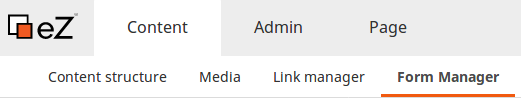
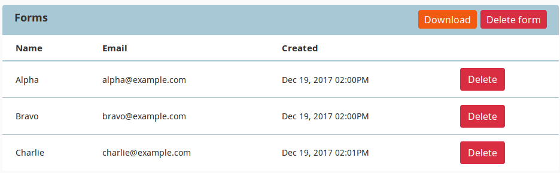

# Creating content, advanced

## Languages

The content on your website can be translated into different languages. Each Content item can have different language versions.
Which version is shown to a visitor depends on the way your installation is set up
(see [SiteAccess](https://doc.ezplatform.com/en/latest/guide/siteaccess/) for a technical explanation of the concept).

### Adding translations

You can create a new translation of a Content item by selecting **Translations** in the menu.
You will see a list of all the existing translations and can switch to them and edit them.
From there you can also add a new translation. When doing so, you can base the new translation on an existing one.
All the fields will then be pre-filled with the values they have in the base translation.
If you do not choose a base translation, the fields will be empty. Every time you add or edit any translation,
the Content item gets a new version, the same way as when editing only one language.

You can only add translations in languages that have been set up for your website in the Admin Panel.
To create a new language for the website, go to the Admin Panel and the **Languages** tab and select **Create a new language**.

Every new language must have a name and a language code, written in the xxx-XX format, for example eng-US, fre-FR, nor-NO, etc.
After adding a language you may have to reload the application to be able to use it.

!!! caution

    After adding a language you should be able to start adding translations to your content.
    However, depending on the way your website it set up, additional configuration will probably be necessary
    for the new language to work properly, especially with siteaccesses.
    It's recommended you contact your administrator and inform them if you need to add a new language to the website
    (here is the [technical documentation of languages](https://doc.ezplatform.com/en/latest/guide/internationalization/)).

### SiteAccess

When working in Page mode you can see a bar at the top of the page listing SiteAccesses configured for your website.
SiteAccesses are a way of offering different versions of your website to different categories of users.
You can treat them as different "entrance points" to your website,
that allow you to show different content or design to the visitor, depending on which SiteAccess they use.
SiteAccesses can be used for example to serve a different website version for paying and non-paying visitors,
or different language versions to visitors from different countries.
You can use this bar to switch between and work on the different versions.

Siteaccess must be [set up by the administrator of the installation](https://doc.ezplatform.com/en/latest/guide/siteaccess/).

## Forms

In eZ Enterprise you can add a Form block to a Landing Page to place a form/survey/questionnaire on your site.
The data entered in this form will be available from the editing interface.

To create a form, drag a Form block to a Landing Page and look at its options.
Every form must be given a name, you can also enter a description and change the default label that will be displayed on the submission button.
In the settings section you can also define different options:
what will be displayed after a visitor fills in the form (a message, a Content item or a page based on a URL),
and who will be notified every time someone fills in the form.

To add the actual contents of the form, go to the Fields tab.
Every form can contain any number of fields of a few different kinds. The ones available by default are:

- Single Line Text
- Paragraph Text
- Email

and since v1.8:

- URL
- Date
- Checkbox
- Radio
- Dropdown
- Captcha
- File

Custom fields may be added to your installation.

You place the fields in the form by dragging and dropping them.
Each field can have its own specific options, but they all have five settings in common:

| Option           | Description                                                                                          |
|------------------|------------------------------------------------------------------------------------------------------|
| Name             | Name of the field                                                                                    |
| Admin label      | Alternative, shorter version of the name. This will be used as the column name in the results table. |
| Help text        | Additional explanatory text that will be displayed next to the field.                                |
| Placeholder text | The text that fills the field before the user fills in their content.                                |
| Required         | Whether filling in the field is necessary for the form to be submitted.                              |

### Viewing form results

Once you publish a page with a Form and users start filling it in,
you can preview the results by activating **Form Manager** in the Content mode tab.

You can see there a table with every form throughout your site, with the number of submissions and other details.
Select a form to view a list of all submissions. There you can also delete any submissions
(for example if they were made while testing or contain spam).
The **Download Data** button lets you download all the submissions to a form in a CSV (comma-separated value) file.

Files uploaded through the **File** field will be added as separate Content items in the Media Library.

#### Best Practices: Forms

##### Avoiding possible inconsistency in forms

When creating a form using Form Fields each field is reflected with a unique ID in the database.
This unique ID is tied with this field, regardless of changes made in Form Builder afterwards.
This means that editing a field in a form that is already published may lead to possible inconsistency of data provided by viewers.

For example: If you decide to gather a wider range of information from viewers, using a form that consist of many Form Fields is the best idea.
However, after some time, it may seem reasonable to re-use one of the fields by changing its name
and to collect information that requires the same field type.
Let's say the field Name is renamed to Full Name in order to make it more clear for viewers and collect more accurate data.
What happens here is that all entries from field's old version and all entries from updated field are now saved under the same unique ID.

Best practice is to remove the old field and create a new one with a new unique ID if there is a risk of inconsistency.
