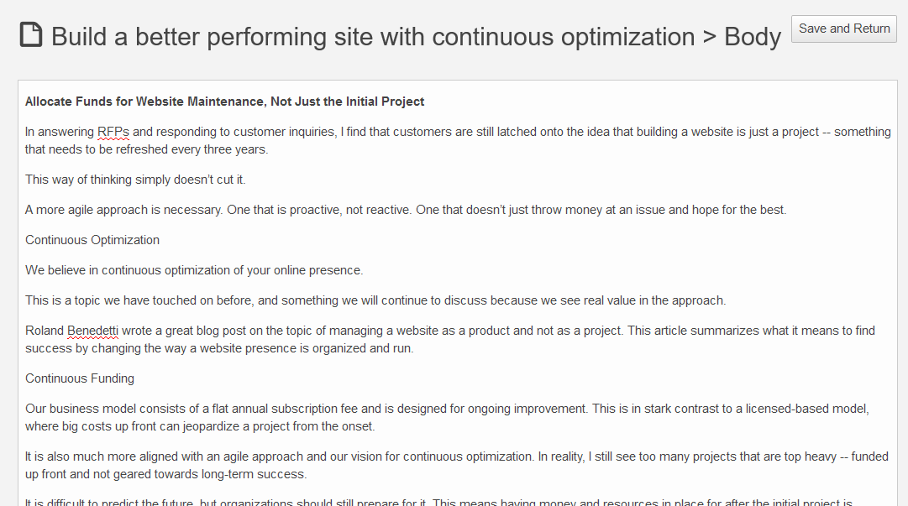

# Creating content – basic

## Creating content

There are a few ways of creating a new Content item:

1. Click **Create** in the right menu *whenever you are viewing any other content*.
The new item will be placed under the current Content item in the tree.
1. Click **Create** in the upper right corner of the *Dashboard*.
In this case you have to select where the content will be located. (Enterprise only).
1. Go to the **Create** tab in the *Content browser*.
Here also you have to choose a location for the new item.
1. Drag files onto the *Sub-items box* when viewing any content or click **Choose files** and select files to upload.
In this way you can upload files such as images, videos, pdf documents etc.

If you choose one of the first three options, you have to select the Content Type first.
When uploading files the Content Type will be chosen automatically.

!!! enterprise

    If you are using eZ Enterprise, you will have the [*Landing Page*]((#working-with-a-landing-page)) Content Type available for selection.

Each Content item is based on a Content Type. The Content Type defines what Fields you have to fill in when creating a new item.
It may also determine the layout or style in which this item is displayed.

Fields marked with an asterisk (\*) are required. You will not be able to save the Content item without filling them in.

Some Fields, such as *Relation* Fields (which link two Content items), or *Image* Fields
require you to select a different Content item to link to.
A *Location* Field is a point on the map. You can type the place name, enter its coordinates, or select it on the map.

Note that it's impossible to link to a different Content item (e.g. create a relation or embed an image)
if you created your content directly in the Create tab in the Content browser.

### Editing Rich Text Fields

Rich Text Fields are filled in using a special Online Editor. Its options appear when you click the Field box.

To add a new element to the Field, select the plus icon to the left of the box and choose one of the available elements:

- Heading
- Paragraph
- Unordered list
- Ordered list
- Image
- Embed
- Table

Each of these elements can have its own settings, such as text formatting.
The option bar also lets you reorder or remove any elements in the Rich Text Field.

#### Images

In image options you can select an image variation.
Variations can include different sizing options and other filters that are applied to images.
Available image variations must be configured at the developer level.
See [Images](https://doc.ezplatform.com/en/latest/guide/images/) for a technical guide on how to do this.

#### Tables

In table options you can define the first row and/or column as headers,
add or delete rows and columns in any part of the table, as well as merge and split cells.

#### Text formatting

When you select a section of text, you get access to text formatting options such as bold or underline.
Here you can also add a link to the text. You can link to an external website, or to another Content item.

If you'd like a distraction-free editing environment when working with a Rich Text Field,
activate **Focus** to enter a special mode where only this Field is visible.

### Previewing content

While editing you can preview what the content will look like using one of the preview buttons in the menu.

A Content item can have different looks for different [SiteAccesses](creating_content_advanced.md#siteaccess).
You can select a SiteAccess to preview by using a dropdown in the preview screen.

!!! enterprise

    ## Working with a Landing Page

    Landing Pages, in contrast with regular content, are best created from the Page mode.
    You can do this by activating **Create** in the upper right corner of the screen and selecting **Landing Page**.

    In a newly created Landing Page you must first choose a layout which defines the available zones.
    Next, fill in basic information about the page: its Title and Description.
    Notice that the URL under which the page will be accessible is generated automatically based on the title.

    

    

    A new empty Landing Page will be divided into those zones.
    In the editor you can also see a menu of blocks (Elements) that you can add to the zones.
    Do this by dragging any of the blocks to an empty place on a zone. Do not worry about placing blocks in the proper place from the start.
    You can reorder the blocks at any time by dragging and dropping them in the desired location.

    

    eZ Enterprise comes with a set of ready-to-use Landing Page blocks,
    but [developers can add their own](https://doc.ezplatform.com/en/latest/cookbook/creating_landing_page_blocks_(enterprise)/). The blocks provided out of the box are:

    - Content List - displays Content items of a chosen Content Type (or Types) that are contained in a folder.
    - Banner - displays an image Content item with a URL attached to it.
    - Embed - embeds content of any type on the Landing Page.
    - Gallery - displays Images contained in a folder.
    - Keyword - lets you specify a keyword or keywords. It will then display all Content items which contain the selected keywords.
    - MA Form - (Marketing Automation) gathers information about visitors to the page.
    - Places - displays a list of all place Content items in a folder you choose.
    - RSS - loads and displays news from RSS feeds (channels).
    - Schedule - allows you to select Content items and plan (schedule) the times at which they will be displayed on the page.
    - Code - inserts custom HTML into your Landing Page.
    - Video - embeds a video Content item into a page, with standard playback controls.
    - Form - places a form (questionnaire, survey, etc.) on the Landing Page.
    - Personalize - serves personalized content in the Landing Page.
    - Collection - displays a set of Content items you select manually.

    

    Each kind of blocks has its special properties that you can access from the block's menu when it is selected.
    In most cases you do this by activating the settings button.
    The settings for most blocks should be self-explanatory, but a few require additional explanation.

    #### MA Form block

    The Marketing Automation form starts working automatically when it is placed on a page.
    It needs no additional configuration.

    #### Personalize block

    Personalize Block is used in conjunction with the Recommendation feature to show the visitor content
    dependent on a predefined personalization scenario. Content can be displayed in a number of styles.

    | Option                       | Description                                                                                                 |
    |------------------------------|-------------------------------------------------------------------------------------------------------------|
    | Name                         | Name of the block                                                                                           |
    | Displayed                    |                                                                                                             |
    | Personalized Scenario        | Predefined personalization scenario that will be used.                                                      |
    | Content Type to be displayed | Type of items that will be shown in the block.                                                              |
    | Number of Items              | Number of Content items to show.                                                                            |
    | Display Options              | Orientation of the content shown in the block.                                                              |
    | Use Carousel                 | If Horizontal orientation is chosen, you can use choose to display content in a scrollable carousel layout. |

    To create and use Personalized Scenarios, it is necessary to use eZ Personalization GUI (YOOCHOOSE admin page)
    and create scenarios that will appear in the "Select Scenario" dropdown menu.
    There are no out-of-the-box scenarios for the block.

    The scenarios at YOOCHOOSE support multiple output types, e.g. articles, pictures, videos, blog posts and more.
    However, Content Types also need to be defined in eZ Personalization GUI (YOOCHOOSE admin page) in order to be included in the dropdown menu.
    Selecting a Content Type is mandatory.

    Recommended content can be displayed in a horizontal and vertical (skyscraper) way.
    However, differences are not only in the position of the block:

    - If the option "Use Carousel" is not active, be sure that the number of items to display in the Personalize Block
    meets the block size and none of items are "hidden" behind the block borders.
    - During resizing for responsive layout the available space for items may change.
    - In the horizontal layout it is possible to insert more items that move in a carousel fashion.
    The carousel option is available for horizontal display only!

    #### Schedule block

    Schedule block can be used in conjunction with the Timeline toolbar to plan the exact times at which each Content item is supposed to appear.
    Depending on its template, the block contains a number of slots where you can add Content items and define their airtimes.
    More about how to use and customize the Schedule block in [Publishing](publishing.md#scheduling).

    #### Form block

    Using the Form block is described in detail in [Forms](creating_content_advanced.md#forms).

## Publishing content

If you are ready to publish the Content item, in the menu, click **Publish**.
To save the Content item as a draft to finish editing it later, click **Save**.
For more details, see [Publishing](publishing.md).
