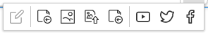

# Creating content, basic

## Creating content

There are four ways of creating a new Content item:

1. Activate **Create** in the right menu *whenever you are viewing any other content*.
The new item will be placed under this content in the tree.
1. Activate **Create** in the upper right corner of the *Dashboard*.
In this case you will have to select where the content will be located.
1. Go to the **Create** tab in the *Universal Discovery Widget*.
Here also you'll have to choose a location for the new item.
1. Drag files onto the *Sub-items box* when viewing any content or activate the upload button and select files to upload.
In this way you can upload files such as images, videos, pdf documents etc.

If you choose the first three options, you have to select the Content Type first.
When uploading files the Content Type will be chosen automatically.

If you are using eZ Enterprise, you will have the *Landing Page* Content Type available for selection.
This Type requires a slightly different way of creating, [see below](#working-with-a-landing-page).

Each Content item is based on a Content Type. The Content Type defines what Fields you will have to fill in the new item.
It may also, depending on the way your website is set up, decide things such as the layout or style in which this item will be displayed.

Different Fields may require different formats of data.
Fields marked with an asterisk (\*) are required and you will not be able to save the Content item without filling them in.

It's worth taking a closer look at a couple of formats you may have to deal with.

In case of *Relation* Fields (which link two Content items), or *Image* Fields (which should be self-explanatory)
you may need to select a different Content item using the UDW.
If you have a *Location* Field, you may type the place name, enter its coordinates or point to it on the map.
A *Rich Text* Field requires a bit more explanation.

Note that it's impossible to link to a different Content item (e.g. create a relation or embed an image)
if you created your content directly in the Create tab in the Content browser.

### Editing Rich Text Fields

Rich Text Fields are filled using a special Online Editor whose options appear when you activate the Field box.

You can add a new element to the Field by activating the plus icon to the left of the box
 and choosing one of the available elements:

- Heading
- Paragraph
- Unordered list
- Ordered list
- Image
- Embed
- Table

Each of these elements can have its own settings, such as formatting, that you can access by activating it.
The option bar also lets you reorder or remove any elements in the Rich Text Field.

#### Images

Images options enable you to select the variation (alias) for the image.
Available image variations, including different sizing options and other filters that can be applied to images,
can be configured for your installation at a developer level.
See [Images](https://doc.ezplatform.com/en/latest/guide/images/) for a technical guide on how to do this.

#### Tables

In table options you can define the first row and/or column as headers,
add and delete rows and columns in any part of the table as well as merge and split cells.

#### Custom elements

You installation can also have custom elements. Contact your site administrator about the details of using them.

#### Text formatting

When you select a section of text, you get access to text formatting options such as bold or underline.
Here you can also add a link to the text. You can link to an external website, or to another Content item.

### Previewing content

While editing content you can preview what it will look like using the Preview button in the menu.

A Content item can have different looks for different [SiteAccesses](glossary.md#siteaccess).
You can select a SiteAccess to preview using a dropdown in the preview screen.

!!! enterprise

    ## Working with a Landing Page

    Landing Pages are a special Content Type available in eZ Enterprise that can be used as entrance points to your website.
    Instead of regular Fields a Landing Page has a number of zones onto which you can drop different dynamic blocks.

    Landing Pages, in contrast with regular content, are best created from the Page mode.
    You can do this by activating **Create** in the upper right corner of the screen and selecting **Landing Page**.

    In a newly created Landing Page you must first choose a layout which defines the available zones.
    Next, fill in basic information about the page: its Title and Description.
    Notice that the URL under which the page will be accessible is generated automatically based on the title.

    

    This creates an empty Landing Page with the predefined zones.
    In the editor you can also see a menu of blocks (Elements) that you can add to the zones.
    Do this by dragging any of the blocks to an empty place on a zone.
    Don't worry about placing blocks in the proper place from the start, you can also reorder them by dragging later.

    

    eZ Enterprise comes with a set of ready-to-use Landing Page blocks,
    but [developers can add their own](https://doc.ezplatform.com/en/latest/cookbook/creating_landing_page_blocks_(enterprise)/). The blocks provided out of the box are:

    - Content List - displays Content items of a chosen Content Type (or Types) that are contained in a folder.
    - Banner - displays an image Content item with a URL attached to it.
    - Embed - embeds Content of any type on the Landing Page.
    - Gallery - displays Images contained in a folder.
    - Keyword - lets you specify a keyword or keywords. It will then display all Content items which contain the selected keywords.
    - MA Form - (Marketing Automation) gathers information about visitors to the page.
    - Places - displays a list of all place Content items in a folder you choose.
    - RSS - loads and displays news from RSS feeds (channels).
    - Schedule - allows you to select Content items and plan (schedule) the times at which they will be displayed on the page.
    - Code - inserts custom HTML into your Landing Page.
    - Video - embeds a video Content item into a page, with standard playback controls.
    - Form - places a form (questionnaire, survey, etc.) on the Landing Page.
    - Personalize - serves personalized content in the Landing Page.
    - Collection - displays a set of Content items you select manually.

    

    Each kind of blocks has its special properties that you can access from the block's menu when it is selected.
    In most cases you do this by activating the  settings button.
    The settings for most blocks should be self-explanatory, but a few require additional explanation.

    #### MA Form block

    The Marketing Automation form starts working automatically when it is placed on a page.
    It needs no additional configuration.

    #### Personalize block

    Personalize Block is used in conjunction with the Recommendation feature to show the visitor content
    dependent on a predefined personalization scenario. Content can be displayed in a number of styles.

    | Option                       | Description                                                                                                 |
    |------------------------------|-------------------------------------------------------------------------------------------------------------|
    | Name                         | Name of the block                                                                                           |
    | Displayed                    |                                                                                                             |
    | Personalized Scenario        | Predefined personalization scenario that will be used.                                                      |
    | Content Type to be displayed | Type of items that will be shown in the block.                                                              |
    | Number of Items              | Number of Content items to show.                                                                            |
    | Display Options              | Orientation of the content shown in the block.                                                              |
    | Use Carousel                 | If Horizontal orientation is chosen, you can use choose to display content in a scrollable carousel layout. |

    To create and use Personalized Scenarios, it is necessary to use eZ Personalization GUI (YOOCHOOSE admin page)
    and create scenarios that will appear in the "Select Scenario" dropdown menu.
    There are no out-of-the-box scenarios for the block.

    The scenarios at YOOCHOOSE support multiple output types, e.g. articles, pictures, videos, blog posts and more.
    However, Content Types also need to be defined in eZ Personalization GUI (YOOCHOOSE admin page) in order to be included in the dropdown menu.
    Selecting a Content Type is mandatory.

    Recommended content can be displayed in a horizontal and vertical (skyscraper) way.
    However, differences are not only in the position of the block:

    - If the option "Use Carousel" is not active, be sure that the number of items to display in the Personalize Block
    meets the block size and none of items are "hidden" behind the block borders.
    - During resizing for responsive layout the available space for items may change.
    - In the horizontal layout it is possible to insert more items that move in a carousel fashion.
    The carousel option is available for horizontal display only!

    #### Schedule block

    Schedule block can be used in conjunction with the Timeline toolbar to plan the exact times at which each Content item is supposed to appear.
    Depending on its template, the block contains a number of slots where you can add Content items and define their airtimes.
    More about how to use and customize the Schedule block in [Publishing](publishing.md#scheduling).

    #### Form block

    Using the Form block is described in detail in [Forms](creating_content_advanced.md#forms).

## Publishing Content

After you are done, in the menu you can choose to **Publish** the Content item or to **Save** its draft.
See [Publishing](publishing.md) for more details.
