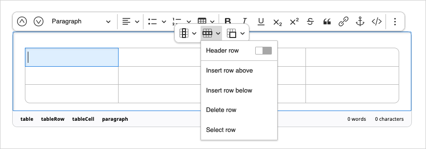

# Creating content – basic

## Creating content

There are four ways of creating a new Content item:

1. Click **Create** in the right menu while viewing any other content.
The new item appears under the current Content item in the tree.
1. Click **Create** in the upper-right corner of the Dashboard.
In this case you have to select where the content will be located.
1. Go to the **Create** tab in the *Universal Discovery Widget*.
Here also you have to choose a location for the new item.
1. Drag files onto the **Sub-items** box when viewing any content or click the upload button and select files to upload.
In this way you can upload files such as images, videos, PDF documents, etc.

If you choose the first three options, you have to select the Content Type first.
When uploading files, the Content Type will be chosen automatically.

!!! enterprise

    If you are using eZ Enterprise Edition,
    you will have the *Page* Content Type available for selection.
    Pages are edited in the Page Builder, [see below](#working-with-a-page).

Each Content item is based on a Content Type. The Content Type defines what Fields you have to fill in when creating a new item.
It may also determine the layout or style in which this item is displayed.

Fields marked with an asterisk (\*) are required. You will not be able to save the Content item without filling them in.

Some Fields, such as *Relation* Fields (which link two Content items), or *Image* Fields
require you to select a different Content item to link to.
A *Location* Field is a point on the map. You can type the place name, enter its coordinates, or select it on the map.

### Editing Rich Text Fields

Rich Text Fields are filled in using a special Online Editor. Its options appear when you click the Field box.

To add a new element to the Field, select the plus icon to the left of the box and choose one of the available elements:

- Heading
- Paragraph
- Unordered list
- Ordered list
- Image
- Embed
- Table

Each of these elements can have its own settings, such as text formatting.
The option bar also lets you reorder or remove any elements in the Rich Text Field.

#### Anchors

For longer texts, insert an anchor linking a fragment of text with another fragment or section 
to quickly jump through sections of an article.
Create an anchor by clicking in the area to link to and selecting the anchor icon from the editor menu.
In the modal window, provide the name for the anchor. Scroll to the fragment where you want to insert the link,
and select the text to appear as a link. In the modal window, click the **Link** button. 
This will open the window to create the link. In the **Link to box**, enter the anchor name. Click **Save**.

#### Images

In image options you can select an image variation.
Variations can include different sizing options and other filters that are applied to images.
Available image variations must be configured at the developer level.
See [Images](https://doc.ezplatform.com/en/latest/guide/images/) for a technical guide on how to do this.

#### Tables

In table options you can define the first row and/or column as headers,
add or delete rows and columns in any part of the table, as well as merge and split cells.

#### Custom elements

You installation can also have custom elements available in the Rich Text field.
Contact your site administrator about the details of using them.

#### Text formatting

When you select a section of text, you get access to text formatting options such as bold or underline.
Here you can also add a link to the text. You can link to an external website, or to another Content item.

### Previewing content

While editing, you can preview what the content will look like by clicking the **Preview** button in the menu.

A Content item can have different looks for different [SiteAccesses](creating_content_advanced.md#siteaccess).
You can select a SiteAccess to preview by using a dropdown in the preview screen.

!!! enterprise

    ## Working with a Page

    **Page** is a special Content Type that contains zones onto which you can drop different dynamic blocks.
    You create and edit Pages using the Page Builder.

    Go to the Page Builder by selecting **Page** in the top bar.
    You can create content here by clicking the plus button in the upper-right corner.

    !!! tip

        The Page Content Type contains a **Landing Page** Field Type which manages the zones and blocks.
        Any Content item that has the **Landing Page** Field Type will behave like the Page Content Type.

    In a newly created Page you must first choose a layout which defines the available zones.
    You can switch it later using the menu:

    

    A new empty Page will be divided into those zones.
    In the editor you can also see a menu of blocks (Elements) that you can add to the zones.
    Do this by dragging any of the blocks to an empty place on a zone. Do not worry about placing blocks in the proper place from the start.
    You can reorder the blocks at any time by dragging and dropping them in the desired location.

    

    eZ Enterprise comes with a set of ready-to-use Page blocks,
    but [developers can add their own](https://doc.ezplatform.com/en/latest/guide/page_rendering/#page-blocks/).
    
    The blocks provided out of the box are:

    - Code – inserts custom HTML into your Page.
    - Content List - displays Content items of a chosen Content Type (or Types) that are contained in a folder.
    - Banner – displays an image Content item with a URL attached to it.
    - Collection - displays a set of Content items you select manually.
    - Embed - embeds content of any type on the Page.
    - Gallery - displays Images contained in a folder.
    - Video - embeds a video Content item into a page with standard playback controls.
    - RSS - loads and displays news from RSS feeds (channels).
    - Content Scheduler - displays Content items at a selected time.
    - Text - displays Rich Text.
    - Form - embeds a Form.

    

    Each kind of blocks has its special properties.
    You can access them from the block's menu when it is selected by using the settings button.

## Publishing content

If you are ready to publish the Content item, in the menu, click **Publish**.
To save the Content item as a draft to finish editing it later, click **Save**.
For more details, see [Publishing](publishing/publishing.md).
