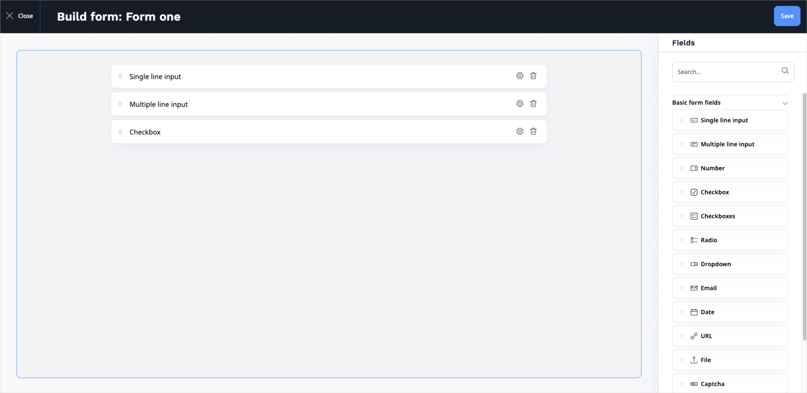
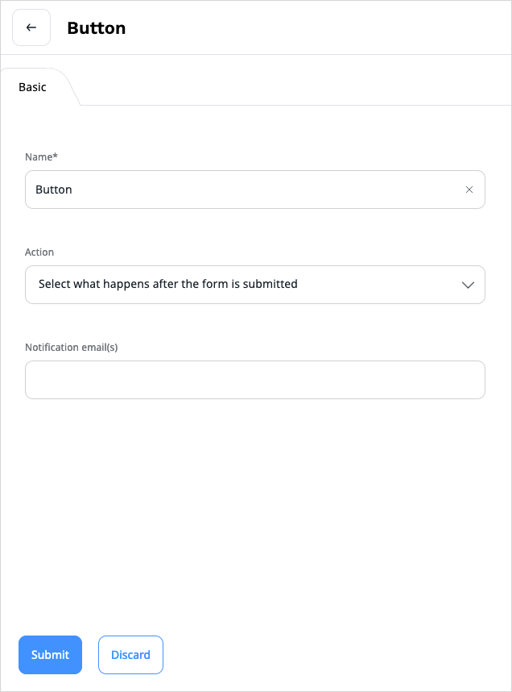

# Creating forms [[% include 'snippets/experience_badge.md' %]] [[% include 'snippets/commerce_badge.md' %]]

With forms you can place a survey, questionnaire, sign-up form, etc. on your website.

Create a form like a regular Content item by choosing the Form Content Type.
Click the **Edit** button to start adding fields to the form.

Build a form by dragging different types of fields into it.
The available types are:

- Single line input
- Multiple line input
- Number
- Checkbox
- Checkboxes
- Radio
- Dropdown
- Email
- Date
- URL
- File
- Captcha
- Button
- Hidden field

Each field has settings you can access through the options button.
The settings differ depending on the type of the field.

Button is a special kind of field. It is used for submitting the form.
You can choose one of a few options of what is shown to the user after filling in and submitting the form.

## Viewing results

Once you publish a form and users start filling it in, you can preview the results in the **Submissions** tab in the Content item view.

Here you can view the details of each submission.
You can also delete any submissions (for example if they were made while testing or contain spam).

The **Download submissions** button enables you to download all the submissions in a .CSV (comma-separated value) file.

