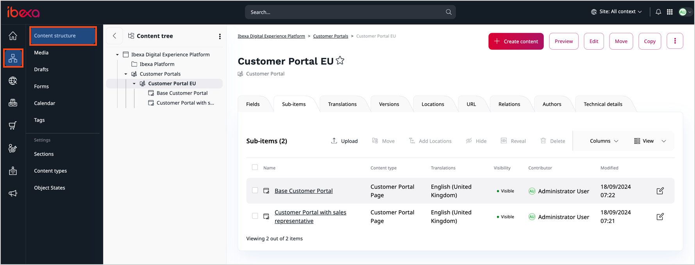

# Create and edit Customer Portal

To create and edit a Customer Portal with Page Builder, you need to first set it up in configuration.
For detailed instructions on how to do it, go to [Create Customer Portal]([[= developer_doc =]]/customer_management/cp_page_builder/).

The Customer Portal creation and edition are based on Page Builder and work on the same principles.
If you're unfamiliar with how Page Builder works, see [Create and edit Pages](create_edit_pages.md).

## Create Customer Portal

To create a new Customer Portal, go to **Content** and from the menu select **Content structure**.
There, navigate to the root folder for your Customer Portals. 
If you don't have one, you can add it yourself.
Remember to specify its `location_id` in the configuration, you can find it under **Technical details**.
For more information, see [Configure Page Builder access to Customer Portal]([[= developer_doc =]]/customer_management/cp_page_builder/#configure-page-builder-access-to-customer-portal).

Inside a root folder you can select **Create content** from the right-side toolbar.
On the list of content items, you can see two possibilities: **Customer Portal** and **Customer Portal Page**.

The first one is a container for your Customer Portal pages (this is not a root folder), and the second one represents the actual page.
It's recommended to use Customer Portal containers to divide and store your portal pages.
If your project requires it, the Customer Portal containers can also be defined as root folders in the configuration.

First, select **Customer Portal** and name it appropriately.
Next, navigate to the newly added container and create **Customer Portal Page**. 

In the **Page creation** box, you should see the Customer Portal layout where you can add dedicated Customer Portal block, Sales Representative, or choose from selection of blocks available to your [[= product_name =]] version.

For a list of blocks available out of the box, see [Block reference](block_reference.md).

If provided ready-to-use Page blocks aren't sufficient, you can [add your own blocks]([[= developer_doc =]]/content_management/pages/create_custom_page_block/).

Before you publish or save the Customer Portal page, edit its title and description in the field view, you can find it in the top toolbar on the left side.

If you're ready to publish the Customer Portal page, click **Publish** in the top right corner.
You can also save it as a draft, even if some required fields aren't filled in.
To do it, click **Save draft**.

## Add multiple pages

You can have multiple Customer Portal pages available in one Customer Portal by adding them under one Customer Portal container.
If company members have sufficient `content/read` policies and have the portal assigned to their customer group, they can see the changes in the left menu.

You can manipulate the order of pages in a menu by assigning priority to them in the **Customer Portal** container under **View**->**Sub-items**.

## Grant permissions

Company members need to have the following permissions to be able to see custom Customer Portals:

- `user/login` to `custom_portal` SiteAccess
- `content/read` to selected Customer Portals

If members of the company don't have sufficient permissions for any Customer Portal, they're transferred to the default Customer Portal view.

!!! note

    Customer Portal is only available to users that are members of the company.
    Even if a user has all sufficient permissions but is not a member of a company, they cannot see the Customer Portal.

Customer Portal must also be assigned to the company's Customer Group. To learn more see, [assigning portals to Customer Groups]([[= developer_doc =]]/customer_management/cp_page_builder/#assign-portal-to-customer-group).
