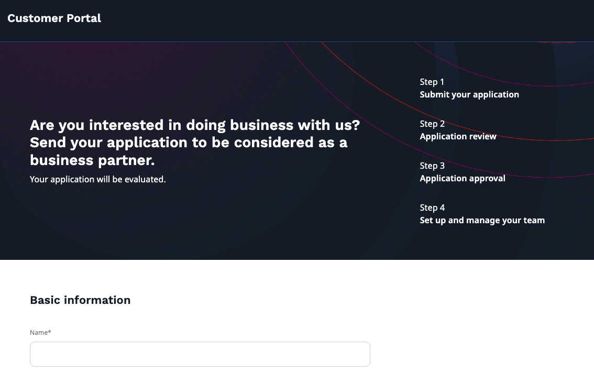
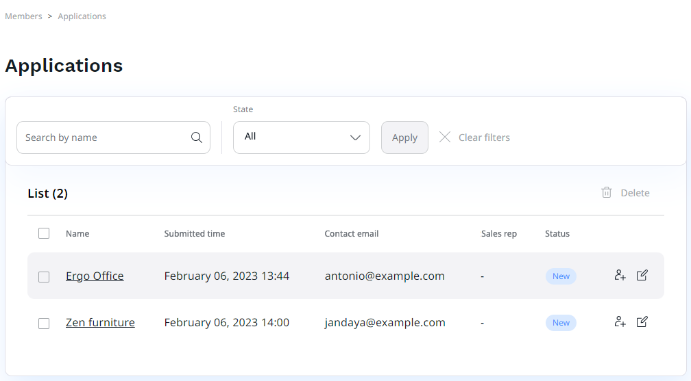
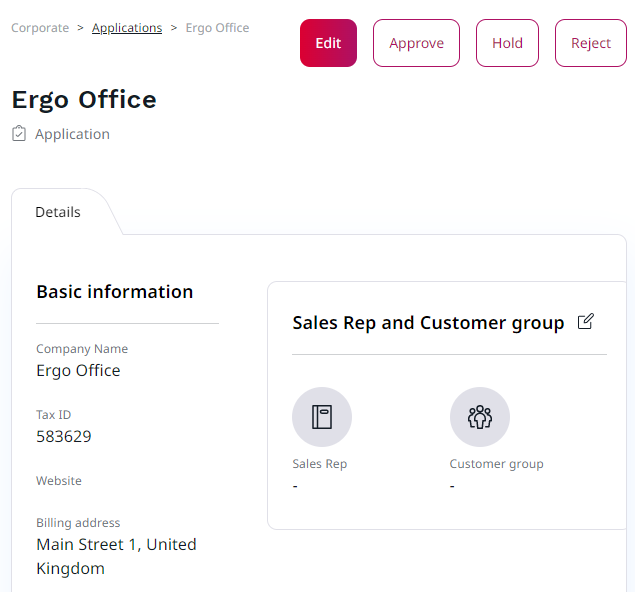
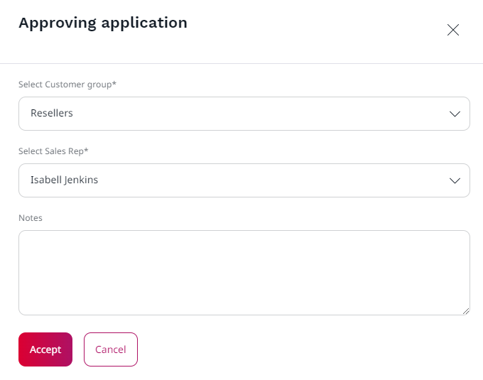

# Company self-registration

Self-registration allows your business customers to take charge and apply for a business account on your website by themselves.
The application is not approved automatically, it has to go through the approval process in the back office.
If it's accepted, the business partner receives an invitation link to the Customer Portal,
where they can set up their team and manage their account.

## Submitting application

Potential business partners need to fill in an application form to apply for a company account under this link:
`<yourdomain>/corporate/customer-portal/register`

They need to provide their basic information, contact information and billing address to submit an application.

## Application approval

The application then goes through an approval process in the back office.
To see a list of pending applications, go to **Customers** -> **Applications**.
There you can edit them or check their current status.

Each application can be either edited, approved, rejected, or put on hold.
Applications with status reject and on hold remain on the list for future reference.
Accepted ones move to **Customers** -> **Companies** section.

If you decide to approve a business partner's application, you need to specify its sales representative and a customer group.

If you cannot see sales representatives, you need to go to **Admin** -> **Users** and add them under a **Sales rep** group before approval.
Follow the same procedure with a customer group, it can be set up in **Product catalog** -> **Customer Groups**.

Finally, the invitation link is sent back to the applier to finish the registration process
and give them access to the [Customer Portal](customer_portal.md).

Application is moved to **Customers** -> **Companies** section and the company is created with **Active** status.
From there, you can manage the company and resend an invitation link if needed.
For more information on managing companies in the back office, see [Customer management documentation](manage_customers.md#manage-company).
