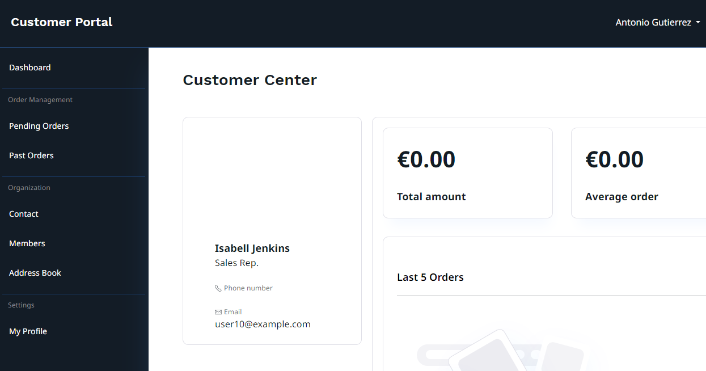
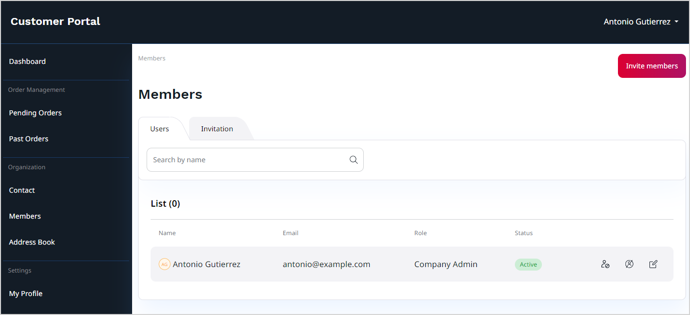
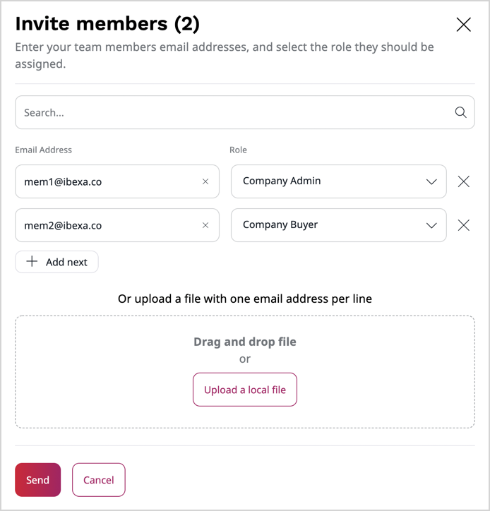
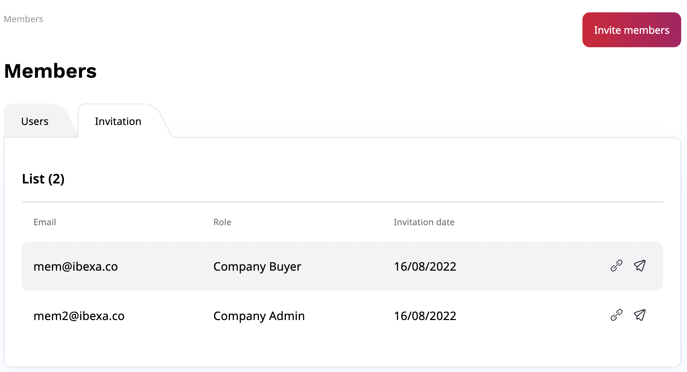

# Customer Portal account

If you represent a company that uses a business partner's [[= product_name =]] instance, Customer Portal allows you to create and manage your business account.
With this feature, you can edit your organization information, invite and view members and check your order history.

<!-- TODO: retake screenshot - blocked: no company can be created on either instance (the back-office company form rejects a fully filled billing address without reporting why), and Customers > Clients returns 404. Needs >=1 company with >=1 member account and a few orders seeded. -->

To access Customer Portal follow this link `<yourdomain>/corporate/login` and log in to your business account.

In the dashboard, you can find a sales representative of your company and a brief summary of your order history.
For a detailed list of your order history, go to **Pending Order** and **Past Orders** sections.

## Manage members

To view and manage members of your company, go to the **Members** section.
There you can:

- change the status of each member, cannot be performed on logged-in users
- change their role
- edit their basic information

<!-- TODO: retake screenshot - blocked: no company can be created on either instance (the back-office company form rejects a fully filled billing address without reporting why). Needs a company with 4-5 members in different roles and statuses. -->

To invite new members to your organization, select **Invite members**.
Then, in a pop-up window, fill out email addresses one by one, or use drag and drop to upload a file with a list of emails.
Assign a role to each new member of your team from a drop-down list.
Click **Send** to send out invitation emails.

<!-- TODO: retake screenshot - blocked: no company can be created on either instance (the back-office company form rejects a fully filled billing address without reporting why), so the invitation pop-up cannot be reached. Needs >=1 company with roles available for assignment. -->

Invited users then receive an email message with a registration link.
With it, they can register and create their account in the Customer Portal.

In the **Invitation** tab, you can find a list of all invitations, registration links and the option to re-send invitations, if needed.

<!-- TODO: retake screenshot - blocked: no company can be created on either instance (the back-office company form rejects a fully filled billing address without reporting why). Needs a company with 3-4 pending invitations seeded. -->

## Address book

If you want to add a new shipping address or change the default one, you can do it in the **Address Book** section.
