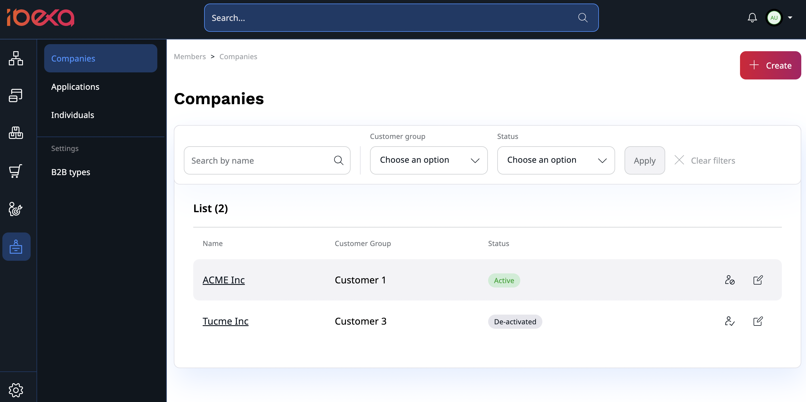
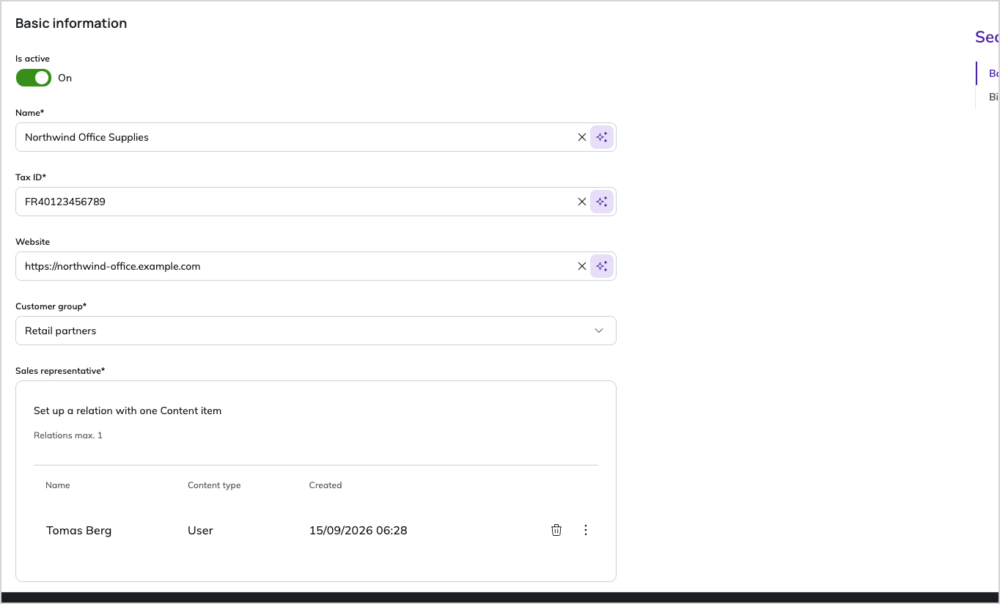
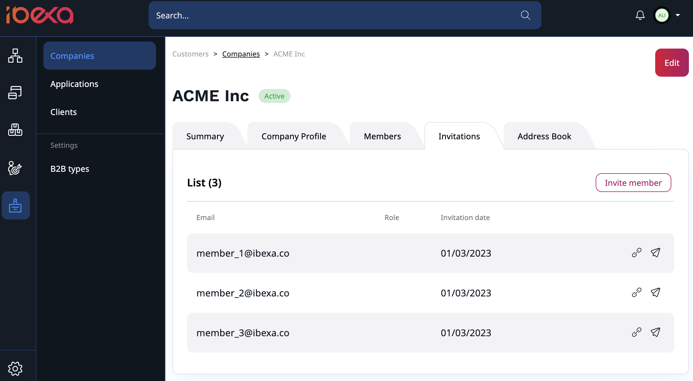
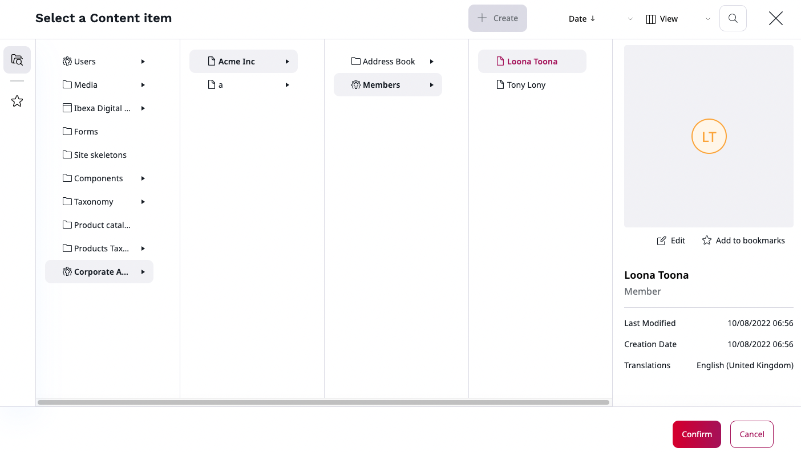
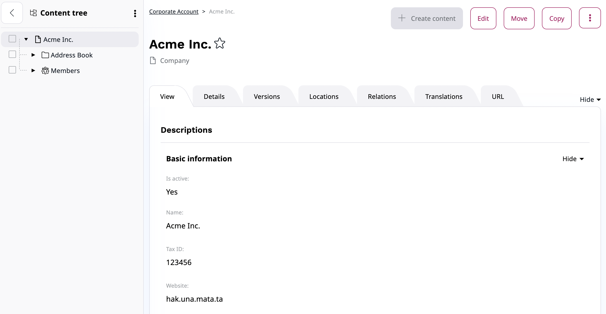
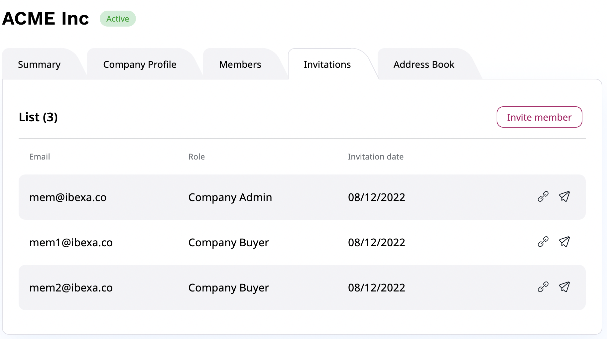

# Customer management

In the back office, you can manage members of your team, customers and organizations' accounts in your system, including their web store activities such as orders.

## Create new company

To create a new company, go to **Customers** -> **Companies** section.
There you can view a list of companies you have access to, you can also edit them or create a new one by selecting **Create** button in the top right corner.

<!-- TODO: retake screenshot - blocked: no company can be created on either instance (the back-office company form rejects a fully filled billing address without reporting why). Needs >=1 customer group and 4-5 companies seeded. -->

To create a new company, you need to provide:

- name
- tax ID
- customer group
- sales representative
- billing address

Optionally, you can add a website and other contact details.

## Manage company

Companies can be managed from the back office in the **Customers** -> **Companies** section.
Each company has its own profile where you can find:

- summary with basic information and order history
- company profile with billing information and contact person
- list of members and pending invitations
- address book with multiple shipping addresses

<!-- TODO: retake screenshot - blocked: no company can be created on either instance (the back-office company form rejects a fully filled billing address without reporting why). Needs >=1 company with members, invitations, addresses and order history seeded. -->

From there, you can edit the company information, invite members, manage their roles, and edit their basic information.
You can also add members to a team from existing pool of users.
The Contact Person in the company has to be a member of that company.

<!-- TODO: retake screenshot - blocked: no company can be created on either instance (the back-office company form rejects a fully filled billing address without reporting why). Needs >=1 company with several members so the Contact Person picker has entries. -->

### Admin Panel

You can also manage companies from **Admin** in the left menu.
There, in the **Corporate** section, you can find a list of members,
billing addresses and technical details regarding the organization such as visibility, IDs, or relations.
You can manage companies information, activate, deactivate members, and change their personal information.
Logged-in users cannot be deactivated.

<!-- TODO: retake screenshot - blocked: no company can be created on either instance (the back-office company form rejects a fully filled billing address without reporting why) and the corporate admin area has no data. Needs >=1 company with members and billing addresses seeded. -->

In the **Roles** section, you can define policies for each user group, for example, a company buyer.
You can also set up policies for every user who has a business account by editing a **Corporate Access** role.

!!! caution "Warning"

    Do not remove any policies from the **Corporate Access** role, the proper behaviour of business accounts depends on them.

## Invite members

To invite other members to the organization,
go to **Customers** -> **Companies** -> Select your company -> **Invitations**.

<!-- TODO: retake screenshot - blocked: no company can be created on either instance (the back-office company form rejects a fully filled billing address without reporting why). Needs >=1 company with 3-4 pending invitations seeded. -->

There, you can find a list of all invitations, copy their registration links and re-send the invitation emails.

To invite new members to the company, select **Invite member**.

Then, in a pop-up window fill out email addresses one by one, or use drag and drop to upload a file with a list of emails.
You also have to assign a role to each new member from a drop-down list.
Click **Send** to send out invitations.

Invited users receive an email message with a registration link.
With it, they can register and create their account in [the Customer Portal](customer_portal.md).
