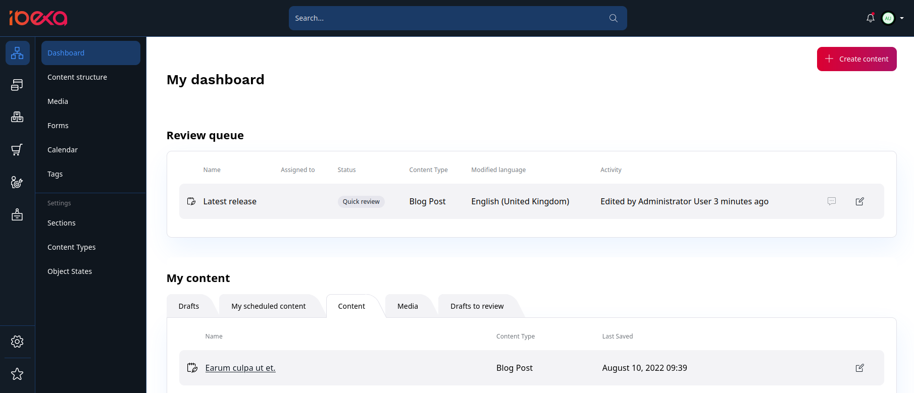
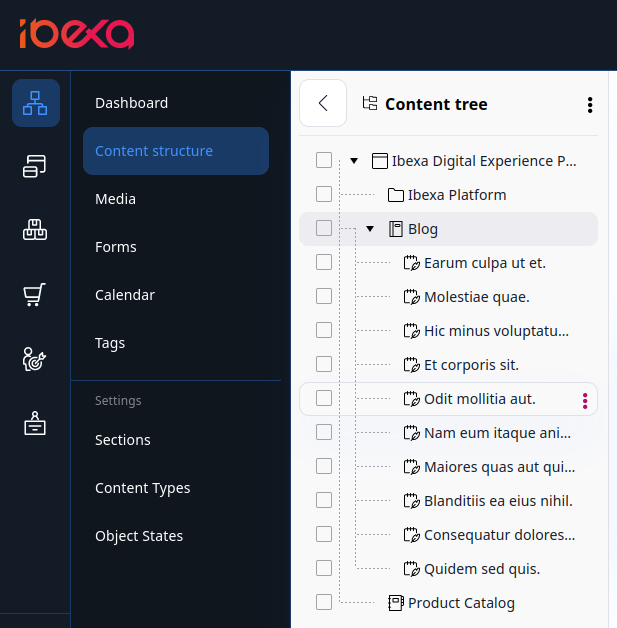

# Discover the User Interface

## My dashboard

The first screen that you see after logging in is **My dashboard**. 
It contains shortcuts to most commonly used areas:

- review queue
- your drafts
- the content that you have created
- recently modified content, etc.

You can select any of these items and view them in detail or start [editing them](create_content_basic.md) from this point.
You can also [reschedule or cancel planned publications](content_management/content_publishing/advanced_publishing_options.md#reschedule_or_cancel_publications) using the dashboard.

You can always return to the **My dashboard** screen by clicking the logo in the upper left corner.

The left side menu allows you to move between important sections of the application.

Depending on the product edition and your [permissions], the top level sections on the leftmost pane may include, for example:

- **Content** gives you access to the content Repository.
It lets you navigate the Content Tree, create, edit, move, copy, delete content, etc.
- **Product catalog** enables you to handle products presented on the website, including their specifications and pricing.
- [[% include 'snippets/experience_badge.md' %]] [[% include 'snippets/commerce_badge.md' %]] **Site** enables you to create and edit block-based Pages and manage multiple sites.
- **Admin** is the administration panel where you can manage Users, Sections, permissions, etc.

## Content Tree

If you want to navigate through your website with a menu, go to the **Content** tab, and select **Content structure**.
**Content Tree** in the left sidebar opens an expandable content menu of your site.

Unique icons for each Content Type instantly show you what type of content you are selecting. To add custom icons to your Content Tree, follow [configuration tutorial in developer documentation.]([[= developer_doc =]]/administration/back_office/back_office_elements/custom_icons/#customize-content-type-icons)

Hidden content is blurred out in the tree view.

To simplify the Content Tree, big lists are shortened with a **Show more** option. You can select it to expand all lists in the tree.
The **Collapse all** option situated at the bottom of the tree closes all expanded sections.

For more information on custom configuration, go to [Content Tree]([[= developer_doc =]]/administration/back_office/content_tree/) in developer documentation.

## Content browser

During your work with [[= product_name =]] you might need to select content from the Repository.
This happens, for example, when you want to move or copy a Content item, embed an image, link two Content items, etc.
In such cases, you use the **Content Browser**.

To access the **Content Browser**, go to the **Content** tab and select **Content structure** or **Media**.
Then, select a file you want to copy or move and click the corresponding button in the top right corner.
The Content Browser window opens, and you can select the new location of the selected file or its copy.

With the **Content Browser**, you can switch between the Grid, Panels and Tree views to navigate through the content of the site.
Depending on your permissions, you might be able to review the regular content, media, forms, site skeletons and User accounts.
You can also use the **Content Browser** to search the Repository for content, edit content, create bookmarks, and create new content when needed.

!!! note

    If you have administrator permissions, you can also view and manage User accounts and site skeletons in the **Admin** tab.
    
    For more information about users and permissions, see [Users](permission_management/permissions_and_users.md).
    
    For more information about site skeletons, see [Site skeletons]([[= developer_doc =]]/multisite/site_factory_configuration/#site-skeletons).
