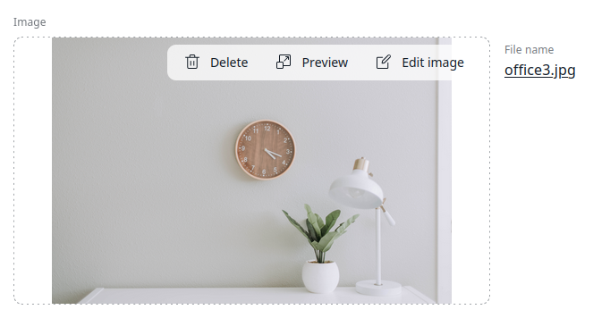

# Editing images

When you browse the [Media library](https://doc.ibexa.co/projects/userguide/en/latest/content_model/#content-and-media), or create or edit a Content Item that contains the *Image* 
or the *Image asset* field, you can perform basic image editing functions by using an Image Editor. 

The Image Editor function set includes: 

* image cropping 
* image flipping
* setting a point of focus within an image

Image Editor is available whenever you see the Edit icon on the preview.

After you open the Image Editor screen, you see the image preview area, and a pane on the right that contains different configuration options and buttons.

### Flip

With the Flip feature you mirror the image along a horizontal or vertical axis.
Click either the **Horizontal** or **Vertical** button to flip an image.

### Crop

With the Crop feature you can cut the image down to a desired aspect ratio and dimensions.
You can either choose one of the preset aspect ratio options (square, vertical or horizontal rectangle, or widescreen), or click **Random** to enter the exact width and hight values in the **Clop size** area. 

After you choose a preset aspect ratio, a grid appears on the preview.
You can resize the grid to mark an area of the image that you want to be visible.

Click the tick icon to confirm the change once you are happy with the results.
Click the X icon to abort the changes and clear the preview.
When you confirm the change, the preview refreshes to display a cropped image.

!!! note "Saving changes"

    Confirming the crop operation does not mean that it has been saved.
    You must click **Save** to apply the changes to an original image.

### Focal Point

If your page contains an image that is larger that a current viewport, for example when a user accesses the page from a mobile phone, you can select a point on the image that the view should focus on.

This way, when a responsive image is automatically cropped to fit the viewport, the area that contains the selected point is always visible.

Click the **Show point** button, and a target appears on the preview.
Drag the target to a point on the image that you want to focus on.
Click the X icon to restore the original position of the target.

### Undoing changes

Click either the left or right arrow button to undo or redo the most recent change.
Click **Reset image** to restore an original appearance of the image. It does not affect the Focal Point setting.

### Saving or aborting changes

Click **Save** to apply your edits to the original image and navigate away from the Image Editor screen. Click **Cancel** to abort your changes.
