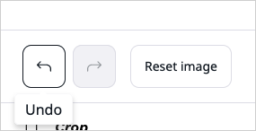

# Editing images

When you browse the [Media library](content_model.md#content-and-media), 
or create or edit a Content Item that contains an *Image* 
or *Image asset* Field, you can perform basic image editing functions by using the Image Editor. 

The Image Editor enables: 

* image cropping 
* image flipping
* setting a point of focus within an image

Image Editor is available whenever you see the **Edit** icon on the preview.

## Flip

With the Flip feature you mirror the image along a horizontal or vertical axis.
Click either the **Horizontal** or **Vertical** button to flip an image.

## Crop

With the Crop feature you can cut the image down to a desired aspect ratio and dimensions.
You can either choose one of the preset aspect ratio options (square, vertical or horizontal rectangle, or widescreen), or click **Custom**.

After you choose an aspect ratio, a grid appears on the preview.
You can then resize the grid to mark an area of the image that you want to be visible.
You can also enter the exact width and height values in the **Crop size** area. 

Click the tick icon to confirm the change or the X icon to cancel it and clear the preview.
When you confirm the change, the preview refreshes to display a cropped image.

!!! note "Saving changes"

    Confirming the crop operation does not mean that it has been saved.
    You must click **Save** to apply the changes to the original image.

## Focal point

If your page contains an image that is larger that the current viewport, for example, when a user accesses the page from a mobile phone, 
you can select a point on the image that the view should focus on.

This way, a responsive image can be cropped to fit the viewport, 
so the area that contains the selected point is always visible.

!!! note

    Cropping to focal point is not automatic. The site's templates must be adapted for this to happen.
    See [Use focal point](https://doc.ibexa.co/en/latest/guide/content_rendering/embed_and_list_content/render_images/#use-focal-point)
    in developer documentation for an example of implementing such cropping.

Click the **Show point** button to see a target on the preview.
Drag the target to a point on the image that you want to focus on.
Click the X icon to restore the original position of the target.

## Undoing changes

Click the left or right arrow button to undo or redo the most recent change.
Click **Reset image** to restore the original appearance of the image.

## Saving changes

Click **Save** to apply your edits to the original image and exit the Image Editor screen.
