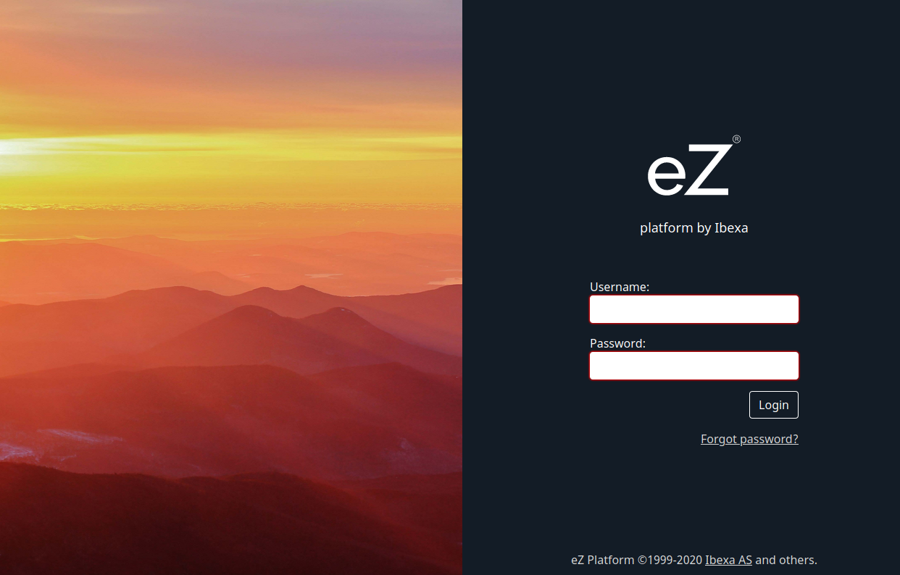
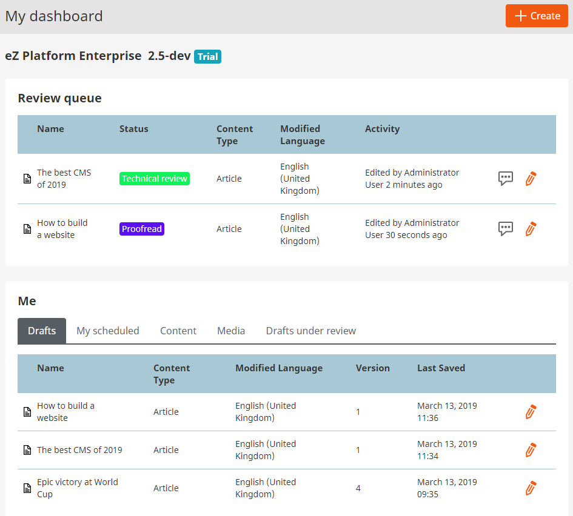
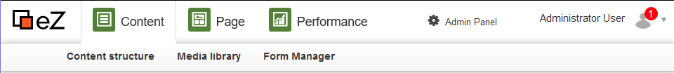

# Getting started

## What is eZ Platform?

eZ Platform is an open-source, Symfony-based CMS.

eZ Platform consists of the technical platform for developers
(including a Web framework, APIs and a content repository)
and provides a user interface to work with the content and administer the platform.

### eZ Platform Enterprise Edition

eZ Platform Enterprise Edition is a commercial product built on top of the open-source eZ Platform.
It offers additional functionalities and enhancements to the editing experience.

eZ Enterprise provides advanced editorial capabilities such as [in-page editing](creating_content_basic.md#working-with-a-landing-page), creation of landing pages, [editorial workflow](publishing.md#review-workflow), advanced marketing capabilities, etc.

## Quick start

To get started working with eZ Platform you need [an installation set up by your administrator / developer team](https://doc.ezplatform.com/en/1.11/getting_started/install_ez_platform/).
Once the installation is ready, you should be provided with the address where the installation is located, your login and password.

**The default administrator account information is:**

- login: `admin`
- password:` publish`

Going to the provided address in your browser will show you what the page will look like to the visitors.
To access your editor interface, add `/ez` to this address.
For example, if your website's URL is `www.my-site.com`, you enter the editing interface through `www.my-site.com/ez`.

The application greets you with the Dashboard. It lists the content that may be of most relevance to you:
your drafts, the content you have created, recently modified content, etc.
You can select any of these items and view them in detail or start editing them from this point.

Wherever you are in the app, you can always return to the Dashboard by selecting the eZ logo in the upper left corner.

The top bar where the logo is located also allows you to move between work modes and important sections of the application.

### Work modes

eZ Platform offers two different work modes: Content mode and Page mode.

- **Content mode** gives you access to the content repository.
It lets you navigate the Content tree, create, edit, move, copy, delete content, etc.
- **Page mode** allows you to manage website pages and website content from the pages themselves.
It is only available for eZ Enterprise users and allows you to create and edit Landing Pages
and make use of other Enterprise-specific functionalities.
