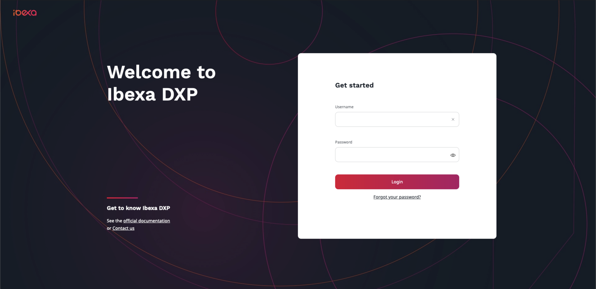
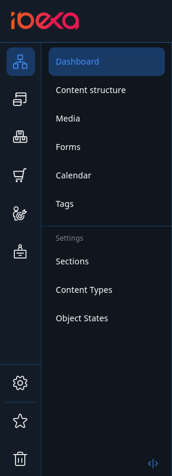
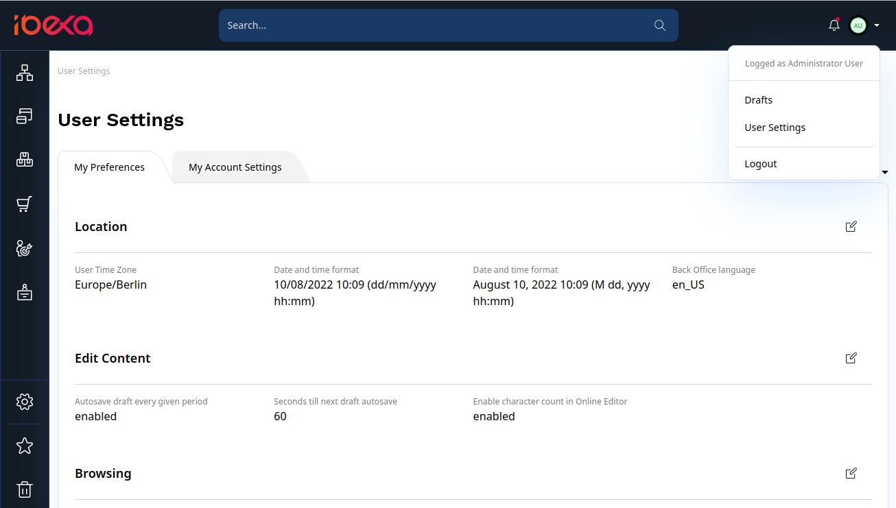

# Getting started

[[= product_name =]] consists of the technical platform for developers
(including a Web framework, APIs and a Content Repository)
and provides a user interface to work with the content and administer the platform.

[[= product_name =]] provides advanced editorial capabilities such as [in-page editing](site_organization/working_with_page.md), creation of [block-based Pages](site_organization/working_with_page.md#adding-blocks), [editorial workflow](publishing/editorial_workflow.md), etc.

## Quick start

[[= product_name =]] must be [installed by administrator](https://doc.ibexa.co/en/latest/getting_started/install_ez_platform/).
They should provide you with the address of the installation.

To access the Back Office (the editor interface), add `/admin` to this address.
For example, if your website's URL is `www.my-site.com`, you enter the editing interface through `www.my-site.com/admin`.

**The default administrator account information is:**

- username: `admin`
- password:` publish`

The first screen after logging in is **My dashboard**. It contains shortcuts to most commonly used content:
review queue, your drafts, the content you have created, recently modified content, etc.
You can select any of these items and view them in detail or start editing them from this point.
You can also reschedule or cancel planned publications using the dashboard.

You can always return to the **My dashboard** screen by selecting the logo in the upper left corner.

The top bar allows you to move between important sections of the application.

Top level sections include, for example:

- **Content** gives you access to the content Repository.
It lets you navigate the Content Tree, create, edit, move, copy, delete content, etc.
- **Product catalog** enables you to handle products presented on the website, including their specifications and pricing.
- [[% include 'snippets/experience_badge.md' %]] [[% include 'snippets/commerce_badge.md' %]] **Site** enables you to create and edit block-based Pages and manage multiple sites.
- **Admin** is the administration panel where you can manage Users, Sections, permissions, etc.

### User settings

You can access your User Settings on the right side of the top bar:

Here you can change your user password and define your user preferences,
such as preferred timezone, date and time format, or Back Office language.
